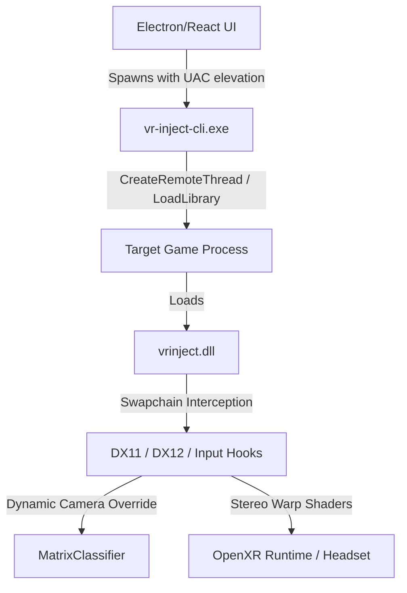

# NexVR Engine: Comprehensive Project Memory

This document serves as the master record of the **NexVR Engine** project. It details the core mission, current architecture, code audit resolutions, active roadmap, and next-generation AI implementation plans.

---

## 1. Project Mission & Core Technology
**NexVR Engine** is a universal virtual reality injection layer that instantly transforms flat-screen PC games into native, stereoscopic 3D VR experiences. It hooks DirectX 11, DirectX 12, and Vulkan render swapchains, converts mono outputs to stereo views (custom IPD), and projects them to OpenXR headsets.

### Core Stack:
*   **Launcher:** Electron + React (Vite, TypeScript, Tailwind CSS)
*   **Injection CLI:** C++ Command-Line Injector (`vr-inject-cli.exe`)
*   **Core Hook Engine:** C++ DLL (`vrinject.dll`) utilizing MinHook, Direct3D, and OpenXR.

---

## 2. Codebase Architecture

---

## 3. Resolution Log: Audit & Stability Fixes
We successfully audited the codebase and resolved multiple critical issues, deadlocks, and code quality issues:

*   **BUG-01/02 (MinHook Stability):** Removed redundant, dangerous double-initialization and double-shutdown of MinHook in `dx11_hook.cpp`. HookManager now solely owns MinHook lifecycle.
*   **BUG-05 (Thread Handle Leak):** Fixed a thread handle leak in `dllmain.cpp` by implementing proper `CloseHandle` calls.
*   **BUG-06 (Serialization Failure):** Added 5 missing configuration fields (recommended resolution, sRGB correction, depth submission, raw input mode, auto-inject) to the C++ `config_manager.cpp` serialization loop to prevent state desync with the Electron UI.
*   **BUG-09 (UI Infinite Loop):** Replaced the infinite tasklist polling loop in the Electron `injectionManager.ts` with a strict iteration ceiling to prevent launcher freezes on game crashes.
*   **DEAD-02/04 (Concurrency Races):** Converted global variables (`g_maxDepthPixels`, `g_onFrameCallback`) in `dx11_hook.cpp` to thread-safe `std::atomic` variables.
*   **DEAD-05 (DllMain Deadlock):** Added `WaitForSingleObject` with a timeout during DLL detach inside `dllmain.cpp` to prevent loader lock deadlocks during cleanup.
*   **QUAL-01 (Code Duplication):** Deleted redundant injector code (`tools/injector.cpp`) and synchronized all builds to use the unified C++ `src/injector/main.cpp`.
*   **QUAL-04 (Hardcoded Logic):** Cleaned up a hardcoded icon exception for *Sekiro* in `libraryManager.ts`.

---

## 4. Current Milestone: Advanced Heuristic Memory Scanning
To avoid hardcoded camera matrix pointers, we are moving from basic constant buffer hooks to an active memory scanner:
1.  **`PageScanner` (Traverses Heaps):** Loop over dynamic RAM heaps using `VirtualQuery`, filtering for `MEM_COMMIT` and `PAGE_READWRITE` regions to find where projection/view matrices reside.
2.  **`PointerChainResolver` (Static Offset Resolution):** Backtrace dynamic matrix memory addresses to static base offsets (e.g., `Game.exe + 0x3AF10 -> +0x24 -> +0x180`) to cache paths for subsequent launches.
3.  **`CameraDeltaTracker` (Input Synchronization):** Cross-reference candidates with mouse delta values to isolate matrices that respond directly to head movement.

---

## 5. Next-Generation AI & Rendering Roadmap
The future roadmap details 7 AI-driven models optimized to run within an 11.1ms frame budget:

### The 7 AI Models:
1.  **Spatial-Temporal Memory Transformer:** Encoder-only Self-Attention model to classify raw dynamic memory vectors (10-frame sequences).
2.  **Depth-Aware Gated Inpainter:** U-Net utilizing Gated Convolutions and depth buffer inputs to patch disocclusion holes without boundary color bleeding.
3.  **OFA Vector Refiner:** Quantized CNN correcting raw GPU hardware Optical Flow vectors to synthesize wobbly-free ASW frames.
4.  **Comfort Guard MLP:** Dense network predicting simulation sickness based on gaze vectors and rotational speeds.
5.  **Holographic UI Synthesizer:** YOLOv8-tiny model extracting 2D HUD components to project them as floating wrist watch panels in 3D.
6.  **Gaze Predictor:** Recurrent LSTM/GRU model predicting pupil trajectories to offset eye-tracker latency.
7.  **Neural Super Resolution:** TSR-GAN network upscaling low-res internal renders to 4K.

### Execution Blueprint:
*   **Synchronous Path (Main Render Thread, < 1.5ms):** Gaze Predictor, Comfort Guard, and Frame Gen Refiner. Must compile to **INT8/FP16** with node-fusion.
*   **Asynchronous Path (Worker Thread Pool):** Memory Transformer and Inpainter Mask Generator. Runs on background threads communicating via thread-safe atomic variables.
