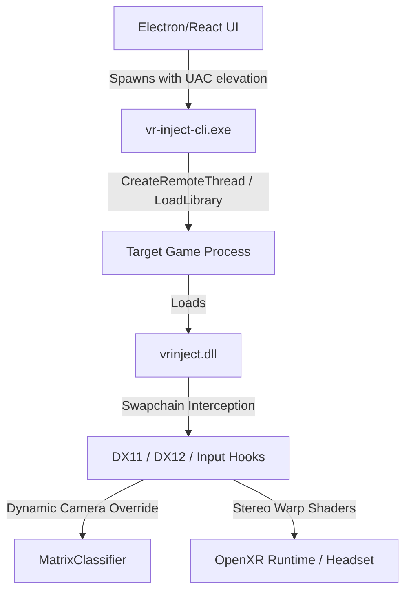

# NexVR Engine: Comprehensive Project Memory

This document serves as the master record and single source of truth for the **NexVR Engine** project. Every model in the Multi-Model Engineering team must use this document as their reference.

---

## 1. Project Mission & Core Technology
**NexVR Engine** is a universal virtual reality injection layer that instantly transforms flat-screen PC games into native, stereoscopic 3D VR experiences. It hooks DirectX 11, DirectX 12, and Vulkan render swapchains, converts mono outputs to stereo views (custom IPD), and projects them to OpenXR headsets.

### Core Stack:
*   **Launcher:** Electron + React (Vite, TypeScript, Tailwind CSS)
*   **Injection CLI:** C++ Command-Line Injector (`vr-inject-cli.exe`)
*   **Core Hook Engine:** C++ DLL (`vrinject.dll`) utilizing MinHook, Direct3D, and OpenXR.

---

## 2. Architecture & Subsystems

```mermaid
graph TD
    Launcher[Electron/React UI] -->|Spawns with UAC elevation| CLI[vr-inject-cli.exe]
    CLI -->|CreateRemoteThread / LoadLibrary| Target[Target Game Process]
    Target -->|Loads| DLL[vrinject.dll]
    DLL -->|Swapchain Interception| Hooks[DX11 / DX12 / Input Hooks]
    Hooks -->|Dynamic Camera Override| Matrix[MatrixClassifier]
    Hooks -->|Stereo Warp Shaders| OpenXR[OpenXR Runtime / Headset]
```

### Core Subsystems:
*   **HookManager:** Manages MinHook lifecycle, threading, and synchronization.
*   **GraphicsBackend (DX11/DX12/Vulkan):** Manages GPU correctness, synchronization, resource transitions, pipeline states, descriptor heaps, barriers.
*   **Memory Scanner:** Heuristic engine traversing heaps to locate projection/view matrices.
*   **OpenXR Submitter:** Manages VR runtime integration, rendering swapchains, and head tracking.

---

## 3. Folder Structure
*   `src/`: Core C++ source for the DLL and CLI injector.
*   `src/rendering/`: Graphics backends (DX11, DX12, Vulkan).
*   `src/openxr/`: VR headset communication and rendering pipeline.
*   `launcher/`: Electron/React launcher application.
*   `shaders/`: Stereo warp and custom rendering shaders.
*   `tools/`: Build tools and helper scripts.

---

## 4. Coding Standards & Naming
*   **Interfaces:** Prefix with `I` (e.g., `IGraphicsBackend`).
*   **Thread Safety:** Use `std::atomic` for globals accessed across threads. Prevent deadlocks by avoiding locks during DLL attach/detach (`DllMain`).
*   **Ownership:** Clear lifetimes for hooks and backend resources (e.g., HookManager owns MinHook).
*   **No Hardcoded Offsets:** Avoid hardcoded matrix pointers; use dynamic `PageScanner` and heuristic matching.

---

## 5. Performance Budgets
*   **Frame Budget:** 11.1ms total (targeting 90Hz).
*   **Synchronous AI Path (Main Render Thread):** < 1.5ms budget (must compile to INT8/FP16 with node-fusion).
*   **Asynchronous AI Path:** Background threads on worker pool.

---

## 6. Testing Requirements
*   **Adversarial Testing:** Must test edge cases: what happens if descriptor heap is destroyed? Fence timeouts? Device removal? Swapchain recreation?
*   **Raw Output:** Always report EXACT numbers and raw test output, not pass/fail summaries. Flag anything not yet run as "not yet run". Never assume verified without raw evidence.
*   **Concurrency:** Stress test threading (e.g., 10,000 frame stress).

---

## 7. Resolution Log & Completed Sprints
We successfully audited the codebase and resolved multiple critical issues, deadlocks, and code quality issues:
*   **BUG-01/02 (MinHook Stability):** Removed redundant double-initialization. HookManager solely owns lifecycle.
*   **BUG-05 (Thread Handle Leak):** Fixed thread handle leak in `dllmain.cpp` using `CloseHandle`.
*   **BUG-06 (Serialization Failure):** Added missing configuration fields to `config_manager.cpp`.
*   **BUG-09 (UI Infinite Loop):** Replaced infinite tasklist polling loop in Electron with iteration ceiling.
*   **DEAD-02/04 (Concurrency Races):** Converted global variables in `dx11_hook.cpp` to `std::atomic`.
*   **DEAD-05 (DllMain Deadlock):** Added `WaitForSingleObject` with timeout during DLL detach.
*   **QUAL-01 (Code Duplication):** Deleted redundant injector code, unified C++ `src/injector/main.cpp`.
*   **QUAL-04 (Hardcoded Logic):** Cleaned up hardcoded icon exception in `libraryManager.ts`.

---

## 8. Current Milestone: Advanced Heuristic Memory Scanning
To avoid hardcoded camera matrix pointers, we are moving from basic constant buffer hooks to an active memory scanner:
1.  **`PageScanner`:** Loop dynamic RAM heaps, filtering for `MEM_COMMIT` / `PAGE_READWRITE`.
2.  **`PointerChainResolver`:** Backtrace dynamic addresses to static base offsets.
3.  **`CameraDeltaTracker`:** Cross-reference candidates with mouse delta values.

---

## 9. Future Roadmap: Next-Generation AI
The future roadmap details 7 AI-driven models:
1.  **Spatial-Temporal Memory Transformer:** Encoder-only Self-Attention for memory vectors.
2.  **Depth-Aware Gated Inpainter:** U-Net for patching disocclusion holes.
3.  **OFA Vector Refiner:** Quantized CNN for optical flow ASW.
4.  **Comfort Guard MLP:** Dense network for predicting simulation sickness.
5.  **Holographic UI Synthesizer:** YOLOv8-tiny for 2D HUD extraction.
6.  **Gaze Predictor:** Recurrent LSTM/GRU for eye-tracker latency.
7.  **Neural Super Resolution:** TSR-GAN for upscaling.

---

## 10. Known Issues / Compatibility & Anti-Cheat Posture
*   **Anti-Cheat Warning:** Injecting via `CreateRemoteThread` is flagged by Vanguard, EAC, BattlEye. 
*   **Unsupported Environments:** Games utilizing active kernel-level anti-cheats are strictly **unsupported** (high ban risk).
