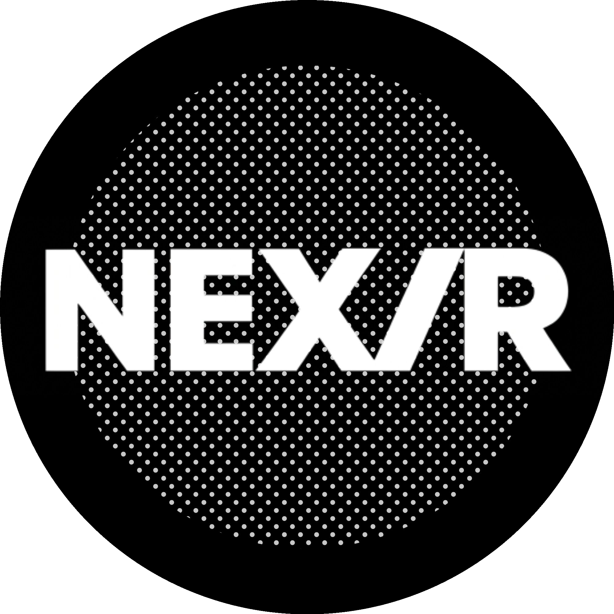

# NexVR Engine

<p align="center">
  
  <br><br>
  <a href="https://github.com/sathishssj3/NexVR-Engine/actions/workflows/release.yml"></a>
  <a href="LICENSE"></a>
</p>

> **Universal VR Injector** — Brings native OpenXR stereo rendering to flat-screen PC games by hooking into DX11, DX12, and Vulkan render pipelines.

NexVR Engine intercepts a game's graphics pipeline in real time, converts its mono output into stereoscopic VR frames, and submits them directly to your headset via OpenXR. It ships as an Electron/React launcher with a robust C++ injection engine underneath.

> [!CAUTION]
> **Account Ban Risk**: Injecting into multiplayer games protected by Anti-Cheat software (e.g., Easy Anti-Cheat, BattlEye, Vanguard) is strictly prohibited and can result in permanent account bans. NexVR Engine explicitly refuses to inject when these systems are detected. Use this tool only with single-player or unprotected titles.

Project context, current roadmap, and prior audit decisions are tracked in [docs/project_memory.md](docs/project_memory.md). Read that file before making architectural or feature changes.

---

## ✨ Key Features

| Feature | Description |
| :--- | :--- |
| **Universal Graphics Hook** | Hooks DirectX 11, DirectX 12, and Vulkan swapchains automatically |
| **Stereo Rendering Pipeline** | GPU compute shaders for stereo warp, depth reconstruction, and disocclusion fill |
| **Comfort Guard** | Motion-sickness reduction via vignette and comfort analysis shaders |
| **Asynchronous Spacewarp** | Adaptive frame interpolation to maintain smooth headset framerates |
| **Smart Steam Integration** | Auto-scans local Steam libraries and detects compatible games |
| **Auto Headset Detection** | Detects active OpenXR runtime (Meta Quest, SteamVR, WMR) from the Windows Registry |
| **Live Session Logs** | Streams real-time injection and hooking logs to the launcher UI |
| **Per-Game Profiles** | Save individual VR configs, resolutions, and input settings per game |

---

## 🏗️ Monorepo Architecture

NexVR is organized as an enterprise monorepo:

```text
NexVR-Engine/
├── nexvr-client/         # 🎮 Windows Native C++ Engine, OpenXR Layer & Electron Launcher
│   ├── src/              # C++ Direct3D 11/12, Vulkan & OpenXR hooks
│   ├── shaders/          # Compute shaders (stereo warp, depth reprojection)
│   └── launcher/         # Electron/React desktop app
├── nexvr-backend/        # ☁️ Cloud Microservices Platform (Node.js/TypeScript)
│   ├── src/gateway/      # API Gateway (Rate limiting, routing)
│   ├── src/services/     # Auth, User, Game, Profile, Update, Telemetry
│   └── prisma/           # PostgreSQL schema & migrations
├── nexvr-infrastructure/ # 🌐 AWS Cloud Infrastructure (Terraform)
│   ├── modules/          # VPC, EKS, ECR, Aurora Postgres, Redis, S3, CloudFront, WAF
│   └── environments/     # Production & Staging root configurations
├── nexvr-deployment/     # ☸️ Kubernetes, Helm, Argo CD & Monitoring
│   ├── helm/             # Production Helm charts
│   ├── argocd/           # GitOps application manifests
│   └── monitoring/       # Prometheus rules & Grafana dashboards
└── nexvr-docs/           # 📚 System Architecture & DevOps Playbooks
```

---

## 🛠️ Building from Source

### Native Windows Client (`nexvr-client`)

```bash
# 1. Build C++ Engine (Release x64) from repo root
cmake -B build -S . -A x64
cmake --build build --config Release

# 2. Build and launch the Electron desktop app
cd nexvr-client/launcher
npm install
npm run dev
```

### Cloud Services (`nexvr-backend`)

```bash
# 1. Start local PostgreSQL, Redis, and LocalStack
cd nexvr-backend
npm run docker:up

# 2. Run database migrations & start API Gateway
npm install
npm run db:push
npm run dev
```
npm run pack
```

The NSIS installer will be generated in `launcher/dist-electron/`.

---

## 🔍 Troubleshooting

| Problem | Solution |
| :--- | :--- |
| **Game crashes on inject** | Disable conflicting overlays (Discord, MSI Afterburner, RivaTuner) |
| **"Game path not found"** | Click **Rescan Library** at the bottom of the sidebar |
| **Headset shows black** | Check Live Session Logs — try setting the game to Windowed/Borderless mode |
| **No headset detected** | Verify your OpenXR runtime in `HKLM\SOFTWARE\Khronos\OpenXR\1` |

---

## ⚠️ Security Notice

> [!WARNING]
> Both `vrinject.dll` and `vr-inject-cli.exe` **must be code-signed** before public distribution. Unsigned injection DLLs are flagged by Windows Defender and antivirus software. Set `SIGN_CERT_PATH` and `SIGN_CERT_PASS` environment variables before building to enable automatic signing.

## 🤝 Contributing & Community Profiles

We welcome community contributions! You can add support for new games without writing a single line of C++ code by creating a profile in [`profiles/`](profiles/):
- **Adding a Game**: See the [3-minute game profile guide](CONTRIBUTING.md#-how-to-add-a-new-game-profile-in-3-minutes).
- **Subsystem Architecture**: Read the subsystem guides in [`nexvr-client/src/core/`](nexvr-client/src/core/README.md), [`nexvr-client/src/hooks/`](nexvr-client/src/hooks/README.md), and [`nexvr-docs/architecture/`](nexvr-docs/architecture/system-overview.md).
- **Enterprise Documentation**: Browse full guides in [`nexvr-docs/`](nexvr-docs/).

---

## 📄 License

This project is licensed under the [MIT License](LICENSE).

---

### Developed by sathishssj3
