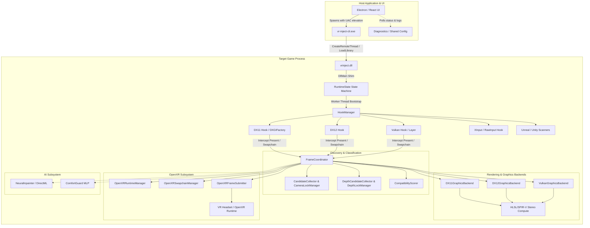
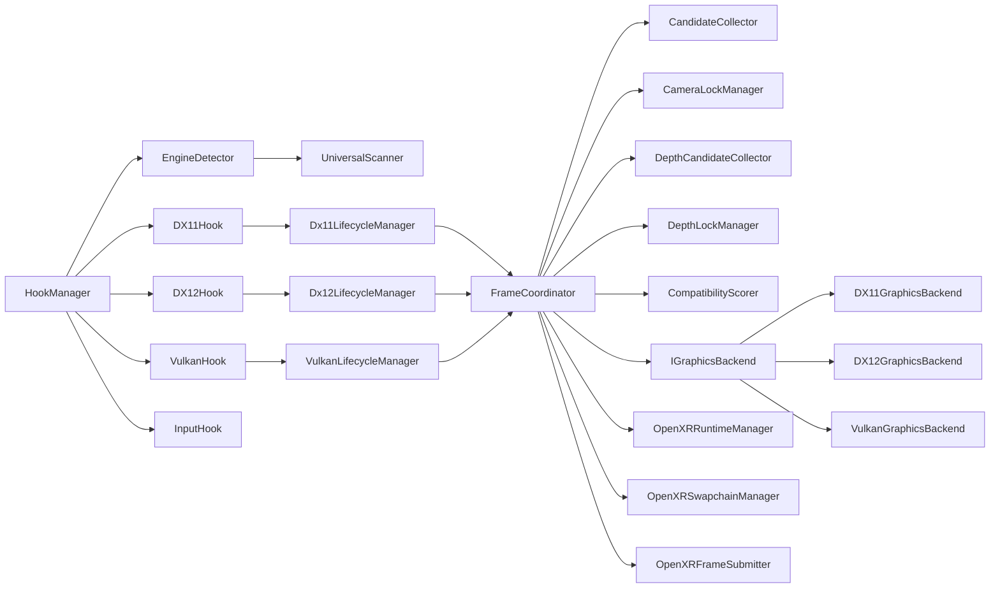

# NexVR Engine — Comprehensive Architecture Audit

**Author:** Principal Software Architect, Graphics Engineer & VR System Maintainer  
**Audit Date:** August 2026  
**Target Release:** NexVR Production Architecture Baseline  

---

## 1. Executive Summary

This document presents a comprehensive, read-only architectural audit of the **NexVR Engine** codebase. NexVR is an advanced universal virtual reality injection layer designed to intercept flat-screen DirectX 11, DirectX 12, and Vulkan games on Windows x64 and convert them in real-time into stereoscopic 3D VR experiences projected to OpenXR runtimes (SteamVR, Meta Quest Link, Virtual Desktop, WMR).

The audit assesses the system across **39 core architectural dimensions** without modifying production source code. The overall architecture is fundamentally sound with high-performing native subsystems, but suffers from monolithic coupling in `FrameCoordinator`, an over-reliance on 36+ global singletons, lack of versioned JSON game profiles, hardcoded executable heuristics, and a monolithic 800-line `CMakeLists.txt`.

---

## 2. Current System Architecture

The current NexVR engine operates via a four-tier architecture:

### Subsystem Operational Flow:
1. **Injection & Bootstrap**: `vr-inject-cli.exe` elevates, verifies `vrinject.dll` SHA-256 hash, and injects into the target game via `CreateRemoteThread`. `DllMain` safely hands execution to `RuntimeState::BackgroundInitialize()` on a worker thread with zero loader-lock.
2. **Hook Interception**: `HookManager` uses MinHook to hook `IDXGISwapChain::Present`, `IDXGISwapChain1::Present1`, `ID3D12CommandQueue::ExecuteCommandLists`, and Vulkan WSI `vkQueuePresentKHR`.
3. **Frame Execution & Fallback**: `FrameCoordinator::OnPresentBegin` executes on the render thread. It evaluates compatibility via `CompatibilityScorer`. If camera matrices and depth buffers are locked, it dispatches stereo reprojection compute shaders; if in menus or loading screens, it passes the 2D backbuffer to the OpenXR swapchain.
4. **XR Submission**: `OpenXRFrameSubmitter` acquires OpenXR swapchain images (DX11 texture, DX12 resource, or Vulkan `VkImage`), renders the stereo or passthrough views, and calls `xrEndFrame`.

---

## 3. Top-Level Dependency Map

---

## 4. 39-Point In-Depth Codebase Audit

| # | Audit Dimension | Status / Findings | Severity |
|---|---|---|---|
| **1** | **Module Dependencies** | `FrameCoordinator` is heavily entangled with all three graphics backends (`dx11_graphics_backend.h`, `dx12_graphics_backend.h`, `vulkan_graphics_backend.h`) and OpenXR concretions. | **High** |
| **2** | **Circular Dependencies** | Potential header inclusion loops between `core/logger.h`, `core/diagnostic_context.h`, and `core/runtime_state.h`. | **Medium** |
| **3** | **Hidden Dependencies** | Direct dependency on `openxr_loader.dll`, `DirectML.dll`, and `onnxruntime.dll` requiring post-build manual copying next to binaries. | **Medium** |
| **4** | **Global State** | 36+ Meyer's singletons (`static T& Get()`) scattered across `core/`, `hooks/`, and `rendering/`. | **High** |
| **5** | **Static State** | Static local frame counters and caches in `frame_coordinator.cpp` (`frameCounter`), `hook_manager.cpp` (`frameCount`). | **Medium** |
| **6** | **Singleton Usage** | `HookManager`, `FrameCoordinator`, `RuntimeState`, `CameraLockManager`, `DepthLockManager`, `DiagnosticContext`, `VulkanDispatchTable` are all singletons with uncoordinated destruction order during DLL detach. | **Critical** |
| **7** | **Threading Relationships** | Game render thread, worker initialization thread, OpenXR polling thread, and AI worker thread interact across shared locks. | **High** |
| **8** | **Ownership Relationships** | OpenXR textures and Direct3D backbuffers have dual ownership: target application and VR injection layer. | **High** |
| **9** | **Resource Lifetime Problems** | Swapchain recreation (e.g., resizing game window or alt-tabbing) requires atomic teardown of cached stereo render targets and descriptor heaps. | **High** |
| **10** | **Memory Ownership Problems** | Direct buffer reads in `MemoryScanner` use raw `VirtualQuery` without RAII page protection shields. | **High** |
| **11** | **API Coupling** | `FrameCoordinator` contains `if (backend == DX11) ... else if (backend == DX12) ... else if (backend == Vulkan) ...` branching in hot render loops. | **Critical** |
| **12** | **Platform Coupling** | Windows-only Win32 API calls (`HWND`, `GetModuleFileNameA`, `MultiByteToWideChar`) without platform abstraction wrappers. | **Low** |
| **13** | **Renderer Coupling** | Renderer depends directly on OpenXR swapchain image types instead of an abstract VR render target interface. | **High** |
| **14** | **Launcher/Engine Coupling** | Launcher settings schema in TypeScript and C++ `VRConfig` in `config_manager.cpp` require manual synchronization; drift is a known bug class. | **High** |
| **15** | **AI/Renderer Coupling** | `NeuralInpainter` and `ComfortGuard` instantiated directly within render pipeline path rather than behind an `IAIBackend` interface. | **Medium** |
| **16** | **Game-Specific Code Leaking into Core** | Hardcoded check `if (exeStr.find("HogwartsLegacy") != std::string::npos)` in `src/core/engine_detector.cpp`. | **High** |
| **17** | **Duplicate Functionality** | Matrix classification duplicated across `src/core/matrix_classifier.cpp` and `src/ai_matrix_classifier/matrix_classifier.cpp`. | **High** |
| **18** | **Dead Code** | Quarantined test targets in `CMakeLists.txt` (`test_ai_pipeline`, `test_camera_tracker`, `test_depth_tracker`, `test_dx11_lifecycle`); empty test shells (`e2e_test_app.cpp`, `test_beta_validation.cpp`). | **High** |
| **19** | **Unused Files** | Root directory clutter: `dummy.cpp`, `scratch.cpp`, `test.log`, `output.txt`, `vulkaninfo.html`, `test_onnx_dml.py`, `git-filter-repo.py`, `dxc.zip`, `onnx_dml.zip`, `ruvector.db`, `agentdb.rvf`. | **High** |
| **20** | **Oversized Source Files** | `src/hooks/vulkan_hook.cpp` (33 KB), `src/hooks/dx12_hook.cpp` (31 KB), `src/rendering/backends/dx12_renderer.cpp` (30 KB), `src/core/vulkan_dispatch_table.cpp` (20 KB). | **Medium** |
| **21** | **Oversized Classes** | `FrameCoordinator` handles engine detection, GPU profiling, CPU timing, camera discovery, depth discovery, stereo dispatch, OpenXR lifecycle, and dashboard rendering. | **Critical** |
| **22** | **God Objects** | `FrameCoordinator` is a classic God Object orchestrating all unrelated engine responsibilities simultaneously. | **Critical** |
| **23** | **Generated Artifacts in Source/Root** | Binary `.onnx` files, `.cso` shader binaries, `.zip` archives, and `.exe` test targets present in root directory. | **High** |
| **24** | **Hardcoded Paths** | Hardcoded model path `L"../models/depth_inpainter.onnx"` in `test_ai_directml.cpp` causing CTest failures when run from non-build directories. | **High** |
| **25** | **Hardcoded Game Names** | "HogwartsLegacy" hardcoded in `engine_detector.cpp`. | **High** |
| **26** | **Hardcoded Configuration** | Default IPD (0.064), convergence (10.0), scale factor (100.0) embedded in structs without schema verification. | **Medium** |
| **27** | **Hardcoded API-Specific Behavior** | `ID3D11DeviceContext*` static casts in DX11 profiling routines inside `FrameCoordinator`. | **High** |
| **28** | **Error Handling Weaknesses** | Blanket `catch (...)` in `FrameCoordinator` around camera/depth discovery concealing underlying memory access violations. | **High** |
| **29** | **Logging Weaknesses** | `LOG_INFO` spam in `FrameCoordinator::OnPresentBegin` ("Entering stereo pipeline (frame %llu)") every frame. | **High** |
| **30** | **Security Risks** | Dynamic DLL injection (`CreateRemoteThread`) flagged by AV heuristics; unvalidated profile paths could cause path traversal. | **High** |
| **31** | **Performance Risks** | Excessive string operations, CPU timer allocations, and vector clear/reallocation on per-frame render thread. | **High** |
| **32** | **Race Conditions** | `DX12Hook::SetOnFrameCallback` and Vulkan queue submission callbacks updating shared state without atomic guards. | **Medium** |
| **33** | **Undefined Behavior Risks** | `reinterpret_cast` of Vulkan surface and swapchain handles to dummy pointer constants in test harnesses. | **Medium** |
| **34** | **Exception-Safety Problems** | Non-RAII COM pointers (`ID3D12Resource*`) in error early-returns risking GPU memory leaks. | **Medium** |
| **35** | **Resource Leaks** | Unreleased D3D11/D3D12 render target views and shader resource views on device reset. | **Medium** |
| **36** | **DLL Lifecycle Problems** | `DllMain` detaches threads using `thread.detach()`, risking teardown execution after CRT unloads. | **High** |
| **37** | **Hook Lifecycle Problems** | `AudioHook` lacks a shutdown implementation (`AudioHook::Shutdown()` missing). | **Low** |
| **38** | **OpenXR Lifecycle Problems** | OpenXR session creation blocks render thread synchronously on `SYSTEM_SELECTED` transition. | **Medium** |
| **39** | **GPU Resource Lifetime Problems** | Vulkan descriptor sets and command buffers lack unified frame-in-flight recycling fences across rapid window resizes. | **High** |

---

## 5. Categorized Problem Matrix

### Critical Problems (P0)
1. **God Object `FrameCoordinator`**: Mixes lifecycle, profiling, camera discovery, depth ranking, OpenXR session management, and per-API rendering dispatch.
2. **Scattered API Branching**: Core render loop uses `if (DX11) ... else if (DX12) ... else if (Vulkan)` rather than polymorphically delegating to `IGraphicsBackend`.
3. **Singleton Sprawl (36+ Singletons)**: Non-deterministic destruction order on DLL detach, causing unpredictable crashes on game exit.

### High Priority Problems (P1)
4. **Hardcoded Engine/Game Heuristics**: `HogwartsLegacy` hardcoded in `engine_detector.cpp`; lack of versioned JSON profile database.
5. **Per-Frame Logging & Profiling Overhead**: `LOG_INFO` and string formatting called in per-frame rendering critical path.
6. **Hardcoded Test Paths & CTest Failures**: `AiDirectMLTest` fails because `../models/depth_inpainter.onnx` path is relative; `test_vulkan_stress` fails due to uninitialized dispatch table.
7. **Monolithic `CMakeLists.txt`**: Single 800-line CMake file with manual source globs and quarantined tests.
8. **Root Directory Clutter**: Loose binary `.onnx`, `.zip`, `.log`, `.cso`, `.exe` files in repository root.
9. **Duplicate Matrix Classifiers**: `src/core/matrix_classifier.cpp` vs `src/ai_matrix_classifier/matrix_classifier.cpp`.
10. **Quarantined / Empty Tests**: 7 quarantined tests referencing removed API symbols and 12 empty 0-byte test files.

### Medium Priority Problems (P2)
11. **Config Drift Risk**: C++ `VRConfig` and Electron TypeScript settings schema have manual synchronization.
12. **AI DirectML Pipeline Isolation**: AI models not abstracted behind unified `IAIBackend` interface.
13. **Vulkan Dispatch Table Fallback Safety**: Untracked devices in late-injection scenarios need guarded pass-through.
14. **Lack of GPU Memory Budget Enforcement**: Potential VRAM exhaustion during 4K VR supersampling.
15. **OpenXR Session Blocking**: Synchronous session initialization stalls render thread during headset wake-up.

### Low / Cosmetic Problems (P3)
16. **HLSL Compiler Warnings**: Signed/unsigned mismatch in `stereo_reprojection.hlsl` and `tonemap.hlsl` isnan warning.
17. **Missing `AudioHook::Shutdown`**: Audio hook missing explicit cleanup method in hook manager rollback stack.
18. **Inconsistent Header Include Conventions**: Mix of `#include "..."` with relative parent paths (`../rendering/...`) and `#include <...>` quotes.

---

## 6. Risk Areas for Refactoring

1. **MinHook Lifecycle**: Must never add `MH_Initialize` / `MH_Uninitialize` inside individual hook files.
2. **DX12 Single-Queue Contract**: All stereo compute dispatches must execute on the game's main command queue (`Dx12LifecycleManager::GetMainQueue()`).
3. **2D Passthrough Fallback**: In menus, loading screens, or camera unlock, backbuffer must be submitted to OpenXR swapchain so user is never left in a black void.
4. **Zero Loader-Lock**: `DllMain` must remain a pure shim.
5. **DirectX/Vulkan Interop**: Never cast native device pointers across API boundaries.
