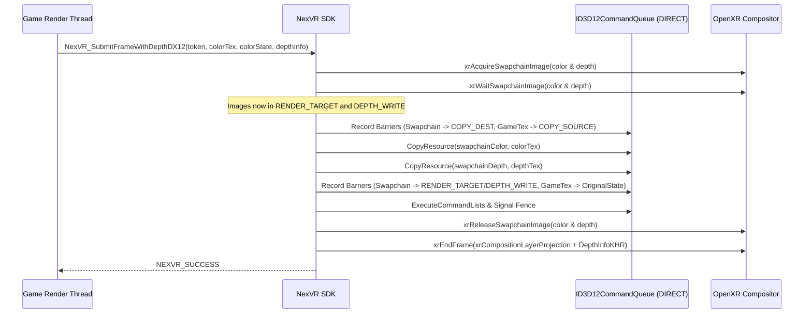

# NexVR B2B SDK — Direct3D 12 Native SDK Path Integration Plan

**Version:** 0.3.0 · DirectX 12 & DirectX 11 · Windows x64  
**Classification:** B2B Native Engine Plugin & Licensing Framework  

---

## 1. Architectural Overview & Design Premise

The NexVR B2B SDK provides a direct, native, non-injected C ABI for game engines (Unreal Engine 5, Unity, custom in-house proprietary engines) to achieve sub-millisecond flat-to-VR stereoscopic presentation via OpenXR.

While Phase 0 and Phase 1 introduced the Direct3D 11 native integration path, modern AAA game engines heavily utilize **Direct3D 12**. The D3D12 Native SDK Path expands the SDK's C ABI surface with zero breaking changes to existing D3D11 integrations (**DEC-020 Compliance**), providing native resource state management, explicit command queue synchronization, and optional Reverse-Z depth reprojection.

### Core Architectural Guarantees:
1. **Model B Device Purity**: The SDK operates strictly on the host engine's existing `ID3D12Device*` and direct `ID3D12CommandQueue*`. `nexvr_sdk.dll` never creates a D3D12 device (`D3D12CreateDevice` is forbidden and verified absent by binary import audits).
2. **Zero Injector Pollution**: No hooking engines (`MinHook`), memory scanners, or remote thread primitives (`CreateRemoteThread`, `VirtualAllocEx`) exist in the SDK binary.
3. **Explicit Barrier & Queue Protocol**: OpenXR requires swapchain images to be in `D3D12_RESOURCE_STATE_RENDER_TARGET` prior to release, and depth images in `D3D12_RESOURCE_STATE_DEPTH_WRITE`. The SDK safely transitions barriers, executes copy operations on the game's direct command queue, signals frame completion via hardware fences, and restores all resources to their original states.
4. **Mandatory Startup Sequencing**: Adapter LUID and recommended buffer extents must be queried prior to device creation (`NexVR_GetGraphicsRequirementsDX12`), eliminating multi-GPU mismatches at startup.

---

## 2. Direct3D 12 C ABI Specification

The complete D3D12 interface is exposed via `include/nexvr_sdk.h`:

```c
/* ===========================================================================
   Data Structures
   =========================================================================== */

typedef struct NexVR_InitializeDX12Info {
    uint32_t             structSize;             /* sizeof(NexVR_InitializeDX12Info) */
    ID3D12Device*        device;                 /* Borrowed host engine device */
    ID3D12CommandQueue*  commandQueue;           /* MUST be D3D12_COMMAND_LIST_TYPE_DIRECT */
    ID3D12Resource*      representativeTarget;   /* Validated at init for size & format */
    NexVR_ColorSpace     colorSpace;             /* NEXVR_COLOR_SPACE_SRGB_ENCODED or _LINEAR */
    uint32_t             enableCopyVerification; /* Optional readback audit for bring-up */
} NexVR_InitializeDX12Info;

typedef struct NexVR_DepthInfoDX12 {
    uint32_t             structSize;             /* sizeof(NexVR_DepthInfoDX12) */
    ID3D12Resource*      depthTexture;           /* Matched resolution single-sample depth */
    float                nearZ;                  /* Near clip plane (metres, > 0.0f) */
    float                farZ;                   /* Far clip plane (> 0.0f or INFINITY) */
    NexVR_DepthRange     range;                  /* ZERO_TO_ONE or REVERSED */
    D3D12_RESOURCE_STATES depthState;            /* State of depthTexture upon entry */
} NexVR_DepthInfoDX12;

/* ===========================================================================
   Exported Function Entry Points
   =========================================================================== */

NEXVR_API NexVR_Result NEXVR_CALL
NexVR_GetGraphicsRequirementsDX12(NexVR_GraphicsRequirements* requirements);

NEXVR_API NexVR_Result NEXVR_CALL
NexVR_InitializeDX12(const NexVR_InitializeDX12Info* info, NexVR_Session* outSession);

NEXVR_API NexVR_Result NEXVR_CALL
NexVR_SubmitFrameDX12(NexVR_Session session, uint64_t token,
                      ID3D12Resource* colorTexture,
                      D3D12_RESOURCE_STATES colorState);

NEXVR_API NexVR_Result NEXVR_CALL
NexVR_SubmitFrameWithDepthDX12(NexVR_Session session, uint64_t token,
                               ID3D12Resource* colorTexture,
                               D3D12_RESOURCE_STATES colorState,
                               const NexVR_DepthInfoDX12* depth);
```

---

## 3. GPU Command Sequencing & Resource Barrier Lifecycle

OpenXR D3D12 Swapchain (`XR_KHR_D3D12_enable`) and Depth (`XR_KHR_composition_layer_depth`) mandate strict barrier transitions:



### Precondition Enforcement Matrix:
- **Direct Queue Check**: Validated via `commandQueue->GetDesc().Type == D3D12_COMMAND_LIST_TYPE_DIRECT`. Fails with `NEXVR_ERROR_INVALID_COMMAND_QUEUE = -14` if compute or copy queues are passed.
- **Multisample Rejection**: Multisampled depth (`sampleCount > 1`) is rejected with `NEXVR_ERROR_INVALID_ARGUMENT`. `ResolveSubresource` does not support depth formats; engines must submit resolved single-sample depth.
- **Reverse-Z Projection**: Natively accepted when `nearZ > farZ` with `range = NEXVR_DEPTH_RANGE_REVERSED`.

---

## 4. Integration Example (Unreal Engine 5 / Custom D3D12 Engine)

```cpp
// 1. Startup phase (prior to D3D12 device creation)
NexVR_GraphicsRequirements req{ sizeof(NexVR_GraphicsRequirements) };
NexVR_Result res = NexVR_GetGraphicsRequirementsDX12(&req);
if (NEXVR_FAILED(res)) {
    UE_LOG(LogNexVR, Error, TEXT("OpenXR runtime requirements check failed: %s"), 
           UTF8_TO_TCHAR(NexVR_GetLastErrorDetail()));
    return;
}

// Ensure the game creates its DXGI Adapter and ID3D12Device using req.adapterLuid
// and creates its side-by-side or combined VR target at req.requiredTextureWidth x req.requiredTextureHeight.

// 2. Renderer Initialization
NexVR_InitializeDX12Info initInfo{ sizeof(NexVR_InitializeDX12Info) };
initInfo.device = GDirect3DDevice;
initInfo.commandQueue = GDirect3DCommandQueue;
initInfo.representativeTarget = SceneColorTexture->GetResource();
initInfo.colorSpace = NEXVR_COLOR_SPACE_SRGB_ENCODED;
initInfo.enableCopyVerification = 0;

NexVR_Session session = nullptr;
res = NexVR_InitializeDX12(&initInfo, &session);
if (NEXVR_FAILED(res)) {
    UE_LOG(LogNexVR, Error, TEXT("NexVR_InitializeDX12 failed: %s"), 
           UTF8_TO_TCHAR(NexVR_GetLastErrorDetail()));
    return;
}

// 3. Game Tick (WaitFrame on Game/Simulation Thread)
NexVR_FrameState frameState{ sizeof(NexVR_FrameState) };
res = NexVR_WaitFrame(session, &frameState);
if (res == NEXVR_SUCCESS && frameState.shouldRender) {
    UpdatePlayerEyeCameras(frameState.views[0], frameState.views[1]);
}

// 4. Render Thread (End of Scene Render)
if (frameState.shouldRender) {
    NexVR_DepthInfoDX12 depthInfo{ sizeof(NexVR_DepthInfoDX12) };
    depthInfo.depthTexture = SceneDepthTexture->GetResource();
    depthInfo.nearZ = 1000.0f; // UE5 Reverse-Z
    depthInfo.farZ = 0.1f;
    depthInfo.range = NEXVR_DEPTH_RANGE_REVERSED;
    depthInfo.depthState = D3D12_RESOURCE_STATE_DEPTH_READ;

    res = NexVR_SubmitFrameWithDepthDX12(
        session,
        frameState.token,
        SceneColorTexture->GetResource(),
        D3D12_RESOURCE_STATE_RENDER_TARGET,
        &depthInfo
    );
} else {
    // Non-rendered frames must submit a null texture to cleanly close the OpenXR frame loop
    NexVR_SubmitFrameDX12(session, frameState.token, nullptr, D3D12_RESOURCE_STATE_COMMON);
}

// 5. Engine Shutdown
NexVR_Shutdown(session);
```

---

## 5. Verification & Test Suite Strategy

The implementation is verified across three automated test tiers:

1. **Pure Validation Suite (`test_sdk_validation.exe`)**:
   - 36 GoogleTest cases running pure functions against mock facts without requiring a physical GPU.
   - Verifies requirements ordering, adapter LUID matching, direct command queue checks, typeless format matching, color space requirements, and reverse-Z depth plane validations.
2. **Binary Import Audit (`test_sdk_imports.exe`)**:
   - Parses the PE headers of built `nexvr_sdk.dll`.
   - Asserts that all 12 C ABI exports are present.
   - Asserts that `D3D12CreateDevice`, `D3D11CreateDevice`, `CreateRemoteThread`, `VirtualAllocEx`, and `MH_*` symbols are **completely absent**, maintaining Model B purity and anti-cheat compliance.
3. **API & Contract Suite (`test_sdk_dx12.exe`)**:
   - 10 functional tests validating argument bounds, token contracts, and null session safety.
4. **Coupling Ratchets (`check_coupling.ps1`)**:
   - Verified that zero hardcoded game names exist and singleton budgets remain within strict thresholds.
