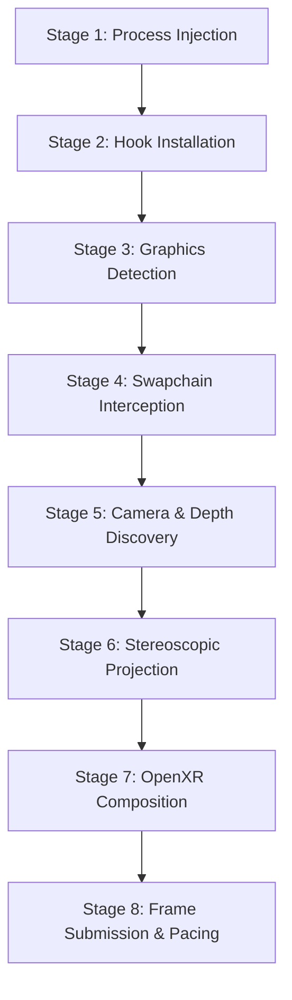

# NexVR Engine — Golden Pipeline Architecture Contract

**Document Version:** 1.0.0-gold  
**Date:** August 15, 2026  
**Status:** Frozen Reference Specification  
**Mandate:** *The Golden VR Pipeline is the primary functional asset of NexVR. All architectural refactorings must preserve the exact inputs, outputs, threading, and GPU execution invariants defined in this contract.*

---

## 1. Golden Pipeline Overview

---

## 2. Stage-by-Stage Specification

### Stage 1: Process Injection & Zero-Loader-Lock Bootstrap
- **Stage Goal:** Safely load `vrinject.dll` into target game process without loader-lock or antivirus aborts.
- **Input:** Target process ID / Executable handle from `vr-inject-cli.exe`.
- **Output:** `vrinject.dll` loaded in target address space; `RuntimeState` worker thread spawned.
- **Subsystem Owner:** `apps/nexvr-cli` $\to$ `engine/core/lifecycle/RuntimeState`.
- **Execution Thread:** Windows Loader Thread (`DllMain`) $\to$ Worker Bootstrap Thread (`RuntimeState::BackgroundInitialize`).
- **Synchronization:** Windows OS loader lock (exited immediately); `std::condition_variable` on `RuntimePhase`.
- **GPU Queue:** N/A.
- **Failure Behavior:** If injection fails or trial/hash validation fails, DLL self-unloads without crashing the game.
- **Verification Tests:** `vr-inject-cli.exe` integration tests, `test_runtime_state`.

---

### Stage 2: Hook Installation & Transactional Detours
- **Stage Goal:** Detour target graphics APIs, input, and engine-specific functions via MinHook.
- **Input:** Target game loaded modules (`d3d11.dll`, `d3d12.dll`, `vulkan-1.dll`, `dxgi.dll`, `xinput1_3.dll`).
- **Output:** Installed function detours pointing to NexVR interceptors.
- **Subsystem Owner:** `engine/injection/HookManager`.
- **Execution Thread:** Worker Bootstrap Thread (sleeps 1000 ms to ensure remote injection thread exit).
- **Synchronization:** Central `HookManager` recursive mutex; atomic rollback stack on failure.
- **GPU Queue:** N/A.
- **Failure Behavior:** Atomic rollback: `MH_DisableHook` + `MH_Uninitialize()`; engine transitions to `RuntimePhase::Error`.
- **Verification Tests:** `test_hook_manager`.

---

### Stage 3: Graphics Backend Detection & Initialization
- **Stage Goal:** Detect whether the game is using DirectX 11, DirectX 12, or Vulkan.
- **Input:** First hooked call to `IDXGISwapChain::Present`, `D3D12CommandQueue::ExecuteCommandLists`, or `vkQueuePresentKHR`.
- **Output:** Concrete `IGraphicsBackend` instance (`DX11GraphicsBackend`, `DX12GraphicsBackend`, `VulkanGraphicsBackend`).
- **Subsystem Owner:** `engine/graphics/common/IGraphicsBackend`.
- **Execution Thread:** Game Main Render Thread.
- **Synchronization:** `std::mutex` around lazy backend instantiation.
- **GPU Queue:** Target game's native render/direct command queue.
- **Failure Behavior:** Transitions to `StereoRendererState::DEGRADED`; logs diagnostic event.
- **Verification Tests:** `test_dx12_graphics_backend`, `test_vulkan_graphics_backend`.

---

### Stage 4: Swapchain Interception & Backbuffer Extraction
- **Stage Goal:** Capture active game backbuffer surface, dimensions, format, and epoch generation.
- **Input:** `IDXGISwapChain*`, `ID3D12Resource*`, or `VkImage` swapchain present handle.
- **Output:** Validated `RenderFrameSnapshot` structure.
- **Subsystem Owner:** `engine/injection/{dx11,dx12,vulkan}` $\to$ Lifecycle Managers.
- **Execution Thread:** Game Main Render Thread.
- **Synchronization:** Non-blocking epoch comparison (`deviceGeneration`, `swapchainGeneration`).
- **GPU Queue:** Game Native Direct / Graphics Queue.
- **Failure Behavior:** If swapchain is resizing or invalidated, resets camera/depth locks and passes frame through untouched.
- **Verification Tests:** `test_dx11_lifecycle`, `test_vulkan_lifecycle`, `test_vulkan_swapchain_recreation_depth`.

---

### Stage 5: Camera Matrix & Depth Buffer Discovery
- **Stage Goal:** Identify view/projection matrix buffers in memory and matching depth-stencil buffer.
- **Input:** Intercepted Constant Buffers, Dynamic Memory Pages, and Depth-Stencil Views / Depth Images.
- **Output:** Validated `CameraSnapshot` and `DepthSnapshot` with confidence score.
- **Subsystem Owner:** `engine/camera/` & `engine/rendering/depth/`.
- **Execution Thread:** Game Main Render Thread (candidate collection offloaded to lightweight heuristics).
- **Synchronization:** Mutex-guarded lock managers (`CameraLockManager`, `DepthLockManager`).
- **GPU Queue:** N/A (CPU heuristics & memory inspection).
- **Failure Behavior:** If score $< 70$ or locks invalid, sets `shouldAttemptStereo = false` $\to$ falls back to **2D Passthrough Mode** (OpenXR receives 2D backbuffer; headset never gets black screen).
- **Verification Tests:** `CompatibilityScorerTest`, `test_camera_classifier`, `test_camera_lock`, `test_depth_classifier`, `test_depth_lock`.

---

### Stage 6: Stereoscopic Compute Projection & Warp
- **Stage Goal:** Convert monoscopic color + depth into left and right eye stereoscopic textures with custom IPD.
- **Input:** Game Color Texture, Depth Texture, Left/Right Eye Projection Matrices, `StereoParams` (IPD, Convergence).
- **Output:** Dispatched Left and Right Eye render targets in native GPU format.
- **Subsystem Owner:** `engine/rendering/stereo/StereoPipeline` $\to$ Hardware Compute Shaders (`stereo_reprojection.hlsl` / SPIR-V).
- **Execution Thread:** Game Main Render Thread.
- **Synchronization:**
  - **DX11:** Direct device context compute dispatch $\to$ immediate texture copy.
  - **DX12:** Dispatched strictly to **Game Main Command Queue** (`Dx12LifecycleManager::GetMainQueue()`) via single-queue execution contract.
  - **Vulkan:** Synchronized via `VulkanResourceStateTracker` and pipeline barriers.
- **GPU Queue:** Main Game Direct / Graphics Queue (Strict FIFO ordering).
- **Failure Behavior:** If shader dispatch fails or GPU timeout occurs, fallback to bilateral blend or 2D passthrough.
- **Verification Tests:** `test_stereo_camera`, `test_stereo_renderer`, `test_dx12_stereo_renderer`, `test_vulkan_renderer`.

---

### Stage 7: OpenXR Session Composition
- **Stage Goal:** Acquire OpenXR swapchain images and copy stereo (or 2D passthrough) buffers into VR runtime.
- **Input:** Left/Right eye textures, OpenXR Session handle, Headset 6DOF pose.
- **Output:** Populated `XrSwapchainImage` buffers ready for presentation.
- **Subsystem Owner:** `engine/xr/openxr/` $\to$ `OpenXRSwapchainManager`, `OpenXRFrameSubmitter`.
- **Execution Thread:** Game Main Render Thread.
- **Synchronization:** `xrWaitSwapchainImage`, `xrAcquireSwapchainImage`, `xrReleaseSwapchainImage` bracketed with GPU fence synchronization.
- **GPU Queue:** Shared Graphics Device Queue.
- **Failure Behavior:** If OpenXR device is lost, health monitor triggers background session re-creation.
- **Verification Tests:** `test_openxr_lifecycle`, `test_openxr_dx12_swapchain`, `test_openxr_vulkan_swapchain`.

---

### Stage 8: Frame Submission & VR Pacing
- **Stage Goal:** Submit completed stereoscopic frame to OpenXR compositor with precise timing.
- **Input:** Completed `XrCompositionLayerProjection` with field-of-view and eye poses.
- **Output:** `xrEndFrame` presentation to headset display.
- **Subsystem Owner:** `engine/xr/openxr/OpenXRFrameSubmitter`.
- **Execution Thread:** Game Main Render Thread.
- **Synchronization:** Frame pacing driven by OpenXR runtime `xrWaitFrame` timestamp.
- **GPU Queue:** OpenXR Compositor Queue.
- **Failure Behavior:** Degrades to ASW / ATW timewarp on headset runtime if application drops frame.
- **Verification Tests:** `test_frame_timing_manager`, `test_runtime_health`.

---

## 3. Immutable Architectural Invariants

Every refactoring phase must preserve these exact rules:

1. **Dual-Mode Contract:** OpenXR must NEVER receive empty/black frames. When 3D camera/depth is unlocked, 2D backbuffer passthrough MUST execute.
2. **DX12 Single-Queue Contract:** All stereo dispatches and resource copies in DX12 MUST submit to the game's main queue (`Dx12LifecycleManager::Get().GetMainQueue()`).
3. **MinHook Centralization:** All `MH_Initialize` and `MH_Uninitialize` calls belong exclusively to `HookManager`.
4. **Zero-Loader-Lock:** `DllMain` must remain an OS shim; all background initialization must execute on detached worker threads.
5. **No Cross-API Pointer Casting:** Never cast native pointers across DX11, DX12, and Vulkan types.
