# Complete Software & Website Production Deployment Checklist
### Pre-Launch Readiness · Production Deployment · Post-Launch Monitoring

> **Release Readiness Principle**  
> Do not consider an application production-ready until critical security, data integrity, recovery, and operational checks have passed. A successful build deployment is not equivalent to a successful public launch. Treat this checklist as an evidence-based release gate: for critical items, record the verifier, timestamp, and audit artifact.

---

## Table of Contents
1. [Phase 1: Project & Release Readiness (6 items)](#phase-1-project--release-readiness)
2. [Phase 2: Code Quality & Development (7 items)](#phase-2-code-quality--development)
3. [Phase 3: Functional & Integration Testing (8 items)](#phase-3-functional--integration-testing)
4. [Phase 4: Security & Privacy (11 items)](#phase-4-security--privacy)
5. [Phase 5: Performance & Reliability (9 items)](#phase-5-performance--reliability)
6. [Phase 6: Infrastructure & Environments (9 items)](#phase-6-infrastructure--environments)
7. [Phase 7: Data, Backups & Migration (8 items)](#phase-7-data-backups--migration)
8. [Phase 8: Deployment & Release Engineering (9 items)](#phase-8-deployment--release-engineering)
9. [Phase 9: Domain, Networking & Public Access (7 items)](#phase-9-domain-networking--public-access)
10. [Phase 10: Observability & Incident Response (8 items)](#phase-10-observability--incident-response)
11. [Phase 11: Frontend, UX & Accessibility (7 items)](#phase-11-frontend-ux--accessibility)
12. [Phase 12: Legal, Compliance & Business Operations (7 items)](#phase-12-legal-compliance--business-operations)
13. [Phase 13: Documentation & Support Handoff (7 items)](#phase-13-documentation--support-handoff)
14. [Phase 14: Launch-Day Execution (8 items)](#phase-14-launch-day-execution)
15. [Phase 15: Post-Launch Stabilization & Review (7 items)](#phase-15-post-launch-stabilization--review)
16. [Final Go/No-Go Decision Matrix](#final-gono-go-decision-matrix)
17. [Standard Release Timeline (T-7 to T+7)](#standard-release-timeline)

---

## Phase 1: Project & Release Readiness

- [x] **1.1 Scope & Feature Lock**  
  *Explanation:* All user-facing features, API contracts, and changes scheduled for this release are finalized. No unplanned scope or feature creep is permitted.  
  *Completion Criterion:* Product manager and tech lead sign off on the exact feature list.

- [x] **1.2 Release Candidate (RC) Freezing**  
  *Explanation:* The code branch is frozen. The exact commit hash and semantic version tag (e.g., `v1.0.0-rc.1`) are locked and documented.  
  *Completion Criterion:* Tagged git commit exists; subsequent PRs target the next minor/patch cycle only.

- [x] **1.3 Bug Triage & Blocker Classification**  
  *Explanation:* All open issues and bug reports are triaged using a strict severity rubric (P0 Blocker, P1 Critical, P2 Major, P3 Minor).  
  *Completion Criterion:* Zero open P0/P1 issues. P2/P3 items are explicitly deferred with documented mitigation.

- [x] **1.4 Roles & Incident Command Assignment**  
  *Explanation:* Specific team members are designated with clear ownership: Release Owner (overall delivery), Deployment Operator (pipeline/infra), Security Contact (vulnerability review), Incident Commander (triage lead).  
  *Completion Criterion:* Roster published with primary/secondary contact handles and cell numbers.

- [x] **1.5 Go/No-Go Criteria & Rollback Triggers**  
  *Explanation:* Objective, non-negotiable thresholds are established that dictate whether to proceed with launch or abort immediately.  
  *Completion Criterion:* Documented list of hard stop triggers (e.g., error rate >0.5%, P99 latency >1.5s, data corruption detected).

- [x] **1.6 Dependency, License & Third-Party Sign-Off**  
  *Explanation:* Confirm all third-party SDKs, APIs, libraries, and open-source licenses are compliant with commercial distribution.  
  *Completion Criterion:* License scanning report clean (no GPL violations in proprietary binaries); external vendor status pages verified healthy.

---

## Phase 2: Code Quality & Development

- [x] **2.1 Mandatory Peer Review & Pull Request Sign-Off**  
  *Explanation:* Every line of code shipped in the release must have passed code review by at least one qualified domain peer.  
  *Completion Criterion:* Branch protection rules enforce 1+ approved reviews on all merged commits; no bypasses.

- [x] **2.2 Static Analysis, Linting & Type Checks**  
  *Explanation:* Automated linters (ESLint, Clang-Tidy, Ruff), static analyzers, and strict type checkers (TypeScript, MyPy, MSVC `/W4`) must pass without errors.  
  *Completion Criterion:* CI build passes typechecking and zero linter warnings on the release branch.

- [x] **2.3 Debug Artifact & Test Code Removal**  
  *Explanation:* Strip all development flags, diagnostic consoles (`console.log`, `printf`), test mock endpoints, bypass credentials, and temporary debug headers.  
  *Completion Criterion:* Production build bundles contain zero mock API paths or verbose console dumping.

- [x] **2.4 Secret Externalization & Environment Isolation**  
  *Explanation:* Source code, config files, and build manifests must contain zero embedded API tokens, passwords, private keys, or internal hostnames.  
  *Completion Criterion:* Automated secret scanning (Gitleaks, Trufflehog, GitHub Secret Scanning) returns 0 findings.

- [x] **2.5 Dependency Version Pinning & Reproducible Builds**  
  *Explanation:* Exact dependency versions must be locked using committed lockfiles (`package-lock.json`, `Cargo.lock`, `go.sum`, pinned CMake commit hashes).  
  *Completion Criterion:* Clean CI build produces identical binary hashes across two independent runners.

- [x] **2.6 Feature Flags & Server-Side Guardrails**  
  *Explanation:* High-risk new capabilities are gated behind dynamic server-side feature flags or kill switches that can be toggled without redeploying code.  
  *Completion Criterion:* Kill switch verified operational in staging environment.

- [x] **2.7 Database Schema & Model Compatibility Review**  
  *Explanation:* Verify that entity changes, foreign key constraints, and migrations are backward-compatible with both running and new application versions.  
  *Completion Criterion:* Dual-version compatibility verified (old app code runs against newly migrated schema without errors).

---

## Phase 3: Functional & Integration Testing

- [x] **3.1 Unit Test Suite Execution**  
  *Explanation:* Execute unit tests across all business logic, math calculations, data parsers, and utility functions.  
  *Completion Criterion:* 100% of registered unit test suites pass; code coverage meets or exceeds repository threshold (e.g., >80%).

- [x] **3.2 Integration & Service-to-Service Testing**  
  *Explanation:* Verify communication paths between services, databases, Redis caches, message queues, and external webhooks.  
  *Completion Criterion:* Integration test harness completes with 0 failed assertions and verified transaction rollbacks.

- [x] **3.3 End-to-End (E2E) Critical Flow Automation**  
  *Explanation:* Automated browser/headless tests (Playwright, Cypress) covering core user journeys: signup, login, search, purchase/injection, logout.  
  *Completion Criterion:* Green E2E test runs across Chrome, Firefox, Safari/WebKit, and Edge.

- [x] **3.4 Authentication & Session Lifecycle Verification**  
  *Explanation:* Test full auth lifecycle: registration, login, 2FA/MFA, session token renewal, password reset tokens, logout invalidation, and expired session rejection.  
  *Completion Criterion:* Expired or tampered tokens are rejected with HTTP 401/403 and cannot access protected endpoints.

- [x] **3.5 Form Validation, File Upload & Notification Testing**  
  *Explanation:* Verify boundary limits on user input fields, MIME-type enforcement, oversized file rejection, and email/webhook dispatch.  
  *Completion Criterion:* Boundary test passes (invalid inputs display polite inline errors; oversized uploads return HTTP 413).

- [x] **3.6 Payment, Billing & Subscription Safety Checks**  
  *Explanation:* Test checkout, tax calculation, renewal, credit card failure, and refund workflows in sandbox mode.  
  *Completion Criterion:* Webhook events from Stripe/payment gateway correctly update internal account entitlement state.

- [x] **3.7 Accessibility (a11y), Localization & Timezone Edge Cases**  
  *Explanation:* Test screen reader accessibility, keyboard focus states, WCAG AA color contrast, UTF-8 character encoding, and UTC timestamp handling.  
  *Completion Criterion:* Lighthouse accessibility score ≥90; no timezone offset bugs when switching time zones.

- [x] **3.8 API Contract, Pagination & Backward Compatibility**  
  *Explanation:* Verify that REST/GraphQL endpoints strictly adhere to published OpenAPI schemas and old clients do not break.  
  *Completion Criterion:* Schema validation passes; pagination handles empty results, page 1, and out-of-range pages gracefully.

---

## Phase 4: Security & Privacy

- [x] **4.1 Threat Modeling & Trust Boundary Review**  
  *Explanation:* Review architecture against STRIDE methodology (Spoofing, Tampering, Repudiation, Information Disclosure, Denial of Service, Elevation of Privilege).  
  *Completion Criterion:* Threat model document updated with countermeasures for each identified vector.

- [x] **4.2 SAST, Dependency Audit & Secret Scanning**  
  *Explanation:* Run static application security testing (SonarQube, CodeQL) and dependency vulnerability checkers (`npm audit`, Snyk, Trivy).  
  *Completion Criterion:* Zero Critical or High CVEs in production dependencies; CodeQL release scan clean.

- [x] **4.3 Dynamic Analysis (DAST) & Penetration Testing**  
  *Explanation:* Scan live staging deployment with automated vulnerability tools (OWASP ZAP) or review reports from third-party penetration testers.  
  *Completion Criterion:* All high/medium severity findings remediated and retested.

- [x] **4.4 Role-Based Access Control (RBAC) & Least Privilege**  
  *Explanation:* Verify authorization gates on all endpoints. Standard users must never access admin actions or another tenant's data (IDOR prevention).  
  *Completion Criterion:* Automated permission matrix test verifies 403 Forbidden across all unauthorized role combinations.

- [x] **4.5 HTTPS, TLS Configuration & Security Headers**  
  *Explanation:* Enforce TLS 1.3/1.2 only. Configure standard security headers: `Strict-Transport-Security` (HSTS), `Content-Security-Policy` (CSP), `X-Frame-Options`, `X-Content-Type-Options: nosniff`.  
  *Completion Criterion:* SecurityHeaders.com score of **A** or higher; zero mixed-content console warnings.

- [x] **4.6 Input Sanitization & SQL/Command Injection Mitigation**  
  *Explanation:* Ensure parameterized database queries (ORM / prepared statements) and strict escaping/sanitization of all user inputs.  
  *Completion Criterion:* Codebase free of raw string interpolation inside SQL, shell execution, or DOM insertion (`innerHTML`).

- [x] **4.7 Cross-Origin Resource Sharing (CORS) & CSRF Defense**  
  *Explanation:* Restrict CORS origins strictly to authorized domains (`Access-Control-Allow-Origin` cannot be `*` with credentials). Implement SameSite cookies and CSRF tokens.  
  *Completion Criterion:* Unauthorized origin receives CORS rejection; mutating requests without CSRF protection fail.

- [x] **4.8 Encryption at Rest & In Transit**  
  *Explanation:* Sensitive data (PII, tokens, financial details) must be encrypted at rest (AES-256) and in transit (TLS). Master keys stored in secure KMS.  
  *Completion Criterion:* Database and backup storage volumes enforce server-side encryption; keys managed through AWS KMS, GCP KMS, or HashiCorp Vault.

- [x] **4.9 Privacy Disclosures & PII Sanitization Policies**  
  *Explanation:* Verify that logs, crash dumps, and analytics scrub user directory paths (`C:\Users\[USER]\`), emails, credit cards, and IP addresses.  
  *Completion Criterion:* Sample log dump audit confirms zero plaintext PII across all ingestion pipelines.

- [x] **4.10 Audit Logging & Security Alert Readiness**  
  *Explanation:* Security-relevant actions (logins, password changes, permission grants, data exports) emit tamper-evident audit logs.  
  *Completion Criterion:* Audit log events forwarded to immutable logging stream with automated alert triggers for suspicious spikes.

- [x] **4.11 Internal Endpoints & Admin Panel Protection**  
  *Explanation:* Administrative dashboards, health status introspection, and metrics endpoints (`/metrics`, `/admin`, `/debug`) are behind VPN, IP allowlist, or SSO.  
  *Completion Criterion:* Public access to `/admin` or internal dashboards returns 404 or drops connection at the edge WAF.

---

## Phase 5: Performance & Reliability

- [x] **5.1 Performance SLA & Metric Targets Defined**  
  *Explanation:* Explicit thresholds established: P95 API response time (<200ms), LCP (<2.0s), error rate (<0.1%), frametime (<11.1ms for 90 FPS VR).  
  *Completion Criterion:* Baseline numbers documented in performance dashboard.

- [x] **5.2 Load & Stress Testing Under Peak Concurrency**  
  *Explanation:* Simulate realistic peak user traffic (e.g., 200% expected load) using k6, Locust, or Artillery to verify stability and auto-scaling response.  
  *Completion Criterion:* System handles peak load without database deadlocks, connection pool exhaustion, or error rate exceeding 0.1%.

- [x] **5.3 Database Indexing & Query Plan Optimization**  
  *Explanation:* Run `EXPLAIN ANALYZE` on slowest queries. Eliminate N+1 query patterns, sequential table scans, and unindexed foreign keys.  
  *Completion Criterion:* No query on core user paths exceeds 50ms under load; slow-query log clean.

- [x] **5.4 Frontend Bundle Optimization & Core Web Vitals**  
  *Explanation:* Compress assets, treeshake unused code, use WebP/AVIF images, and lazy-load non-critical bundles.  
  *Completion Criterion:* Lighthouse Performance score ≥90; total initial JavaScript bundle <350KB gzipped.

- [x] **5.5 Caching & Edge Content Delivery (CDN)**  
  *Explanation:* Static assets served via CDN with immutable cache headers (`max-age=31536000, immutable`). Server-side caching for expensive queries.  
  *Completion Criterion:* CDN cache hit ratio >90% for static assets; cache invalidation tested and working on deploy.

- [x] **5.6 Rate Limiting, Throttling & DDoS Mitigation**  
  *Explanation:* Edge and application-layer rate limits protect login, registration, password reset, and resource-heavy APIs from abuse.  
  *Completion Criterion:* Rapid burst requests to sensitive endpoints correctly trigger HTTP 429 Too Many Requests.

- [x] **5.7 Resource Usage & Saturation Baseline**  
  *Explanation:* Profile CPU, memory, thread pool, and file descriptor usage under idle and sustained load to identify memory leaks.  
  *Completion Criterion:* Memory usage plateaus cleanly over sustained 2-hour stress test with zero unbounded heap growth.

- [x] **5.8 Graceful Degradation & Dependency Circuit Breakers**  
  *Explanation:* When external services (e.g., analytics, email gateway, recommendation engine) fail, the core application must remain functional.  
  *Completion Criterion:* Simulated failure of external third-party API results in fallback UI without crashing primary user flows.

- [x] **5.9 Background Task Queues & Idempotent Processing**  
  *Explanation:* Async jobs (email sending, image processing, report generation) must be idempotent and resilient to worker restarts.  
  *Completion Criterion:* Killing and restarting a worker during job execution results in successful retry without duplicate data writes.

---

## Phase 6: Infrastructure & Environments

- [x] **6.1 Staging & Production Isolation**  
  *Explanation:* Production and staging environments must run in completely isolated VPCs/accounts, with separate databases, storage buckets, and credentials.  
  *Completion Criterion:* Zero cross-environment data access; staging secrets cannot authenticate against production databases.

- [x] **6.2 Infrastructure as Code (IaC) & Configuration Tracking**  
  *Explanation:* Cloud infrastructure provisioned reproducibly using Terraform, Pulumi, CloudFormation, or declarative configs stored in Git.  
  *Completion Criterion:* Infrastructure drift check returns 0 changes; environments can be re-provisioned from clean state.

- [x] **6.3 Network Topology, Firewall Rules & Port Hardening**  
  *Explanation:* Only necessary ports (80, 443) are publicly open. Database and cache instances reside in private subnets with no public IPs.  
  *Completion Criterion:* Port scan of public domain shows only ports 80/443 open.

- [x] **6.4 Auto-Scaling & Health Check Probes**  
  *Explanation:* Container orchestrators (Kubernetes, ECS) configured with valid liveness and readiness probes, CPU/memory scaling triggers.  
  *Completion Criterion:* Terminating a container causes orchestrator to spin up a healthy replacement in <30 seconds without dropped requests.

- [x] **6.5 Secret Management & Key Rotation Mechanisms**  
  *Explanation:* Production credentials pulled dynamically from secrets managers (AWS Secrets Manager, Vault) at runtime, with documented rotation procedures.  
  *Completion Criterion:* Verified that secrets can be updated and reloaded by services without full cluster rebuilds.

- [x] **6.6 Database Connection Pooling & Replica Routing**  
  *Explanation:* Database connection pooler (PgBouncer, RDS Proxy) configured with appropriate max connections and read/write splitting.  
  *Completion Criterion:* Connection pooler absorbs spike of 1,000 concurrent client connections without exceeding database backend connection limit.

- [x] **6.7 Object Storage Lifecycle & Access Permissions**  
  *Explanation:* S3 / GCS buckets configured with private access policies, CORS rules, and lifecycle rules for archiving stale temporary files.  
  *Completion Criterion:* Direct unauthenticated GET to bucket URLs returns 403 Access Denied; pre-signed URLs required.

- [x] **6.8 Container Base Images & OS Patching**  
  *Explanation:* Use minimal, hardened base images (Alpine, Distroless) with all recent OS security updates applied.  
  *Completion Criterion:* Container vulnerability scan (Trivy, Clair) yields 0 Critical/High OS vulnerabilities.

- [x] **6.9 Cloud Provider Quotas & Service Limits**  
  *Explanation:* Check account service quotas (IP addresses, CPU vCPUs, email send limits) to prevent hitting ceilings on launch day.  
  *Completion Criterion:* Provider quota check confirms headroom of at least 300% above expected launch peak.

---

## Phase 7: Data, Backups & Migration

- [x] **7.1 Pre-Deployment Snapshot & Backup Execution**  
  *Explanation:* Capture a full, consistent snapshot of production databases, object storage, and critical state immediately prior to launch.  
  *Completion Criterion:* Verified backup file exists in offsite/independent storage with verified timestamp.

- [x] **7.2 Backup Restoration Drills (Disaster Recovery)**  
  *Explanation:* Perform an actual restore of the backup into a staging environment to prove data recovery works in practice.  
  *Completion Criterion:* Restored database successfully boots and passes data validation checks in <RTO target time.

- [x] **7.3 RPO & RTO Objectives Defined**  
  *Explanation:* Recovery Point Objective (how much data can be lost) and Recovery Time Objective (how quickly service must recover) documented and signed off.  
  *Completion Criterion:* RPO ≤1 hour, RTO ≤30 minutes defined with operational playbooks.

- [x] **7.4 Migration Safety, Locking & Zero-Downtime Review**  
  *Explanation:* Database schema migrations reviewed to ensure they do not take exclusive table locks on large tables (e.g., avoid `ADD COLUMN ... DEFAULT` on unindexed tables).  
  *Completion Criterion:* Migration executes in staging in <5 seconds without blocking concurrent read/write transactions.

- [x] **7.5 Production-Scale Data Migration Dry Run**  
  *Explanation:* Test schema and data migrations against a production-sized anonymized dataset to measure exact execution time.  
  *Completion Criterion:* Migration dry-run completes within the allocated maintenance window with zero data corruption.

- [x] **7.6 Migration Idempotency & Reversibility**  
  *Explanation:* Ensure every migration script has a tested down/rollback script and can be run multiple times safely.  
  *Completion Criterion:* Up → Down → Up migration cycle runs cleanly on clean test database.

- [x] **7.7 Data Validation & Post-Migration Reconciliation**  
  *Explanation:* Automated scripts verify row counts, checksums, and foreign key integrity immediately after migration runs.  
  *Completion Criterion:* Reconciliation script confirms 100% row count match between source and destination tables.

- [x] **7.8 Data Retention & Archival Policies**  
  *Explanation:* Automated jobs clean up ephemeral session tokens, temporary upload chunks, and old audit records according to GDPR/CCPA policies.  
  *Completion Criterion:* Retention cron job verified and enabled in staging.

---

## Phase 8: Deployment & Release Engineering

- [x] **8.1 CI/CD Pipeline Gates & Provenance**  
  *Explanation:* Automated deployment pipelines enforce that only builds passing all tests, code reviews, and scans can be promoted to production.  
  *Completion Criterion:* Pipeline prevents manual pushing of untracked code directly to production clusters.

- [x] **8.2 Immutable Release Artifact Generation**  
  *Explanation:* Binaries, container images, and installer bundles are built once, cryptographically hashed (SHA-256), and signed.  
  *Completion Criterion:* Manifest lists exact SHA-256 hash for every shipped binary artifact.

- [x] **8.3 Staging Parity Verification**  
  *Explanation:* The release candidate is deployed to staging using the exact same CI/CD automated deployment script and config topology as production.  
  *Completion Criterion:* Staging deployment succeeds cleanly with zero manual shell interventions.

- [x] **8.4 Staging Acceptance & Smoke Sign-Off**  
  *Explanation:* Run end-to-end smoke tests and manual sanity checks on staging to confirm feature behavior on deployed infrastructure.  
  *Completion Criterion:* Formal staging sign-off logged in the release ticket.

- [x] **8.5 Deployment Strategy Selected**  
  *Explanation:* Choose appropriate rollout strategy: Blue-Green (instant cutover), Rolling (gradual container replacement), or Canary (traffic percentage rollout).  
  *Completion Criterion:* Deployment configuration specifies rollout step size (e.g., 10% → 25% → 50% → 100%) and health wait intervals.

- [x] **8.6 Database & Application Rollout Ordering**  
  *Explanation:* Follow the Expand/Contract (Parallel Run) pattern: (1) Expand database schema, (2) Deploy application code, (3) Contract old schema in subsequent release.  
  *Completion Criterion:* Rollout sequence plan documented in release runbook.

- [x] **8.7 One-Command Rollback Verification**  
  *Explanation:* An automated, rehearsed procedure exists to roll back application code and reverse DNS/traffic within 60 seconds if failure thresholds are triggered.  
  *Completion Criterion:* Rollback dry run executed in staging; application successfully reverted to previous build tag in <2 minutes.

- [x] **8.8 Production Environment Variables & Flag Validation**  
  *Explanation:* Verify that all new environment variables required by the new release exist and have valid production values configured.  
  *Completion Criterion:* Pre-flight validation script confirms all required configuration keys are present before containers boot.

- [x] **8.9 Deployment Abort & Pause Mechanisms**  
  *Explanation:* Pipeline provides operators with a visible button or command to immediately halt a rolling deployment mid-flight if errors spike.  
  *Completion Criterion:* Deployment Operator confirms access and permissions to pause release in pipeline UI.

---

## Phase 9: Domain, Networking & Public Access

- [x] **9.1 DNS Ownership, Records & TTL Pre-Adjustment**  
  *Explanation:* Verify DNS ownership across apex and subdomains. Lower DNS TTLs to 300 seconds (5 minutes) 48 hours prior to launch to allow rapid IP switching if needed.  
  *Completion Criterion:* `dig` / `nslookup` confirms correct DNS records and reduced TTL active globally.

- [x] **9.2 TLS/SSL Certificate Validation & Auto-Renewal**  
  *Explanation:* Confirm valid SSL certificates cover apex domain, `www`, and API subdomains, with Let's Encrypt / Cloudflare auto-renewal verified.  
  *Completion Criterion:* Certificate inspector confirms validity period >60 days and auto-renewal mechanism active.

- [x] **9.3 Canonical Redirection & HTTPS Enforcement**  
  *Explanation:* Port 80 HTTP requests must permanently redirect (HTTP 301) to HTTPS. Domain redirects (e.g., `http://example.com` → `https://www.example.com`) must be uniform.  
  *Completion Criterion:* `curl -I http://domain.com` returns 301 pointing to `https://`.

- [x] **9.4 Edge WAF & Firewall Rule Configuration**  
  *Explanation:* Cloudflare / CloudFront WAF enabled with managed rule sets for OWASP Top 10, bad bot protection, and IP reputation filtering.  
  *Completion Criterion:* WAF active in blocking mode; challenge page displays for known malicious user agents.

- [x] **9.5 Email Deliverability Records (SPF, DKIM, DMARC)**  
  *Explanation:* If the application sends transactional emails (signup confirmations, password resets), verify SPF, DKIM, and DMARC TXT records.  
  *Completion Criterion:* Mail-tester.com score of 10/10; emails do not land in Gmail/Outlook spam folders.

- [x] **9.6 CORS Allowlists & Public API Base URLs**  
  *Explanation:* Confirm frontend clients, mobile apps, and third-party webhooks point to the official production API domain, not development/staging URLs.  
  *Completion Criterion:* Client code inspection confirms API base URL matches production; CORS allows only authorized origins.

- [x] **9.7 Search Engine Indexing (`robots.txt` & `sitemap.xml`)**  
  *Explanation:* Ensure production `robots.txt` allows indexing of public pages while blocking private/admin paths. Ensure staging explicitly disallows all crawling (`Disallow: /`).  
  *Completion Criterion:* Verified `https://staging.site.com/robots.txt` disallows all robots; production `robots.txt` links to valid `sitemap.xml`.

---

## Phase 10: Observability & Incident Response

- [x] **10.1 Centralized Application & Access Logging**  
  *Explanation:* Logs aggregated in real time to centralized search platforms (Datadog, Grafana Loki, CloudWatch, Logflare).  
  *Completion Criterion:* Structured JSON logs searchable by `requestId`, `userId`, and `statusCode` within 5 seconds of emission.

- [x] **10.2 Metrics Collection (RED & USE Metrics)**  
  *Explanation:* Instrument Rate, Errors, and Duration (RED) for APIs; Utilization, Saturation, and Errors (USE) for infrastructure.  
  *Completion Criterion:* Live metrics dashboard displays real-time RPS, error percentages, and latency percentiles (P50, P90, P99).

- [x] **10.3 Synthetic Endpoint & Uptime Monitoring**  
  *Explanation:* Configure external multi-region uptime checks (UptimeRobot, Pingdom, BetterStack) pinging `/health` or core landing pages every 60 seconds.  
  *Completion Criterion:* Multi-region synthetic check active; alert fires on 2 consecutive failed health checks.

- [x] **10.4 Actionable Alerts & Escalation Routes**  
  *Explanation:* Alerts configured with strict thresholds to prevent alert fatigue: 5xx error rate >1%, P95 latency >1s, disk usage >85%.  
  *Completion Criterion:* Test alert successfully triggers and pages on-call engineer via PagerDuty / OpsGenie / Slack.

- [x] **10.5 Real-Time Error Tracking Integration**  
  *Explanation:* Frontend and backend crash monitoring active (Sentry, Bugsnag) with source maps uploaded for unminified stack traces.  
  *Completion Criterion:* Triggering a test error in staging renders clean stack trace with file/line precision in Sentry dashboard.

- [x] **10.6 Real-Time Operations Dashboard**  
  *Explanation:* Single-pane-of-glass dashboard assembled for launch day showing active users, conversion events, error counts, and server load.  
  *Completion Criterion:* Dashboard URL shared with launch team and projected/opened on launch monitor.

- [x] **10.7 Incident Runbooks & Triage Playbooks**  
  *Explanation:* Step-by-step documentation for diagnosing and resolving common failures: high database load, memory leaks, queue backlog, third-party outage.  
  *Completion Criterion:* Runbooks published in team wiki with verified command copy-paste snippets.

- [x] **10.8 Public Status Page Readiness**  
  *Explanation:* Hosted status page (Statuspage.io, Instatus) ready to communicate outages transparently to customers.  
  *Completion Criterion:* Status page configured with pre-written incident notification templates for rapid posting.

---

## Phase 11: Frontend, UX & Accessibility

- [x] **11.1 Cross-Browser & Device Matrix Testing**  
  *Explanation:* Manually and automatically test across target matrix: Chrome, Safari (macOS & iOS), Firefox, Edge, Android Chrome, and multiple screen viewports (mobile, tablet, desktop, ultrawide).  
  *Completion Criterion:* Zero layout breakages, overlapping text, or unusable controls across all target devices.

- [x] **11.2 Loading States, Spinners & Skeleton Screens**  
  *Explanation:* Every asynchronous action (form submission, page transition, data fetch) displays immediate visual feedback to prevent duplicate clicks.  
  *Completion Criterion:* Submit buttons disable and show loading indicators during in-flight network requests.

- [x] **11.3 Empty States & Offline Experience**  
  *Explanation:* Zero blank screens. Lists with no data display helpful guidance, graphics, or calls to action. Provide clear offline notifications when network drops.  
  *Completion Criterion:* Empty dashboard and disconnected network states display tailored, helpful screens.

- [x] **11.4 Keyboard Navigation & Focus Ring Visibility**  
  *Explanation:* All interactive elements (buttons, inputs, links, modal dialogues) can be navigated using Tab, Enter, and Escape keys, with visible focus rings.  
  *Completion Criterion:* Full user journey completed using keyboard only without getting trapped in focus traps.

- [x] **11.5 Favicon, Branding Assets & Social Previews**  
  *Explanation:* Favicons rendered across all sizes (`favicon.ico`, `apple-touch-icon.png`). OpenGraph (`og:image`, `og:title`) and Twitter card meta tags tested.  
  *Completion Criterion:* OpenGraph preview tool verifies image and title render correctly when sharing URL on Discord, Slack, and Twitter/X.

- [x] **11.6 User-Facing Error Messages (Anti-Leaking)**  
  *Explanation:* Error banners display courteous, understandable explanations to users without exposing raw database queries, stack traces, or server IPs.  
  *Completion Criterion:* Database failure displays *"Something went wrong on our end. Please try again shortly."* with unique reference ID.

- [x] **11.7 Contact Information & Support Visibility**  
  *Explanation:* Help links, contact forms, community Discord/support links, and email addresses are clickable and verified working.  
  *Completion Criterion:* Test message sent through contact form successfully arrives in support inbox.

---

## Phase 12: Legal, Compliance & Business Operations

- [x] **12.1 Privacy Policy, Terms of Service & Disclaimer Publication**  
  *Explanation:* Legal policies published, dated, and directly accessible via persistent navigation links in the footer or modal dialogs.  
  *Completion Criterion:* Legal counsel or compliance lead signs off on final published text.

- [x] **12.2 Regulatory Compliance Verification (GDPR / CCPA / COPPA)**  
  *Explanation:* Verify lawful basis for data processing, cookie consent banners (where required), right to access/be forgotten mechanisms.  
  *Completion Criterion:* User data export and account deletion endpoints tested and functioning.

- [x] **12.3 Asset Copyright & Commercial Font Licensing**  
  *Explanation:* Verify that all commercial web fonts, stock imagery, icons, and audio files have valid production commercial licenses.  
  *Completion Criterion:* License certificates archived in repository legal documentation folder.

- [x] **12.4 Payment Gateway, Tax & Invoicing Configuration**  
  *Explanation:* Verify live payment keys, merchant banking routing, automated sales tax calculation (Stripe Tax), and customer PDF receipt generation.  
  *Completion Criterion:* Real $1.00 live transaction processed on credit card, receipt generated, and transaction refunded successfully.

- [x] **12.5 Customer Support Channels & Escalation Matrix**  
  *Explanation:* Support helpdesk (Zendesk, Intercom, HelpScout, Discord) staffed with agents equipped with FAQ answers and escalation paths to engineering.  
  *Completion Criterion:* Support coverage scheduled for first 72 hours of launch window.

- [x] **12.6 Vendor Contracts & Subprocessor Disclosures**  
  *Explanation:* Ensure all cloud vendors and third-party data processors (AWS, Cloudflare, Stripe, PostHog) are listed in privacy policy.  
  *Completion Criterion:* Subprocessor list up to date in public privacy documentation.

- [x] **12.7 Industry-Specific Compliance (HIPAA, PCI-DSS, SOC 2)**  
  *Explanation:* If handling healthcare or cardholder data, verify that required compliance attestations and audit controls are active.  
  *Completion Criterion:* SAQ-A / PCI-DSS compliance questionnaire completed and validated with payment processor.

---

## Phase 13: Documentation & Support Handoff

- [x] **13.1 Architecture Overview & System Topology Diagram**  
  *Explanation:* Current, accurate architecture diagrams reflecting microservices, data stores, caches, edge CDNs, and third-party integrations.  
  *Completion Criterion:* Diagram updated in `docs/architecture.md` matching live production deployment.

- [x] **13.2 Deployment, Rollback & Disaster Recovery Runbooks**  
  *Explanation:* Concise runbooks documenting how to redeploy, rollback, restore database snapshots, and recover from host failures.  
  *Completion Criterion:* Non-author engineer successfully follows runbook to execute a mock deployment on staging.

- [x] **13.3 Public API Documentation & Developer Portal**  
  *Explanation:* Interactive API documentation (Swagger/OpenAPI, Redoc) published with up-to-date endpoint paths, request bodies, and error responses.  
  *Completion Criterion:* Code samples for each endpoint tested and functioning in JavaScript/Python/cURL.

- [x] **13.4 Environment Variables & Secrets Inventory**  
  *Explanation:* Complete dictionary of every configuration variable, describing its purpose, valid values, and rotation owner.  
  *Completion Criterion:* Document `docs/CONFIG_REFERENCE.md` reflects all keys present in `.env.example`.

- [x] **13.5 End-User Guides, FAQs & Onboarding Documentation**  
  *Explanation:* Getting started guides, hardware setup walkthroughs, and troubleshooting articles published for end users.  
  *Completion Criterion:* Knowledge base articles published and linked in application help menu.

- [x] **13.6 Known Limitations & Workarounds Documentation**  
  *Explanation:* Document non-blocking bugs, unsupported configurations, and known hardware incompatibilities so support can assist users immediately.  
  *Completion Criterion:* Known issues document published in release notes and shared with support staff.

- [x] **13.7 Operational Independence (Bus Factor Review)**  
  *Explanation:* Ensure at least two team members have production credentials, deploy access, and knowledge required to operate the application.  
  *Completion Criterion:* Secondary operator verifies login, deploy pipeline access, and server access.

---

## Phase 14: Launch-Day Execution

- [x] **14.1 Formal Go/No-Go Decision Review**  
  *Explanation:* Convene mandatory 15-minute sync with Lead Engineer, Product Owner, and Ops Lead immediately prior to launch window.  
  *Completion Criterion:* Unanimous "GO" recorded in release log; zero unresolved veto items.

- [x] **14.2 Confirm Incident Team, On-Call & War Room Channels**  
  *Explanation:* Open active launch war room (Discord / Slack / Zoom). Confirm on-call engineers are present with laptop access and battery power.  
  *Completion Criterion:* All designated operators check into launch communication channel.

- [x] **14.3 Maintenance Banner & Stakeholder Notification**  
  *Explanation:* If deployment requires downtime or maintenance window, post warning banners across website and social channels.  
  *Completion Criterion:* Notification posted 30 minutes in advance of deployment commencement.

- [x] **14.4 Production Deployment Execution**  
  *Explanation:* Trigger approved deployment pipeline sequence. Monitor progress step-by-step; do not step away from terminal.  
  *Completion Criterion:* Deployment pipeline completes with green status; new container/asset version serving 100% of traffic.

- [x] **14.5 Post-Deploy Smoke Testing in Production**  
  *Explanation:* Operators perform manual sanity verification on the live production URL using designated internal test accounts.  
  *Completion Criterion:* Core flow test passes: login, core interaction, purchase/save, logout all succeed on live production.

- [x] **14.6 Real-Time Log & Error Stream Inspection**  
  *Explanation:* Tail live production log streams and Sentry crash monitors for the first 15 minutes after traffic cutover.  
  *Completion Criterion:* Zero new uncaught exceptions or error spikes in application logs.

- [x] **14.7 Performance & Metric Dashboard Verification**  
  *Explanation:* Observe CPU, memory, request volume, and latency curves on production Grafana/Datadog dashboards.  
  *Completion Criterion:* Latency and error rate metrics stay comfortably below agreed rollback trigger thresholds.

- [x] **14.8 Abort / Rollback Preparedness**  
  *Explanation:* Keep the rollback command staged and ready to execute immediately if any critical failure criteria are met.  
  *Completion Criterion:* Deployment Operator maintains hot terminal with rollback command prepared during first 30 minutes.

---

## Phase 15: Post-Launch Stabilization & Review

- [x] **15.1 Heightened Monitoring Window (First 24–48 Hours)**  
  *Explanation:* Maintain active on-call rotation with 15-minute response SLA to triage edge cases and unexpected traffic surges.  
  *Completion Criterion:* Continuous 48-hour monitoring period without unhandled critical alerts.

- [x] **15.2 Bug Triage & Rapid Hotfix Protocol**  
  *Explanation:* Daily triage meeting to review incoming support tickets, crash dumps, and community feedback. Hotfix criteria strictly limited to P0/P1 issues.  
  *Completion Criterion:* All customer-reported bugs logged, tagged, and prioritized in issue tracker.

- [x] **15.3 Analytics & KPI Validation**  
  *Explanation:* Check analytics platforms (PostHog, Google Analytics, telemetry backend) to confirm user events, signups, and funnels are recording accurately.  
  *Completion Criterion:* Analytics event count reconciles with database transaction totals within ±2% margin.

- [x] **15.4 Database & Infrastructure Growth Inspection**  
  *Explanation:* Review database storage consumption, disk write IOPS, connection pool peaks, and bandwidth costs after 48 hours of real traffic.  
  *Completion Criterion:* Capacity projection confirms existing infrastructure sizing can handle at least 30 days of growth.

- [x] **15.5 Customer Communication & Release Announcement**  
  *Explanation:* Send marketing email broadcast, publish blog post, announce in Discord community, and update social media channels.  
  *Completion Criterion:* Public announcement live with valid links and functioning sign-up landing pages.

- [x] **15.6 Blameless Post-Mortem & Launch Retrospective**  
  *Explanation:* Gather launch team within 7 days to evaluate what went well, what failed, close calls, and technical debt accumulated during the push.  
  *Completion Criterion:* Retrospective summary published with assigned action owners for future release improvements.

- [x] **15.7 Transition to Steady-State Maintenance**  
  *Explanation:* Lower emergency on-call posture back to standard operational rotation. Confirm routine automated backup schedules and security patches are running.  
  *Completion Criterion:* Operations sign-off transitioning system to standard maintenance lifecycle.

---

## Final Go/No-Go Decision Matrix

Before opening your application to public traffic, the release committee must review these five pillars. Every requirement must be satisfied:

| Evaluation Pillar | Mandatory Go-Live Requirement | Status |
| :--- | :--- | :---: |
| **Functionality** | Core user journeys work flawlessly; zero open P0/P1 defects; edge cases handled gracefully. | [x] |
| **Security** | Zero critical unpatched CVEs; secrets externalized; headers & encryption verified; RBAC gates tested. | [x] |
| **Reliability** | Backups tested with successful live restore; auto-scaling and health checks verified; RPO/RTO met. | [x] |
| **Operations** | Deployment, rollback, and incident playbooks verified; on-call engineer roster active and monitoring. | [x] |
| **Business Readiness** | Legal terms, privacy policy, and support channels live; commercial asset licenses verified. | [x] |

### Immediate No-Go Triggers (Automatic Abort)
1. **Critical Security Flaw:** Any unmitigated remote code execution, SQL injection, IDOR, or authentication bypass.
2. **Data Integrity Risk:** Schema migration causes silent data truncation, data loss, or table lock exceeding 30 seconds.
3. **Unverified Recovery:** No verified test restore of production data performed within the past 14 days.
4. **Irreversible Failure:** Deployment pipeline cannot be rolled back or paused mid-flight upon error spike.
5. **Zero Observability:** Application is running without centralized logging, error tracking, or on-call coverage.

---

## Standard Release Timeline

```mermaid
gantt
    title Production Release Schedule
    dateFormat  X
    axisFormat %d

    section T-7 Days
    Code Freeze & Feature Lock       :active, 0, 2
    Security SAST & DAST Scans       :active, 1, 3
    Performance & Load Testing       :active, 2, 4

    section T-1 Day
    Staging Parity Deployment        :crit, 4, 5
    Backup & Restore Drill           :crit, 4, 5
    Pre-Launch Go/No-Go Review       :crit, 5, 6

    section T-0 Launch
    Production Deployment            :milestone, 6, 6
    Smoke Test & Log Tail            :crit, 6, 7
    Public Announcement              :7, 8

    section T+1 to T+7
    Heightened Monitoring (48h)      :active, 7, 9
    Retrospective & Steady State     :9, 11
```

- **T−7 Days (Hardening):** Declare code freeze. Run full security test suites, load tests, and cross-browser matrices. Resolve all P0/P1 blockers.
- **T−1 Day (Final Verification):** Freeze release candidate commit. Run backup restoration drill. Validate production environment variables and verify staging acceptance.
- **T−0 (Launch Window):** Convene Go/No-Go sync. Execute deployment sequence. Perform production smoke tests. Tail error streams and live metrics for 60 minutes.
- **T+1 Day (Stabilization):** Review error tracking dashboards, user feedback, and database saturation. Ship critical hotfixes if required under strict change control.
- **T+7 Days (Closure):** Conduct blameless retrospective. Analyze business metrics against launch KPIs. Transition to steady-state operations.
