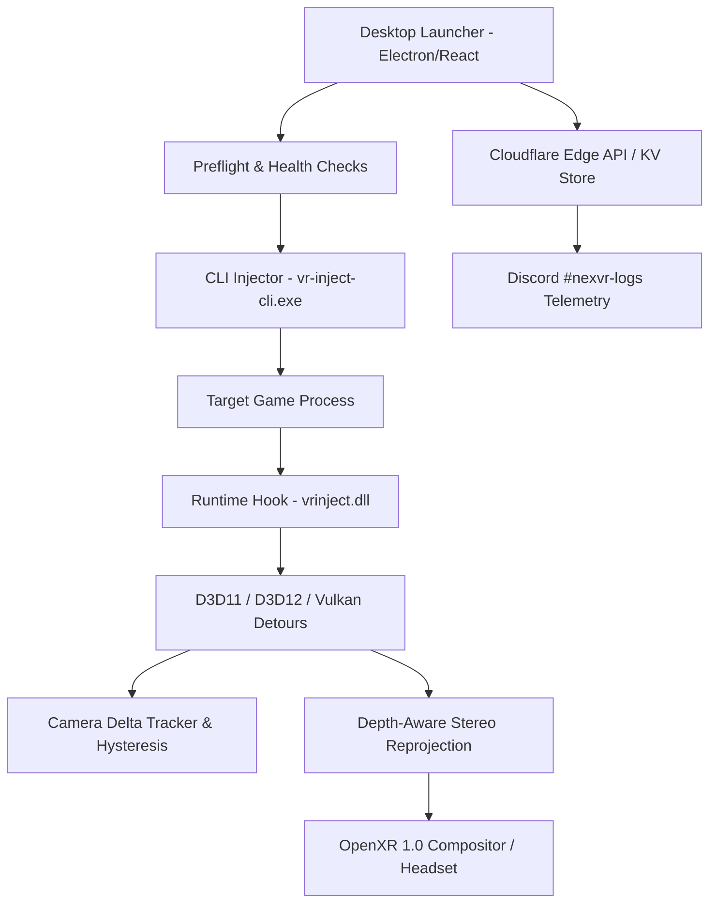

# NexVR Engine: Startup Strategy & Business Roadmap
*Strategic Planning Document · September 2026 · From Functional Beta to Commercial Launch*

---

## Executive Thesis: Prove Reliability Before Universality

> **Core Strategic Decision:**
> NexVR's immediate challenge is not supporting thousands of games. It is proving that a new user can select a supported game, enter VR, play comfortably for an extended session, and return to do it again—without breaking their game installation or risking an account ban.
> 
> Treat NexVR as a **compatibility and reliability platform first**, a **universal VR conversion platform second**. Launch with a carefully tested catalog, establish trust with PC VR enthusiasts, and expand compatibility only when each additional game can be supported without compromising the experience of existing users.

---

## 12-Month Executive Roadmap

```mermaid
gantt
    title NexVR 12-Month Commercial Execution Roadmap
    dateFormat  YYYY-MM
    section Phase 1: Foundation
    M1-2: Reliability & Safety (Trinity Freeze)     :active, p1, 2026-09, 2026-11
    section Phase 2: Community Beta
    M3-4: Closed Beta (50-100 Testers)              :p2, 2026-11, 2027-01
    section Phase 3: Monetization
    M5-6: Paid Validation ($5/mo & $39/yr)          :p3, 2027-01, 2027-03
    section Phase 4: Public Launch
    M7-9: Public v1.0 & Creator Seeding             :p4, 2027-03, 2027-06
    section Phase 5: Scale
    M10-12: Catalog Expansion & Pre-Seed Raise      :p5, 2027-06, 2027-09
```

### Detailed Phase Breakdown

1. **Months 1–2: Reliability and Safety (Critical Path)**
   - Freeze the three-game beachhead (*Sekiro: Shadows Die Twice*, *Hogwarts Legacy*, *Mortal Shell*).
   - Build reproducible compatibility tests and enforce safe failure/recovery mechanisms.
   - Establish a transparent, enforceable 3-Tier anti-cheat policy.
2. **Months 3–4: Closed Beta (50–100 Qualified Testers)**
   - Measure successful first sessions, crash frequencies, vestibular discomfort, repeat usage, and willingness to pay.
3. **Months 5–6: Paid Validation (Limited Paid Tier)**
   - Validate actual purchases and renewal intent before building expensive cloud or AI infrastructure.
4. **Months 7–9: Public v1.0 Commercial Launch (Conditional on Release Gates)**
   - Launch only if safety, compatibility, usability, and support metrics meet the agreed release gates.
   - Initiate creator-led distribution (*Habie147*, *Beardo Benjo*, *VROasis*) and Flat2VR partnerships.
5. **Months 10–12: Expansion & Seed Round**
   - Add verified game profiles sequentially, track subscription retention, and open investor conversations.

---

## 1. MVP Roadmap & Beachhead Strategy

### Current State & Problem
NexVR v0.1.90-beta includes three technically diverse titles in its initial beachhead:

| Game | Graphics API | Engine Type | Role in Beachhead |
| :--- | :--- | :--- | :--- |
| **Sekiro: Shadows Die Twice** | DirectX 11 | FromSoftware Proprietary | High-speed melee combat, rapid camera rotation, precision timing |
| **Hogwarts Legacy** | DirectX 12 | Unreal Engine 4/5 | Heavy modern graphics pipeline, complex lighting, dynamic shadows |
| **Mortal Shell** | DirectX 11 | Unreal Engine 4 | Demanding third-person action with custom post-processing |

There are three distinct products inside NexVR:
1. **Desktop Game Launcher**: Discovers and organizes installed games with an intuitive consumer UI.
2. **Runtime Injection Layer**: Intercepts graphics swapchains and manages OpenXR 1.0 stereo composition.
3. **Compatibility Service**: Maintains and distributes verified, version-locked game configurations.

### v1.0 Acceptance Release Gates

| Metric | Release Target | Operational Significance |
| :--- | :--- | :--- |
| **Successful Launch Rate** | ≥ 95% | On documented supported hardware configurations |
| **First-Time Setup Success** | ≥ 90% | Without manual developer intervention |
| **Crash-Free Sessions** | ≥ 99% | Zero unhandled exceptions or memory leaks caused by NexVR |
| **Defect-Free Sessions** | ≥ 95% | No severe visual glitches, FOV warp, or camera drift |
| **Time to First VR Gameplay** | ≤ 10 minutes | From download completion to in-headset play |
| **Recovery from Failed Launch** | ≤ 2 minutes | Restores game directory cleanly with zero data loss |
| **Anti-Cheat Incidents** | **0** | Strict adherence to single-player offline policy |

### Feature Prioritization: v1.0 vs v2.0+

#### v1.0 Must-Have (Critical Path)
- Desktop launcher with automatic detection of installed Steam/Epic games.
- Curated catalog with explicit support status and known limitations.
- One-click launch for verified profiles.
- Safe installation and clean DLL removal process.
- Local profile storage, backup, and rollback.
- In-headset ImGui dashboard for IPD, convergence, and recentering.
- Crash diagnostics, support bundle export, and privacy-first log redaction.
- Authenticode-signed binaries and secure SHA-256 update verification.
- Mandatory first-run legal, anti-cheat, and health disclaimer modal.

#### v2.0+ (Nice-to-Have / Post-PMF)
- Cloud profile synchronization and cross-device version history.
- Community profile sharing marketplace with moderation and voting.
- Neural inpainting for edge disocclusion gap filling.
- Automatic AI-driven camera matrix classification for unprofiled titles.
- Large catalog expansion (100+ titles).

---

## 2. Market Validation & Demand Metrics

### Five Stages of Demand Validation
1. **Qualified Interest**: Track how many gamers with a compatible PC and headset request beta access.
2. **Activation**: Measure how many successfully install NexVR and reach their first VR session.
3. **Engagement**: Track repeat usage, session duration, and multi-game play.
4. **Monetization**: Measure conversion rates and refund requests at real price points.
5. **Retention & Advocacy**: Measure paid renewals and voluntary community recommendations.

### Key Quantitative Targets

| Metric | Initial Target | Business Purpose |
| :--- | :--- | :--- |
| **Beta Activation** | ≥ 60% of invited testers | Validates setup flow and onboarding appeal |
| **First-Session Success** | ≥ 90% of activated testers | Tests out-of-the-box hardware compatibility |
| **D7 Retention** | ≥ 30% | Tests whether users return after novelty fades |
| **D30 Retention** | ≥ 20% | Demonstrates long-term utility |
| **Median Session Duration** | ≥ 45 minutes | Assesses ergonomic comfort and immersive value |
| **Paid Conversion** | ≥ 5% of activated users | Proves initial willingness to pay |
| **Month-2 Paid Retention** | ≥ 70% | Tests subscription durability |
| **Refund Rate** | ≤ 10% | Validates that expectations match reality |
| **Support Burden** | ≤ 0.3 tickets / active user / mo | Ensures operations can scale sustainably |

---

## 3. Technical & Technological Requirements

### System Architecture Overview



### The Three Hardest Technical Challenges

1. **Game Detection Accuracy**:
   - *Approach*: Combine official storefront local manifests (Steam `appmanifest_<id>.acf`) with heuristic executable signature checks.
   - *Target*: ≥ 98% precision for automatic detection.
2. **Camera Discovery & Lock Stability**:
   - *Approach*: Runtime memory scanner utilizing camera delta tracking, hysteresis thresholds (preserving locks at ≥90% confidence during idle/WASD movement), and aspect-ratio validation (filtering out square shadow cascades).
   - *Target*: ≥ 95% of tested sessions maintain stable camera lock without drift.
3. **OpenXR Frame Pacing & Comfort**:
   - *Approach*: Decouple desktop 60 Hz VSync (`effectiveSyncInterval = 0`) when OpenXR is presenting; submit frames within the strict 11.1ms (90Hz) window.
   - *Target*: 0 dropped compositor frames during normal gameplay.

---

## 4. Go-to-Market Strategy & Creator Seeding

### Positioning Statement
> **"Play supported PC games in VR, with a 1-click launcher and verified compatibility."**
> *(Avoid claiming universal support for 90,000 games before individual titles are battle-tested).*

### Creator Seeding Program
Direct outreach to leading VR creators (*Habie147*, *Beardo Benjo*, *VROasis*, *Cas and Chary*):
- Provide a turnkey, pre-configured setup with 0 friction.
- Give early access to high-demand spectacle titles (*Sekiro*, *Hogwarts Legacy*).
- Never mandate scripted talking points; embrace honest feedback.
- A single high-performing YouTube gameplay video delivers higher conversion than $20,000 in paid ads.

---

## 5. Business Model & Monetization Architecture

### Free vs. Premium Tier Matrix

| Feature | Free Tier | Premium Tier ($5/mo or $39/yr) |
| :--- | :---: | :---: |
| **Core Local Injector (DX11, DX12, Vulkan)** | ✅ Included | ✅ Included |
| **Verified Trinity Profiles (Local)** | ✅ Included | ✅ Included |
| **In-Headset VR Dashboard (ImGui)** | ✅ Included | ✅ Included |
| **Basic Manual Settings & Overrides** | ✅ Included | ✅ Included |
| **Cloud Profile Auto-Sync & Cloud Backup** | ❌ | ✅ Included |
| **Verified Profile Updates (OTA)** | ❌ | ✅ Included |
| **Advanced 1-Click Game Tuning Presets** | ❌ | ✅ Included |
| **Neural Inpainting & Custom Models** | ❌ | ✅ Included (v2.0) |
| **Priority Developer Support** | Community | Direct Discord Ticket |

### Unit Economics (Illustrative Scenario)

$$\text{Estimated LTV} = \frac{\text{Monthly Revenue} \times \text{Gross Margin}}{\text{Monthly Churn}} = \frac{\$5 \times 80\%}{8\%} = \$50.00$$

Target Customer Acquisition Cost (CAC) at a healthy 3:1 ratio: **≤ $16.67**.

---

## 6. Legal, EULA & Anti-Cheat Safeguards

### The 3-Tier Anti-Cheat Posture

```
+-----------------------------------------------------------------+
| TIER 1: Single-Player / Offline (FULLY SUPPORTED)               |
| No active anti-cheat. Single-player titles. Supported natively. |
+-----------------------------------------------------------------+
| TIER 2: Light Anti-Cheat / Mod-Friendly (OFFLINE ONLY)          |
| Games with EAC disabled or launched in offline mode.            |
+-----------------------------------------------------------------+
| TIER 3: Strict Anti-Cheat (PERMANENTLY BLACKLISTED)             |
| Vanguard, BattlEye, active EAC, Ricochet. Injection blocked.    |
+-----------------------------------------------------------------+
```

### Risk Mitigation Policy
1. **Zero Anti-Cheat Bypass**: NexVR will never attempt to circumvent active anti-cheat protections.
2. **EULA Insulation**: Software operates purely as a local graphics presentation wrapper. Does not distribute copyrighted game assets or modify game binaries on disk.
3. **Trademark Fair Use**: Game titles and publisher names are used strictly for compatibility identification. Explicit non-affiliation disclaimers are presented in the launcher and documentation.

---

## 7. Funding & Resource Allocation

### Proposed $350,000 Pre-Seed Budget Breakdown

| Budget Category | Allocation (%) | Amount ($) | Strategic Purpose |
| :--- | :---: | :---: | :--- |
| **Engineering Hires** | **50%** | $175,000 | Senior Graphics/VR Systems Engineer (MSVC/Direct3D/Vulkan) |
| **Testing & Hardware** | **12%** | $42,000 | Multi-GPU test rigs (RTX 3060 to 4090, AMD RX 7900) & headsets |
| **Legal & Security** | **11%** | $38,500 | Software licensing counsel, EULA review, security audit |
| **Community & Distribution** | **10%** | $35,000 | Creator seeding packages, documentation, community manager |
| **Reserve Buffer** | **10%** | $35,000 | 3-month operational runway contingency |
| **Cloud & Infrastructure** | **7%** | $24,500 | Cloudflare KV/D1 databases, object storage, build servers |
| **Total** | **100%** | **$350,000** | **12–18 Month Runway to Sustainable Series Seed** |

---

## Implementation Status & Immediate Next Steps

As of **September 2026 (v0.1.90-beta)**, the technical implementation has already surpassed the initial planning baseline:
- ✅ **Trinity Engines Verified**: DX11 (*Sekiro*), DX12 (*Hogwarts Legacy*), and Vulkan adapters functional.
- ✅ **Automated Dual Telemetry**: Live Cloudflare KV + Discord `#nexvr-logs` telemetry pipeline operational.
- ✅ **Legal & Safety Modal**: Mandatory first-run liability waiver and health advisory deployed.
- ✅ **Desktop Packaging**: Authenticode-signed NSIS and Portable installers generated for v0.1.90.

### Immediate Action Checklist
- [x] Freeze Trinity scope and verify regression test suites.
- [x] Deploy edge telemetry pipeline and in-launcher bug submission modal.
- [x] Configure encrypted webhook secrets on Cloudflare Pages.
- [ ] **Send Founder's Ring invitation (`docs/FOUNDERS_RING_INVITATION.md`) to initial 5–10 VIP testers.**
- [ ] **Track first 50 gameplay sessions in `docs/PHASE_1_FEEDBACK_TRACKER.md`.**
- [ ] **Schedule preliminary legal consultation for commercial EULA review.**
