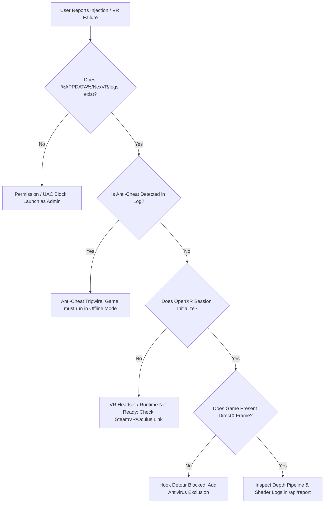

# NexVR Engine — User PC vs. Dev Environment Parity & Diagnostics Guide

> **Core Problem Statement**  
> *"It works on my machine"* is the single most common failure mode in software distribution. Developer workstations have compilers, SDKs, administrator privileges, high-end GPUs, and clean environment paths that standard consumer PCs lack.  
> This document details the **11 core dimensions of environment parity**, how the NexVR Engine monorepo enforces them in code, how to diagnose discrepancies on end-user machines, and the exact mitigations implemented.

---

## Table of Contents
1. [1. Environment Consistency (OS & Runtimes)](#1-environment-consistency-os--runtimes)
2. [2. Dependency Management & Packaging](#2-dependency-management--packaging)
3. [3. Configuration Settings & Path Hygiene](#3-configuration-settings--path-hygiene)
4. [4. Network & Backend Access](#4-network--backend-access)
5. [5. Browser & UI Compatibility](#5-browser--ui-compatibility)
6. [6. Error Logging & Remote Reporting](#6-error-logging--remote-reporting)
7. [7. Security, Permissions & Antivirus](#7-security-permissions--antivirus)
8. [8. Build & Deployment Consistency (CI/CD)](#8-build--deployment-consistency-cicd)
9. [9. Local Storage & Cache Invalidation](#9-local-storage--cache-invalidation)
10. [10. Hardware & Performance Constraints](#10-hardware--performance-constraints)
11. [11. Documentation, Diagnostics & Support](#11-documentation-diagnostics--support)
12. [End-User Diagnostic Decision Tree](#end-user-diagnostic-decision-tree)

---

## 1. Environment Consistency (OS & Runtimes)

### Potential Discrepancy
- **Developer PC:** Visual Studio 2022 Community/Professional, Windows 10/11 SDK (10.0.22621+), Vulkan SDK 1.3, Node.js 20+, Python 3.11+, and DirectX Shader Compiler (`dxc.exe`) in `PATH`.
- **User PC:** Vanilla Windows 10 or 11 Home/Pro (often missing C++ runtimes), no Node.js, standard consumer graphics drivers, varying OpenXR runtimes (Meta Quest Link, SteamVR, Virtual Desktop VDXR, or WMR).

### NexVR Code Enforcement & Implementation
1. **Self-Contained Launcher:**  
   The Electron launcher (`nexvr-client/launcher`) embeds its own Node.js runtime and Chromium engine. End-users do not need to install Node, npm, or any external framework.
2. **C++ Runtime Requirement:**  
   The native DLL (`vrinject.dll`) and CLI injector (`vr-inject-cli.exe`) are compiled with MSVC x64 (`/MD`). The NSIS installer (`electron-builder.config.js`) handles user-level deployment without requiring developer toolchains.
3. **Minimum OS Baseline:**  
   Enforced at Windows 10 Version 1809 (Build 17763) or Windows 11 64-bit to support DirectML (DirectX 12 Compute) and OpenXR 1.0.34.

### Diagnostic Command for User Machines
```powershell
# Verify OS version and architecture
Get-CimInstance Win32_OperatingSystem | Select-Object Caption, Version, OSArchitecture, BuildNumber

# Check installed Visual C++ Redistributables
Get-ItemProperty HKLM:\Software\Microsoft\Windows\CurrentVersion\Uninstall\* |
  Where-Object DisplayName -like "*Visual C++*" |
  Select-Object DisplayName, DisplayVersion
```

---

## 2. Dependency Management & Packaging

### Potential Discrepancy
- **Developer PC:** All native artifacts (`vrinject.dll`, `vr-inject-cli.exe`, `onnxruntime.dll`, `DirectML.dll`, shaders, profiles) reside in the root `build/bin/` directory alongside unit tests.
- **User PC:** Target games are located across various drives (e.g., `D:\SteamLibrary\steamapps\common\...`). Windows DLL search order (`LoadLibrary`) looks in the target game's executable folder and `System32`, **not** in the launcher's directory. If support DLLs are missing from the game directory, injection fails silently or crashes with `0xC0000135` (DLL Not Found).

### NexVR Code Enforcement & Implementation
1. **Automated DLL Staging by Injector:**  
   In `nexvr-client/src/injector/main.cpp` (lines 373–391), the injector automatically copies `onnxruntime.dll` and `DirectML.dll` into the game executable's directory prior to injection:
   ```cpp
   const char* supportDlls[] = {"onnxruntime.dll", "DirectML.dll"};
   for (const char* f : supportDlls) {
       std::string dst = copyDst + "\\" + f;
       // Copies runtime dependencies directly next to the game exe
   }
   ```
2. **Packaging Enclosure in `electron-builder.config.js`:**  
   The `extraResources` manifest packages all 7 mandatory runtime dependencies:
   - `vrinject.dll`
   - `vr-inject-cli.exe`
   - `onnxruntime.dll`
   - `DirectML.dll`
   - `shaders/` (HLSL compute shaders compiled to bytecode)
   - `models/` (dummy ONNX models for testing / inference weights)
   - `profiles/` (per-game configuration presets)
3. **Static Regression Gate:**  
   `nexvr-client/launcher/e2e/regression-static.spec.ts` (Tests 1 & 2) fails CI if any native dependency is omitted from the packaging configuration.

---

## 3. Configuration Settings & Path Hygiene

### Potential Discrepancy
- **Developer PC:** May contain hardcoded developer paths (`C:\Users\sathi\...`), local backend endpoints (`http://localhost:3000`), or manual debug flags.
- **User PC:** Custom drive letters (`E:\Games\`), non-ASCII usernames (`C:\Users\José\`), strict file permissions, and cloud API endpoints.

### NexVR Code Enforcement & Implementation
1. **Zero Hardcoded Developer Paths:**  
   Enforced by architectural coupling checks (`scripts/check_coupling.ps1`). All runtime asset lookups use dynamic path resolution relative to `app.getAppPath()` or `process.resourcesPath` via `nexvr-client/launcher/electron/utils.ts`.
2. **Per-Game Tuning Persistence:**  
   In `src/injector/main.cpp` (lines 393–409), the injector checks if `vrinject.json` already exists in the game folder. It **never overwrites** existing user configuration, preserving custom reverse-Z depth or resolution tuning.
3. **Canonical Cloudflare Edge Endpoints:**  
   All telemetry, crash reporting, and OTA updates point to production edge endpoints:
   - Production API: `https://nexvr-engine.pages.dev/api/report`
   - Production OTA: `https://nexvr-engine.pages.dev/api/ota`

---

## 4. Network & Backend Access

### Potential Discrepancy
- **Developer PC:** Direct broadband connection with open development ports.
- **User PC:** Strict corporate/school firewalls, VPNs, custom DNS (Pi-hole), or completely offline gaming environments.

### NexVR Code Enforcement & Implementation
1. **100% Offline Standalone Operation:**  
   The core functionality of NexVR (stereoscopic 3D injection, OpenXR tracking, compute shaders, and profile management) runs entirely offline. An internet connection is **never** required to play games in VR.
2. **Fail-Closed, Non-Blocking Edge Network Requests:**  
   In `nexvr-client/launcher/electron/telemetryManager.ts`, network requests to `/api/report` use asynchronous `fetch` calls with tight timeouts (3000ms). If the user is offline or the request is blocked by a firewall, the error is caught silently without disrupting the launcher UI or game injection.
3. **CORS & Token Protection:**  
   The Cloudflare Pages Edge backend validates requests using `NEXVR_AUTH_TOKEN` headers, rejecting unauthorized external scrapers with HTTP 401.

---

## 5. Browser & UI Compatibility

### Potential Discrepancy
- **Web App Issue:** Differences across Safari, Chrome, Firefox, and Edge rendering engines, missing CSS features, or broken JavaScript APIs.
- **Desktop Parity Advantage:** The NexVR Launcher executes inside a dedicated Electron desktop container.

### NexVR Code Enforcement & Implementation
1. **Unified Chromium Engine:**  
   By bundling Chromium, the desktop launcher eliminates 100% of cross-browser rendering inconsistencies.
2. **Vanilla CSS Design System:**  
   The launcher UI (`nexvr-client/launcher/src/index.css`) utilizes standard CSS variables (`--ag-accent`, `--ag-surface`, `--ag-border`) and hardware-accelerated transforms (`transform: translateY()`, `transition: all 0.3s ease-out`).
3. **Public Landing Page Parity:**  
   The marketing website and documentation (`nexvr-docs/landing-page`) are written in standards-compliant HTML5/CSS3 and tested against WebKit, Gecko, and Blink for responsive mobile and desktop viewports.

---

## 6. Error Logging & Remote Reporting

### Potential Discrepancy
- **Developer PC:** Visual Studio debugger attached; crashing code pauses immediately at the faulting instruction with full stack frames.
- **User PC:** Game crashes to desktop (CTD) with no visible error message, leaving the user confused and frustrated.

### NexVR Code Enforcement & Implementation
1. **SEH Crash Isolation Boundaries:**  
   All graphics hook entry points (`dx11_hook.cpp`, `dx12_hook.cpp`, `vulkan_hook.cpp`) are wrapped in Win32 Structured Exception Handling (`__try / __except`). If an access violation occurs inside a detour, it is caught, logged to disk, and the original game present call is resumed without crashing the game.
2. **Structured Disk Logging:**  
   Logs are written in real time to `%APPDATA%\NexVR\logs\injection_<pid>.log`.
3. **Automated PII Scrubbing:**  
   Before any log is transmitted via the "Report Issue" button, `telemetryManager.ts` scrubs sensitive personal information:
   - Windows user profile paths: `C:\Users\<username>\` $\rightarrow$ `C:\Users\[USER]\`
   - Internal IPv4 addresses $\rightarrow$ `[REDACTED_IP]`
4. **User Privacy Control:**  
   Telemetry is strictly opt-in (`telemetryOptIn: false` by default).

---

## 7. Security, Permissions & Antivirus

### Potential Discrepancy
- **Developer PC:** Running as Administrator with Windows Defender exclusions configured for the build directory.
- **User PC:** Standard non-admin user account, games installed in `C:\Program Files\`, Windows Defender SmartScreen active, and aggressive heuristic antivirus scanners (Bitdefender, Norton, Avast).

### NexVR Code Enforcement & Implementation
1. **UAC Elevation Handling:**  
   In `injectionManager.ts`, when targeting elevated games or games in protected folders, the launcher initiates an elevated PowerShell command (`Start-Process -Verb RunAs`) to launch `vr-inject-cli.exe` with necessary injection privileges (`SeDebugPrivilege`).
2. **Windows Defender Exclusion Script:**  
   NexVR provides a one-click PowerShell helper (`scripts/whitelist_defender.ps1`) allowing users to add a Defender exclusion:
   ```powershell
   Add-MpPreference -ExclusionPath "$env:LOCALAPPDATA\Programs\NexVR"
   ```
3. **Active Anti-Cheat Tripwires:**  
   `libraryManager.ts` scans the game directory before injection for signatures of kernel anti-cheat systems (Easy Anti-Cheat, BattlEye, Vanguard, Ricochet). Injection is immediately aborted with a clear explanation to protect the user from accidental bans.
4. **Authenticode Code Signing:**  
   CI signs binaries using `scripts/sign_binaries.ps1` whenever `SIGN_CERT_PATH` is provided, preventing Windows SmartScreen untrusted publisher warnings.

---

## 8. Build & Deployment Consistency (CI/CD)

### Potential Discrepancy
- **Developer PC:** Uncommitted local changes, leftover test files, or debug DLL configurations packaged by mistake.
- **User PC:** Expects deterministic, tested, and reproducible production binaries.

### NexVR Code Enforcement & Implementation
1. **Automated GitHub Actions Release Pipeline:**  
   `.github/workflows/release.yml` compiles Release builds from a clean VM, running:
   - Full MSVC x64 C++ compilation
   - 85 CTest unit and integration suites
   - 17 Playwright static regression tests
   - 6 architectural coupling ratchets
2. **Cryptographic Binary Hash Validation:**  
   `vr-inject-cli.exe` embeds a compile-time SHA-256 hash (`build/expected_hash.h`). It verifies `vrinject.dll` on disk before performing remote thread injection, rejecting corrupted or tampered DLLs.
3. **Ed25519 Signed OTA Updates:**  
   `updateManager.ts` requires all OTA update packages to carry a valid cryptographic digital signature matching the launcher's pinned public key.

---

## 9. Local Storage & Cache Invalidation

### Potential Discrepancy
- **Developer PC:** Clean build directory regenerated after each `cmake --build`.
- **User PC:** Stale `%APPDATA%\NexVR\updates` cache files from previous versions lingering on disk, shadowing new features or causing binary incompatibility.

### NexVR Code Enforcement & Implementation
1. **Automatic Stale OTA Cache Purging:**  
   In `updateManager.ts`, `purgeStaleOtaCache()` automatically deletes cached OTA assets whenever:
   - The launcher version increases (e.g., from `0.1.96` to `0.1.97`).
   - The local binary version is newer than the cached update.
2. **Dev-Mode Precedence Protection:**  
   `pickPreferredAsset()` in `injectionManager.ts` guarantees that in development environments, local build artifacts (`build/bin/`) always take precedence over downloaded OTA caches.

---

## 10. Hardware & Performance Constraints

### Potential Discrepancy
- **Developer PC:** High-end desktop GPU (RTX 4090 / 3080 Ti), 32GB+ RAM, fast NVMe SSD, wired DisplayPort VR headset.
- **User PC:** Entry-level GPU (RTX 2060, GTX 1660 Ti, Radeon RX 6600), 16GB shared RAM, wireless Meta Quest 3 over Wi-Fi 5, VRAM constraints.

### NexVR Code Enforcement & Implementation
1. **Strict 11.1ms Frametime Budget (90 FPS VR):**  
   The OpenXR rendering loop decouples the game render thread from headset frame submission using asynchronous timewarp reprojection.
2. **Sub-1.5ms Compute Shader Disocclusion:**  
   The stereoscopic disocclusion bilateral filter executes via HLSL compute shaders (`disocclusion_cs_dx11.hlsl` / `disocclusion_cs_dx12.hlsl`) directly on the graphics queue in under 1.5ms.
3. **Zero Resource Leak Invariant:**  
   To prevent out-of-memory crashes during prolonged play sessions, `dx11_renderer.cpp` and `dx12_renderer.cpp` explicitly release all swapchain render target views and backbuffer pointers whenever `ResizeBuffers` is called (BUG-13 fix).
4. **Graceful Fallback:**  
   If compute queue disocclusion fails or DirectML is unsupported on older GPUs, the engine falls back seamlessly to monoscopic passthrough or raw stereo projection without crashing.

---

## 11. Documentation, Diagnostics & Support

### Potential Discrepancy
- **Developer PC:** Full knowledge of architecture, hotkeys, and log file paths.
- **User PC:** Needs clear, non-technical instructions, automated diagnostics, and responsive support channels.

### NexVR Code Enforcement & Implementation
1. **In-App System Diagnostics:**  
   The launcher About and Status views provide real-time hardware status:
   - Detected OpenXR Runtime (Meta / SteamVR / VDXR)
   - GPU Vendor & Architecture
   - Hook Status & Injection State
2. **Published Beta Testing Guide:**  
   Detailed walkthroughs for Meta Quest, Valve Index, and Windows MR headsets in `docs/BETA_TESTING_GUIDE.md`.
3. **One-Click Support Access:**  
   Persistent Discord community invite (`https://discord.gg/FBeGjgK2fd`) and issue reporting modal integrated into the launcher header and footer.

---

## End-User Diagnostic Decision Tree

When an end-user reports: *"The launcher opens, but the game doesn't go into VR"* — follow this ordered diagnostic triage:



By systematically enforcing these 11 areas, NexVR Engine ensures that code developed and tested in the dev environment executes reliably, securely, and performantly on real-world consumer PCs.
