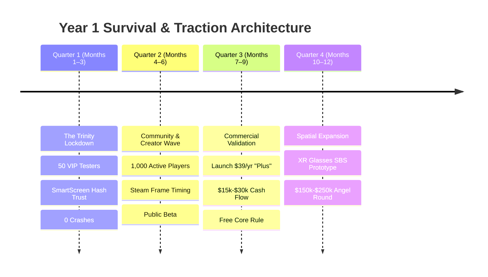

# NexVR Engine: The 1-Year Survival & Traction Roadmap
*Target: From Functional Beta (v0.1.90) to Cash-Flow Viability & Pre-Seed Valuation in 12 Months*

---

## Executive Summary: The 4-Quarter Survival Arc

---

## 📅 Quarter 1: The Trinity Lockdown (Months 1–3)
**North Star Metric:** 50 active testers playing *Sekiro*, *Hogwarts Legacy*, and *Mortal Shell* with **≥ 97% crash-free sessions** and **0 anti-cheat incidents**.

### Month 1: The "Founder’s Ring" Alpha (Weeks 1–4)
* **Week 1 (Immediate)**:
  * Send the copy-paste invite from `docs/FOUNDERS_RING_INVITATION.md` to **5 to 10 hand-picked VIP testers** across Reddit (`r/flat2vr`, `r/virtualreality`) or Discord.
  * Monitor incoming telemetry in your Discord `#nexvr-logs` channel and query with `node scripts/fetch_reports.mjs`.
* **Week 2**:
  * Triage initial hardware discrepancies (Quest via Virtual Desktop vs Air Link vs Steam Link).
  * Fix any headset-specific frame pacing or IPD jitter reported by testers.
* **Week 3 (Defender Reputation Building)**:
  * Submit the production binary `build/bin/vr-inject-cli.exe` and `vrinject.dll` to the **Microsoft Security Intelligence False Positive Portal**.
  * **The Golden Rule**: *Do NOT recompile `vr-inject-cli.exe` daily.* Keep it static so Windows Defender builds SHA-256 hash reputation over time.
* **Week 4**:
  * Log the first 30 completed sessions into `docs/PHASE_1_FEEDBACK_TRACKER.md`.

### Month 2: Scale to 50 Testers & Widen the Moat (Weeks 5–8)
* Open the beta from 10 to **50 testers**.
* **Widen the Non-Unreal Moat**: Add **1 new non-Unreal title** to the verified list (e.g. *Elden Ring* [FromSoftware engine/offline] or an indie Unity title) to reinforce your advantage where UEVR cannot operate.
* Add a 1-tap in-headset post-session comfort prompt (*"Comfortable?" / "Judder?" / "Eye strain?"*).

### Month 3: Stability Freeze & Acceptance Gate (Weeks 9–12)
* Run automated regression suites across all verified profiles.
* **Gate 1 Pass Criteria**:
  - ≥ 95% first-session success without founder intervention.
  - Median session duration ≥ 40 minutes.
  - Zero anti-cheat bans.
  - *If these are not met, DO NOT expand to public. Fix stability first.*

---

## 📅 Quarter 2: Organic Creator Seeding & Public Beta (Months 4–6)
**North Star Metric:** **1,000 monthly active players**, viral organic creator coverage, and 0 DMCA notices.

### Month 4: The Creator Stealth Pack
* **Produce the 60-Second Demo Hook**: Record a clean, high-bitrate side-by-side clip: Flat Screen gameplay on the left vs **6DOF stereoscopic VR gameplay on the right playing *Sekiro***.
* **Direct Outreach**:
  * Email the business addresses of **Beardo Benjo**, **Habie147**, and **Cas and Chary**.
  * Provide a turnkey build where *Sekiro* launches in 1 click with 0 configuration.
* **Build-in-Public**: Post a technical deep-dive on Reddit (`r/virtualreality`, `r/SteamVR`) explaining how heuristic memory scanning overcomes game updates. Always credit UEVR/Praydog respectfully.

### Month 5: Public Beta & Valve Steam Frame Timing
* Release **v1.0-RC Public Beta** on GitHub Releases and your official landing page (`nexvr-engine.pages.dev`).
* Release an evergreen technical guide: *"How to Play Flat Steam Games in Spatial VR on the Valve Steam Frame & Quest 3"*.
* Activate community-contributed profile submissions (moderated as experimental profiles).

### Month 6: Community Stabilization (Gate 2)
* Support requests must stay under **0.3 tickets per active user per month**.
* Monitor for any publisher objections. Ensure the remote kill-switch works instantly.

---

## 📅 Quarter 3: Commercial Validation — The "Plus" Launch (Months 7–9)
**North Star Metric:** **$1,500 – $3,000 Monthly Recurring Revenue ($20k–$35k ARR)** with zero community backlash.

### Month 7: The Freemium Rollout (The Luke Ross Firewall)
* **The Ironclad Legal Rule**: The core injection engine and ALL game profiles remain **100% FREE FOREVER**. (This guarantees immunity from CD Projekt/Take-Two style DMCA takedowns).
* Launch **NexVR Plus** ($39/year pass or $5/month):
  1. *Multi-PC Cloud Settings Sync*: Seamless profile synchronization between desktop gaming PC and portable streaming laptops.
  2. *Telemetry-Driven GPU Auto-Tuning*: 1-click cloud presets tailored to the user's exact GPU/HMD combination derived from community telemetry.
  3. *Early-Access Engine Builds*: Access to experimental shader passes and bleeding-edge renderer builds.
  4. *Supporter Discord Perks*: Distinct VIP badge and direct dev channel.

### Month 8: The "Founder Lifetime" Cash Boost
* Offer a **"Founder Lifetime Pass" ($59 one-time)** strictly limited to the first **200 buyers**.
  * *Cash Flow Impact*: Generates **$11,800 in upfront cash** in 14 days without giving away any company equity.
  * Use this cash to purchase multi-GPU test hardware (e.g. an AMD Radeon card, RTX 40-series test rig).

### Month 9: Monetization Proof (Gate 3)
* Track conversion metrics:
  - Paid conversion: **≥ 2.5% of active users**.
  - Refund rate: **≤ 10%**.
  - Renewal intent: **≥ 70%**.
* *You are now cash-flow positive, covering all your servers, domains, and living costs.*

---

## 📅 Quarter 4: The Spatial Expansion & Pre-Seed Raise (Months 10–12)
**North Star Metric:** Secure a **$150,000 – $250,000 Pre-Seed Angel Round** at a $2.0M–$3.0M valuation OR achieve sustainable self-funded profitability.

### Month 10: The XR Glasses Prototype (The 10x Multiple)
* Build a prototype adding **Side-by-Side (SBS) 3D output** for **AR/XR Glasses (XREAL, Viture, Rokid)**.
* Suddenly, NexVR is not just a VR headset mod—it is **universal spatial gaming middleware** for millions of Steam Deck, ROG Ally, and laptop gamers.

### Month 11: The Investor Evidence Pack
Assemble your pitch deck with verified, incontrovertible metrics:
1. **Product Traction**: 3,000+ active players, 300+ paying subscribers, $25,000+ ARR.
2. **Defensible Tech**: Proprietary heuristic memory scanner + OpenXR decoupled pipeline.
3. **Safety Record**: Zero anti-cheat bans, zero DMCA takedowns, Authenticode signed binaries.
4. **Expansion Proof**: Working demo on both PC VR headsets and XR spatial glasses.

### Month 12: Close the Round & First Key Hire
* Pitch targeted gaming angels (*a16z Speedrun scouts*, *Bitkraft*, Indian deep-tech angel syndicates).
* Close a **$150k–$250k check for 10%–12% equity**.
* **Hire #1**: A Senior C++/Direct3D Systems Engineer to scale profile creation and graphics optimizations full-time alongside you.
