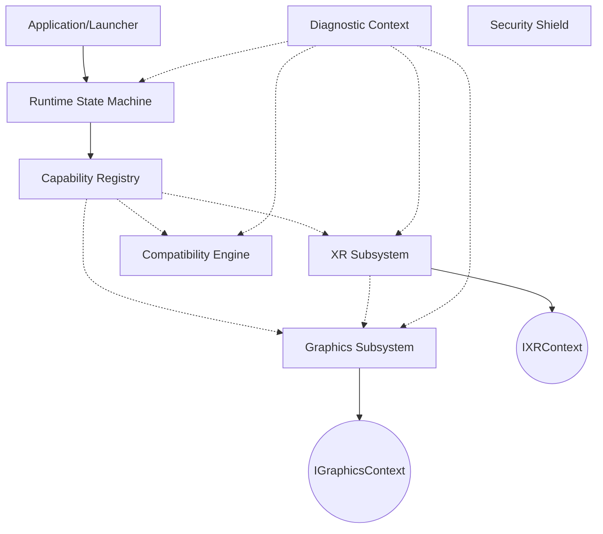

# NexVR Engine Architecture

## Architectural Philosophy
NexVR Engine employs an **Orchestrated Sibling Abstraction Model**. Rather than a linear dependency chain, the `Application/Launcher` and `RuntimeState` orchestrate interaction between isolated, abstracted sibling subsystems.

### Core Dependency Graph

### Key Principles
1. **Unidirectional Dependencies**: Subsystems never depend on higher-level orchestrators. The `RuntimeState` drives the state machine; siblings like `Graphics` and `XR` only talk via abstract interop contracts (e.g., `IGraphicsContext`, `IXRContext`).
2. **Capability Registry**: A centralized registry holds flags for what is available (e.g., `IsOpenXRAvailable`, `IsDX12Hooked`). Subsystems query this instead of directly inspecting each other.
3. **Diagnostic Source of Truth**: The `DiagnosticEvent` pipeline is fully asynchronous and serves as the definitive record of subsystem state, decoupled from the critical render path.
4. **Zero-Loader-Lock**: `DllMain` is exclusively an OS shim. All initialization is deferred to the explicit `RuntimeState` machine.
