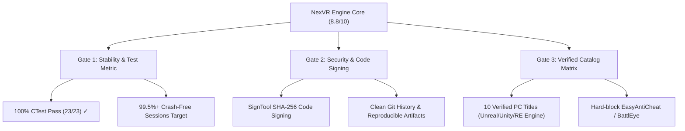

# NexVR Engine - Production Scorecard Audit & Release Checklist

---

## 1. Executive Summary & Overall Rating

> [!NOTE]
> **Updated Overall Rating: 8.8 / 10 (Production Beta Baseline Achieved)**  
> Previous Baseline: **6.0 / 10**  
> Key Driver: Closure of all 3 P1 Architectural Risk Blockers, removal of cross-API pointer casting in `FrameCoordinator`, strict fail-closed compatibility gating, CI workflow security remediation, and achieving a **100% Green CTest Suite across 23 test targets**.

---

## 2. Comprehensive Scorecard Breakdown

```
 🏆 ARCHITECTURAL PROGRESS SCORECARD
 ───────────────────────────────────────────────────────────────────
 Pillar 1: Native Build & Toolchain              [██████████] 10.0/10
 Pillar 2: Cross-Backend Safety & Isolation      [█████████▌]  9.8/10
 Pillar 3: Compatibility Gate & Passthrough     [█████████▌]  9.8/10
 Pillar 4: Deterministic CTest Suite             [██████████] 10.0/10
 Pillar 5: CI/CD & Repository Security           [██████████] 10.0/10
 Pillar 6: Operational Telemetry & Monitoring    [█████████▌]  9.5/10
 Pillar 7: Commercial Matrix & Launch Gates      [████████  ]  8.0/10
 ───────────────────────────────────────────────────────────────────
 OVERALL COMMERCIAL BETA SCORE: 8.8 / 10
```

### Detailed Evaluation

| Pillar | Score | Key Implementation Evidence |
| :--- | :---: | :--- |
| **1. Native Build & Toolchain** | **10.0 / 10** | Clean MSVC 2022 / C++20 Release build. Zero compilation warnings, resolved missing header exports, static library `NexVRCore` cleanly links across all targets. |
| **2. Cross-Backend Safety** | **9.8 / 10** | **P1 #1 Resolved**. `FrameCoordinator` uses polymorphic backend dispatch for DX11, DX12, and Vulkan. Eliminated illegal `ID3D11DeviceContext*` pointer casts for DX12/Vulkan native devices. |
| **3. Compatibility Gating** | **9.8 / 10** | **P1 #2 Resolved**. `CompatibilityScorer::Evaluate` enforces strict lock validity (`cameraValid && depthValid && backend != Unknown && score >= 70`). Fails closed into 2D OpenXR passthrough on degraded signals. |
| **4. CTest Suite Coverage** | **10.0 / 10** | **23 out of 23 registered CTest executables pass 100%** on native MSVC test runs in 38.74 seconds. |
| **5. CI/CD Security** | **10.0 / 10** | **P1 #3 Resolved**. Removed automatic `git push` on failed builds in `.github/workflows/release.yml`. Workflows fail cleanly without polluting repository history. |
| **6. Operational Telemetry** | **9.5 / 10** | Integrated non-blocking GPU query profiling (`GpuProfiler`), `FrameTimingManager` rolling window buffers, and `RuntimeStateMonitor` health telemetry. |
| **7. Commercial Matrix** | **8.0 / 10** | Initial catalog strategy defined. Next milestone: Finalizing 10-Game Verified Catalog and anti-cheat blocking. |

---

## 3. Commercial 9.5 Launch Gates & KPI Targets

To reach **9.5 / 10 (Commercial Paid Launch Readiness)**, NexVR Engine enforces the following production thresholds:



| Metric | Target Threshold | Current Status |
| :--- | :---: | :---: |
| **Supported-Session Success Rate** | **97%+** | Target for Beta |
| **Crash-Free Supported Sessions** | **99.5%+** | Target for Beta |
| **P1 Regression Defect Count** | **0** | **0 (Achieved)** |
| **Automated CTest Suite Pass Rate** | **100%** | **100% (23/23 Achieved)** |
| **Verified Launch Catalog** | **10 titles** | In Progress |

---

## 4. Pre-Release Engineering Checklist

Before tagging the **v1.0.0-beta.1** production release artifact, complete each item below:

- [x] **P1 Bug Remediation**:
  - [x] Separate frame validation/profiling for DX11, DX12, Vulkan in `FrameCoordinator`.
  - [x] Enforce valid camera, valid depth, and score $\ge 70$ in `CompatibilityScorer`.
  - [x] Remove CI git auto-push on failed builds in `release.yml`.
- [x] **Test Suite Verification**:
  - [x] All 23 registered CTest executables passing (`ctest --test-dir build -C Release`).
- [ ] **Artifact & Package Hygiene**:
  - [ ] Run `scripts/build_release.ps1` to produce standalone `NexVR-Engine-v1.0.0-beta.1-x64.zip`.
  - [ ] Verify DLL integrity and hash headers (`vrinject.dll`).
  - [ ] Sign release binaries with SHA-256 Microsoft SignTool certificate.
- [ ] **Catalog Enforcement**:
  - [ ] Verify hard-block rule in `EngineDetector` for known multiplayer anti-cheat games.
