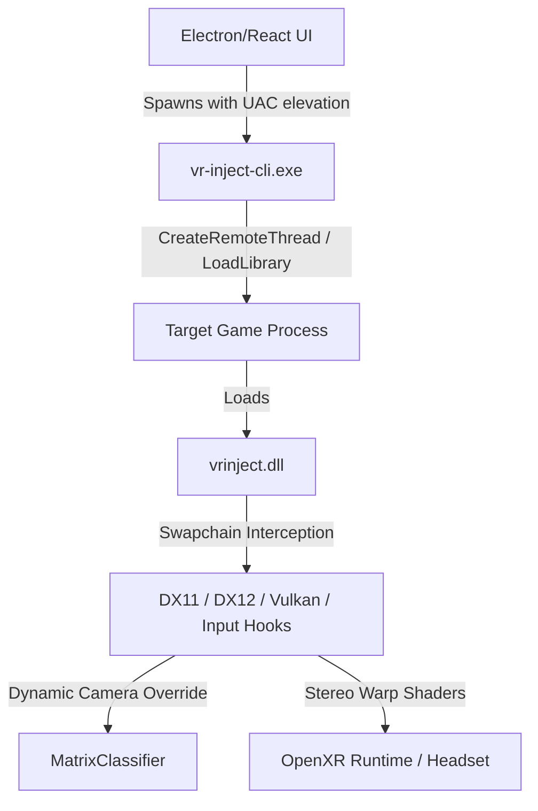

# NexVR Engine Project Memory

This document is the repo-local project memory for NexVR Engine. Use it as the first source of context before editing, adding features, or planning roadmap work.

## 1. Project Mission And Core Technology

NexVR Engine is a universal virtual reality injection layer that transforms flat-screen PC games into native, stereoscopic 3D VR experiences. It hooks DirectX 11, DirectX 12, and Vulkan render swapchains, converts mono outputs to stereo views with custom IPD, and projects them to OpenXR headsets.

Core stack:

- Launcher: Electron + React using Vite, TypeScript, and Tailwind CSS
- Injection CLI: C++ command-line injector, `vr-inject-cli.exe`
- Core hook engine: C++ DLL, `vrinject.dll`, using MinHook, Direct3D, Vulkan, and OpenXR

## 2. Codebase Architecture

## 3. Audit And Stability Resolutions

The codebase has already gone through a stability pass. Preserve these fixes when making future edits:

- BUG-01/02, MinHook stability: `HookManager` owns MinHook lifecycle. Avoid adding redundant initialization or shutdown in individual hooks such as `dx11_hook.cpp`.
- BUG-05, thread handle leak: `dllmain.cpp` should close worker thread handles after creation or cleanup.
- BUG-06, serialization failure: `config_manager.cpp` must keep C++ serialization in sync with launcher fields, including recommended resolution, sRGB correction, depth submission, raw input mode, and auto-inject.
- BUG-09, UI infinite loop: `injectionManager.ts` should use bounded polling when waiting for target game processes.
- DEAD-02/04, concurrency races: shared DX11 hook globals such as max depth pixels and frame callbacks should remain thread-safe.
- DEAD-05, DllMain deadlock: DLL detach cleanup should use bounded waits to reduce loader-lock risk.
- QUAL-01, injector duplication: use the unified injector in `src/injector/main.cpp`; do not reintroduce redundant injector implementations under `tools/`.
- QUAL-04, hardcoded launcher logic: avoid game-specific hardcoded icon exceptions in `libraryManager.ts`.

## 4. Current Milestone: Advanced Heuristic Memory Scanning

The active milestone is to move beyond hardcoded camera matrix pointers and basic constant-buffer hooks toward an active memory scanner.

Primary components:

- PageScanner: traverse dynamic RAM heaps with `VirtualQuery`, filtering for `MEM_COMMIT` and writable regions where projection or view matrices may reside.
- PointerChainResolver: backtrace dynamic matrix memory addresses to static base offsets, for example `Game.exe + 0x3AF10 -> +0x24 -> +0x180`, and cache paths for subsequent launches.
- CameraDeltaTracker: correlate matrix candidates with mouse delta or head-motion input to isolate matrices that respond directly to camera movement.

Implementation guidance:

- Keep scanning work off hot render paths.
- Use conservative memory access and guard against unreadable pages.
- Cache confidence scores and pointer chains per executable/profile.
- Prefer deterministic diagnostics in the launcher so users can see why a candidate was selected or rejected.

## 5. Next-Generation AI And Rendering Roadmap

The long-term roadmap includes seven AI-driven models optimized for an 11.1 ms frame budget.

Planned models:

- Spatial-Temporal Memory Transformer: encoder-only self-attention model for classifying raw dynamic memory vectors over 10-frame sequences.
- Depth-Aware Gated Inpainter: U-Net using gated convolutions and depth-buffer input to patch disocclusion holes without boundary color bleeding.
- OFA Vector Refiner: quantized CNN that corrects raw GPU optical-flow vectors for cleaner ASW frame synthesis.
- Comfort Guard MLP: dense network predicting simulation sickness risk from gaze vectors and rotational speed.
- Holographic UI Synthesizer: YOLOv8-tiny style model extracting 2D HUD components for projection as floating 3D panels.
- Gaze Predictor: LSTM or GRU model predicting pupil trajectory to offset eye-tracker latency.
- Neural Super Resolution: TSR-GAN style upscaler for low-resolution internal renders.

Execution blueprint:

- Synchronous path on the main render thread, under 1.5 ms: gaze predictor, comfort guard, and frame-generation refiner. These should compile to INT8 or FP16 with node fusion.
- Asynchronous worker path: memory transformer and inpainter mask generation. These should communicate through thread-safe atomics or bounded queues.

## 6. Working Rules For Future Edits

- Treat this file as living context, not a frozen spec. Update it when major architecture, roadmap, or stability assumptions change.
- Keep public distribution safety in mind: unsigned injection DLLs and CLIs are likely to trigger security products.
- Prefer clear diagnostics and reversible settings for experimental features.
- Avoid hardcoded per-game behavior unless it is isolated behind profiles or compatibility data.
- When editing launcher and C++ config surfaces, update both sides together to prevent profile drift.
