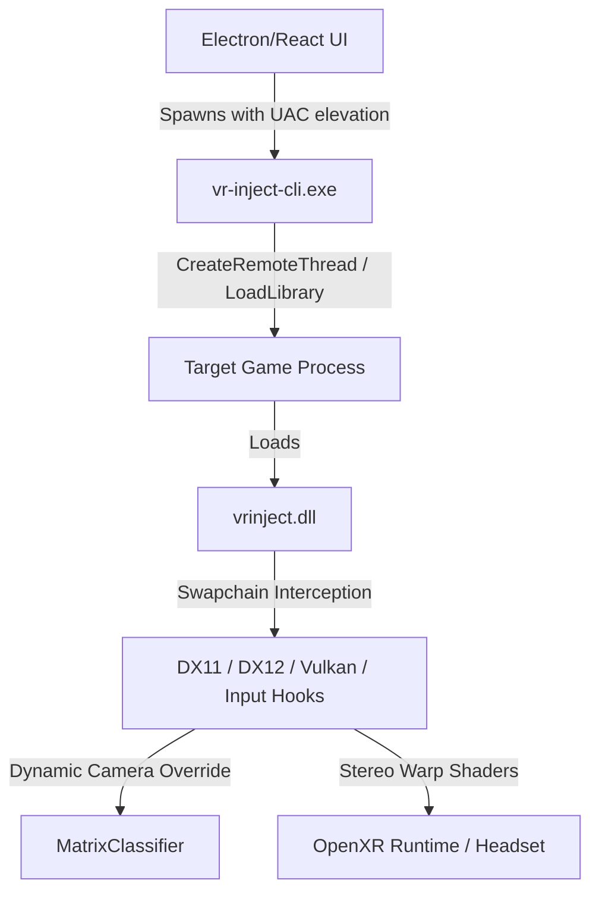

# NexVR Engine Project Memory

This document is the repo-local project memory for NexVR Engine. Use it as the first source of context before editing, adding features, or planning roadmap work.

## 1. Project Mission And Core Technology

NexVR Engine is a universal virtual reality injection layer that transforms flat-screen PC games into native, stereoscopic 3D VR experiences. It hooks DirectX 11, DirectX 12, and Vulkan render swapchains, converts mono outputs to stereo views with custom IPD, and projects them to OpenXR headsets.

Core stack:

- Launcher: Electron + React using Vite, TypeScript, and Tailwind CSS
- Injection CLI: C++ command-line injector, `vr-inject-cli.exe`
- Core hook engine: C++ DLL, `vrinject.dll`, using MinHook, Direct3D, Vulkan, and OpenXR

## 2. Codebase Architecture

```mermaid
graph TD
    Launcher[Electron/React UI] -->|Spawns with UAC elevation| CLI[vr-inject-cli.exe]
    CLI -->|CreateRemoteThread / LoadLibrary| Target[Target Game Process]
    Target -->|Loads| DLL[vrinject.dll]
    DLL -->|Swapchain Interception| Hooks[DX11 / DX12 / Vulkan / Input Hooks]
    Hooks -->|Dynamic Camera Override| Matrix[MatrixClassifier]
    Hooks -->|Stereo Warp Shaders| OpenXR[OpenXR Runtime / Headset]
```

## 3. Audit And Stability Resolutions

The codebase has already gone through a stability pass. Preserve these fixes when making future edits:

- BUG-01/02, MinHook stability: `HookManager` owns MinHook lifecycle. Avoid adding redundant initialization or shutdown in individual hooks such as `dx11_hook.cpp`.
- BUG-05, thread handle leak: `dllmain.cpp` should close worker thread handles after creation or cleanup.
- BUG-06, serialization failure: `config_manager.cpp` must keep C++ serialization in sync with launcher fields, including recommended resolution, sRGB correction, depth submission, raw input mode, and auto-inject.
- BUG-09, UI infinite loop: `injectionManager.ts` should use bounded polling when waiting for target game processes.
- BUG-14, DX12 Map/Unmap worker contention: never hook `ID3D12Resource::Map` / `Unmap` in universal depth mode to prevent worker thread lock contention and `DXGI_ERROR_INVALID_CALL` device removals.
- BUG-15, OpenXR subImage stack corruption: `XrCompositionLayerProjectionView` subImage structs must explicitly zero-initialize `.imageArrayIndex = 0` and `.imageRect.offset = {0, 0}` to prevent `XR_ERROR_SWAPCHAIN_RECT_INVALID`.
- BUG-16, D3D12 SRV format mismatch: fallback depth SRV in `DX12StereoResourceManager` must match `colorFmt` when depth is uninitialized during 2D menus.
- BUG-17, Color space double-gamma: `stereo_reprojection.hlsl` applies gamma 2.2 compensation to preserve native game lighting and contrast when presented to OpenXR compositors.
- DEAD-02/04, concurrency races: shared DX11 hook globals such as max depth pixels and frame callbacks should remain thread-safe.
- DEAD-05, DllMain deadlock: DLL detach cleanup should use bounded waits to reduce loader-lock risk.
- QUAL-01, injector duplication: use the unified injector in `src/injector/main.cpp`; do not reintroduce redundant injector implementations under `tools/`.
- QUAL-04, hardcoded launcher logic: avoid game-specific hardcoded icon exceptions in `libraryManager.ts`.

## 4. Current Milestone: Advanced Heuristic Memory Scanning

The active milestone is to move beyond hardcoded camera matrix pointers and basic constant-buffer hooks toward an active memory scanner.

Primary components:

- PageScanner: traverse dynamic RAM heaps with `VirtualQuery`, filtering for `MEM_COMMIT` and writable regions where projection or view matrices may reside.
- PointerChainResolver: backtrace dynamic matrix memory addresses to static base offsets, for example `Game.exe + 0x3AF10 -> +0x24 -> +0x180`, and cache paths for subsequent launches.
- CameraDeltaTracker: correlate matrix candidates with mouse delta or head-motion input to isolate matrices that respond directly to camera movement.

Implementation guidance:

- Keep scanning work off hot render paths.
- Use conservative memory access and guard against unreadable pages.
- Cache confidence scores and pointer chains per executable/profile.
- Prefer deterministic diagnostics in the launcher so users can see why a candidate was selected or rejected.

## 5. Next-Generation AI And Rendering Roadmap

The long-term roadmap includes seven AI-driven models optimized for an 11.1 ms frame budget.

Planned models:

- Spatial-Temporal Memory Transformer: encoder-only self-attention model for classifying raw dynamic memory vectors over 10-frame sequences.
- Depth-Aware Gated Inpainter: U-Net using gated convolutions and depth-buffer input to patch disocclusion holes without boundary color bleeding.
- OFA Vector Refiner: quantized CNN that corrects raw GPU optical-flow vectors for cleaner ASW frame synthesis.
- Comfort Guard MLP: dense network predicting simulation sickness risk from gaze vectors and rotational speed.
- Holographic UI Synthesizer: YOLOv8-tiny style model extracting 2D HUD components for projection as floating 3D panels.
- Gaze Predictor: LSTM or GRU model predicting pupil trajectory to offset eye-tracker latency.
- Neural Super Resolution: TSR-GAN style upscaler for low-resolution internal renders.

Execution blueprint:

- Synchronous path on the main render thread, under 1.5 ms: gaze predictor, comfort guard, and frame-generation refiner. These should compile to INT8 or FP16 with node fusion.
- Asynchronous worker path: memory transformer and inpainter mask generation. These should communicate through thread-safe atomics or bounded queues.

## 6. Working Rules For Future Edits

- Treat this file as living context, not a frozen spec. Update it when major architecture, roadmap, or stability assumptions change.
- Keep public distribution safety in mind: unsigned injection DLLs and CLIs are likely to trigger security products.
- Prefer clear diagnostics and reversible settings for experimental features.
- Avoid hardcoded per-game behavior unless it is isolated behind profiles or compatibility data.
- When editing launcher and C++ config surfaces, update both sides together to prevent profile drift.

## 8. VR Injection Stability Fixes (Critical — Do Not Regress)

The following fixes ensure all games (DX11, DX12, Vulkan) correctly display in VR. These are verified working with No Man's Sky (Vulkan) and Sekiro: Shadows Die Twice (DX11). **Do not modify these patterns without testing both games.**

### BUG-10: DX11/DX12 API Misidentification
- **File**: `src/hooks/dx11_hook.cpp` — `ProcessPresent()`
- **Problem**: Some DX11 games (e.g., Sekiro) create a DX12 command queue internally (for video/compute). The old code used `DXGIFactoryHook::GetCapturedCommandQueue()` as the sole DX12 indicator, routing these games to `Dx12LifecycleManager` which then failed every frame on `GetBuffer(0, ID3D12Resource)`.
- **Fix**: Probe the swapchain buffer type with `GetBuffer(0, IID_PPV_ARGS(&probe))` where `probe` is `ComPtr<ID3D12Resource>`. Only use DX12 path if the probe succeeds. Otherwise fall back to DX11.
- **Rule**: Never rely solely on the presence of a DX12 command queue to determine API. Always verify the swapchain's actual buffer type.

### BUG-11: Monoscopic Fallback Path
- **Files**: `dx11_graphics_backend.cpp`, `dx12_graphics_backend.cpp`, `vulkan_graphics_backend.cpp`
- **Problem**: When the camera heuristic fails (`shouldAttemptStereo = false`), the stereo compute shader has nothing to render and the OpenXR swapchain receives black/stale data.
- **Fix**: Each backend now has a monoscopic fallback: if stereo rendering is not attempted or fails, the game's raw backbuffer is copied directly to both OpenXR eye textures using `CopyResource` (DX11), `CopyTextureRegion` (DX12), or `vkCmdCopyImage` (Vulkan). Player sees flat 2D in the headset instead of black.
- **Rule**: Every `SubmitStereoFrame` must have a fallback path that shows *something* when stereo fails.

### BUG-12: Vulkan Color Space (Washed-Out Fix)
- **File**: `vulkan_graphics_backend.cpp`, `frame_coordinator.cpp`
- **Problem**: `vkCmdBlitImage` applies implicit gamma conversion when copying UNORM→SRGB, causing washed-out colors.
- **Fix**: Use `vkCmdCopyImage` (raw byte copy, no conversion). OpenXR swapchain format is selected dynamically via `xrEnumerateSwapchainFormats` to match the game's channel order.
- **Rule**: Never use `vkCmdBlitImage` for game→OpenXR copies. Always use `vkCmdCopyImage`.

### Universal Format Selection
- **File**: `frame_coordinator.cpp` — swapchain creation block
- **Pattern**: All backends (DX11/DX12/Vulkan) enumerate OpenXR-supported formats and prefer matching channel order. This prevents gamma/channel mismatches during raw copies.
- **Rule**: When creating OpenXR swapchains, always enumerate supported formats. Never hardcode a single format.

### BUG-13: ResizeBuffers Crash (UE4/UE5 Games)
- **Files**: `src/hooks/dx11_hook.cpp` — `hkResizeBuffers()`, `src/rendering/dx11/dx11_lifecycle_manager.cpp`, `src/rendering/stereo/stereo_resource_manager.cpp`
- **Problem**: DXGI's `ResizeBuffers()` requires ALL external references to swapchain buffers be released first, or it returns `DXGI_ERROR_INVALID_CALL`. UE4 treats this as a fatal crash. Our lifecycle manager and `StereoResourceManager` held `ComPtr<ID3D11Texture2D>` and direct SRVs on the backbuffer, preventing ResizeBuffers from succeeding.
- **Fix**: `hkResizeBuffers` calls `ReleaseSwapchainReferences()`, which also invokes `ClearState()` and `Flush()` on the immediate context. `StereoResourceManager` always creates shadow copies rather than attaching SRVs directly to the game's swapchain backbuffer.
- **Rule**: Never hold persistent references or direct views to swapchain buffers across ResizeBuffers calls.

### BUG-14: UNORM / HDR 10-Bit Color Space Washout
- **Files**: `shaders/stereo_reprojection.hlsl`, `shaders/tonemap.hlsl`, `src/core/frame_coordinator.cpp`
- **Problem**: Games rendering to `DXGI_FORMAT_R10G10B10A2_UNORM` (format 24) or non-sRGB UNORM backbuffers already apply a tone-mapping/gamma curve (~2.2). OpenXR treats all `_UNORM` swapchains as linear RGB and applies an additional display gamma curve (~1/2.2), causing double gamma expansion and washed-out, milky colors.
- **Fix**: `stereo_reprojection.hlsl` and `tonemap.hlsl` convert incoming sRGB colors to linear space (`pow(c, 2.2f)`), perfectly canceling OpenXR's display curve and restoring rich shadows, deep blacks, and intended saturation. `FrameCoordinator` also strictly preserves format family (e.g. format 24 -> 24) so `CopyResource` succeeds.
- **Rule**: Non-sRGB UNORM swapchains must receive linearized values so the OpenXR compositor's transfer curve produces correct colors.

### BUG-12: DX12 ResizeBuffers Reference Lock & Command List Race
- **Files**: `src/rendering/dx12/dx12_lifecycle_manager.cpp`, `src/hooks/dx12_hook.cpp`
- **Problem**: In games transitioning from shader compilation screens to main menu (e.g., Hogwarts Legacy), the game calls `IDXGISwapChain::ResizeBuffers`. `Dx12LifecycleManager` held an outstanding `ComPtr<ID3D12Resource>` reference to the swapchain backbuffer, causing DXGI to fail with `DXGI_ERROR_INVALID_CALL` and trigger device loss (`0x887A0006`). Additionally, `hkExecuteCommandLists` iterated through mapped constant buffers on worker threads without verifying object lifetimes, causing `0xC0000005` access violations.
- **Fix**: Added `Dx12LifecycleManager::ReleaseSwapchainReferences()` called unconditionally in `hkResizeBuffers` / `hkResizeBuffers1` before forwarding to the driver. Removed unsafe dangling map iteration from `hkExecuteCommandLists` (since `ProcessConstantBuffer` is already safely handled in `hkUnmap`).
- **Rule**: Always release backbuffer ComPtrs prior to calling `ResizeBuffers` in DX12, and never iterate asynchronous resource maps on worker command execution queues.

### BUG-18: Multi-Game Isolation & Cross-Game Regression Prevention
- **Files**: `src/core/engine_detector.cpp`, `src/core/config_manager.cpp`, `src/core/runtime_state.cpp`, `src/core/frame_coordinator.cpp`, `launcher/electron/configManager.ts`, `launcher/electron/injectionManager.ts`
- **Problem**: Debugging new titles previously regressed existing verified games (such as Hogwarts Legacy) due to: (1) Hardcoded executable name and heuristic collisions (`-Win64-Shipping` forcing UE5); (2) Desynchronization between `installPath` and `targetExeDir` (`Phoenix\Binaries\Win64`), causing launcher config edits to be missed by the injected DLL; (3) Missing config loading in DX12 / Vulkan; (4) Render thread null dereferences in async OpenXR startup.
- **Fix**: Implemented isolated per-game profile architecture (`engine`, `reverseZ`, `rowMajorMatrices` in `vrinject.json`), centralized hierarchical config discovery in `RuntimeState` and `ConfigManager::Load()`, strict null guards and thread-safe assignment for async OpenXR runtime in `FrameCoordinator`, launcher multi-directory configuration synchronization, and automated Playwright + GTest cross-game regression suites.
- **Rule**: Never introduce hardcoded game names or broad filename heuristics into core engine detection. Each game must be isolated by its own profile and directory structure. Centralized config loading must occur during early runtime before any graphics hooks execute.

## 7. Anti-Cheat & AV Posture Tier List

Because NexVR relies on `CreateRemoteThread` and `LoadLibrary` to inject into arbitrary game processes, its behavior is fundamentally indistinguishable from techniques flagged by Anti-Virus (AV) heuristics and Anti-Cheat (AC) software. This is the standard approach for universal VR injectors and cannot be fundamentally changed. The following tier list defines our official compatibility and support posture:

- **Tier 1: Single-Player / No Anti-Cheat (Fully Supported)**
  Games without active anti-cheat solutions. NexVR operates freely. Users may occasionally need to whitelist `vrinject.dll` and `vr-inject-cli.exe` in Windows Defender or third-party AVs due to heuristic flagging.
- **Tier 2: Light Anti-Cheat / Mod-Friendly (Supported Offline)**
  Games with passive protections or official offline modes (e.g., Elden Ring with EAC disabled). Users MUST explicitly disable the anti-cheat or launch in offline mode before injecting. NexVR will not attempt to hide from active scans.
- **Tier 3: Strict Anti-Cheat (Unsupported / Blacklisted)**
  Competitive multiplayer titles using kernel-level or strict user-mode anti-cheat (e.g., Vanguard, BattlEye, active EAC, Ricochet). NexVR will NOT attempt to bypass these systems. Injection will fail, and attempting to force it may result in permanent account bans. NexVR should never be marketed for or used with these titles.

## 8. Cross-Backend In-Headset ImGui VR Overlay Architecture

The In-Headset ImGui VR Overlay dashboard is implemented across all supported graphics APIs:
- **DirectX 11 (`ImGuiDX11Integration`)**: Creates/caches RTVs on OpenXR eye buffers (`leftSubmit`, `rightSubmit`), executes `ImGui_ImplDX11_RenderDrawData`, and safely preserves/restores viewport and render target states.
- **DirectX 12 (`ImGuiDX12Integration`)**: Manages dedicated SRV and RTV descriptor heaps, transitions OpenXR eye targets to `D3D12_RESOURCE_STATE_RENDER_TARGET`, and executes ImGui command lists directly on the game's direct command queue.
- **Vulkan (`ImGuiVulkanIntegration`)**: Creates dedicated descriptor pools, render passes, and command buffer submissions for rendering ImGui draw data to OpenXR swapchain images.
- **Universal Input Navigation**: Left controller menu button (`/user/hand/left/input/menu/click`), gamepad combos (`L3 + R3` / `Back`), and keyboard hotkeys (`HOME`, `F11`, `INSERT`, `~`) toggle the overlay. All 3D stereo parameters (IPD, Convergence, World Scale) modified in the overlay are synced directly with `ConfigManager` and persisted.
