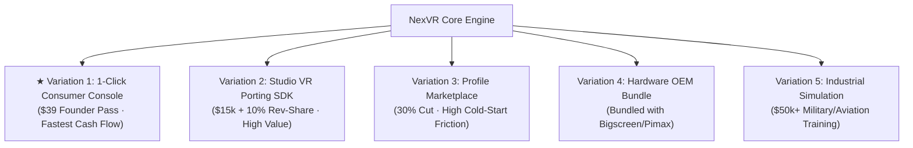

# 💡 5 Business Model Variations & Strategy

> 📌 **TL;DR**: 
> - We evaluated 5 ways to commercialize the NexVR technology.
> - **Winner**: **Variation 1 (Consumer Console)** for immediate cash flow + **Variation 2 (Studio B2B SDK)** as a secondary scale engine.

---

## 🧭 The 5 Strategic Paths

---

## 📊 Comparison Matrix

| Variation | Target Customer | Pricing | Speed to Revenue | Feasibility | Recommendation |
| :--- | :--- | :--- | :---: | :---: | :---: |
| **1. Consumer Console** | PCVR Gamers | Free / $39 Pass | **⚡ Days** | **10/10** | **✅ Primary Launch** |
| **2. Studio B2B SDK** | Indie/AA Game Studios | $15k + 10% Rev | ⏱️ Months | 9/10 | **✅ Secondary Expansion** |
| **3. Profile Marketplace**| Modders & Community | 30% Rev-Share | ⏱️ Months | 6/10 | ⏸️ Defer (Cold start) |
| **4. Headset OEM Bundle** | Pimax, Bigscreen | $15 / headset | ⏱️ Months | 7/10 | 🔜 Future Pipeline |
| **5. Industrial Sim** | Aviation / Training | $50k+ ACV | 🐢 Quarters | 5/10 | ⏸️ Defer (Bureaucracy) |

---

## 🎯 Strategic Roadmap

1. **Step 1 (Now)**: Launch the **1-Click Consumer Console** with the $39 Founder Pass to generate immediate bootstrap cash flow and build an audience.
2. **Step 2 (Months 3–6)**: Approach AA/Indie studios with the **B2B SDK** to publish official VR editions without them needing a full VR team.
