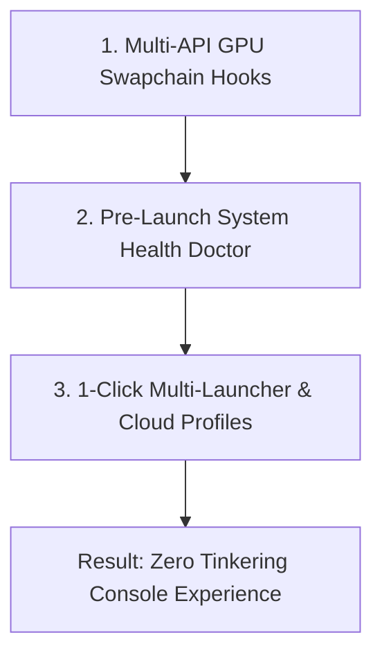

# 🥊 Competitor Analysis & Battle Cards

> 📌 **TL;DR**: 
> - **UEVR** is free, but **cannot play non-Unreal games** (*Sekiro*, *Elden Ring*, Unity).
> - **LukeRoss** costs $10/mo for only ~10 games, uses AER (causes motion sickness), and breaks on updates.
> - **VorpX** costs $40 upfront, takes 2+ hours to configure, and is hated for nausea.
> - **NexVR's Moat**: 1-click launch for non-Unreal AAA games, locked 90 FPS, curved floating HUD.

---

## 📊 Quick Competitor Comparison

| Solution | Price | Works on Non-Unreal? | Setup Time | Motion Sickness Risk |
| :--- | :--- | :---: | :---: | :---: |
| **NexVR Engine** | **Free / $39 Pass** | **✅ YES (DX11/12/VK)** | **< 30 seconds** | **🟢 Low (Curved HUD + Vignette)** |
| **Praydog UEVR** | Free (Open Source) | ❌ No (Unreal Only) | 15–45 min | 🟡 Moderate (Uncalibrated) |
| **LukeRoss** | $10 / month | ⚠️ Only ~10 Games | 20–30 min | 🔴 High (AER Ghosting) |
| **VorpX** | $40 (One-time) | ⚠️ Partial (Legacy) | 1–3 hours | 🔴 Very High (Distortion) |
| **Virtual Desktop**| $20 (One-time) | ❌ Flat 2D Screen Only | Instant | 🟢 None (Flat 2D Screen) |

---

## 🥊 Battle Card 1: Praydog UEVR (Free Open-Source)

* **Who they are**: Free open-source injector for Unreal Engine 4 and 5.
* **Their Strength**: Free price tag, deep Unreal Engine camera hooks.
* **Their Fatal Flaws**:
  1. **Cannot touch non-Unreal games**: Useless for *Sekiro*, *Elden Ring*, *Dark Souls*, *Cyberpunk*, *God of War*, or Unity titles.
  2. **Developer-only UI**: Confuses gamers with a 50-slider developer menu and raw memory pointers.
  3. **No game library**: Gamers must hunt down `.exe` paths manually.
* 🏆 **How NexVR Wins**: NexVR supports non-Unreal games and auto-detects games with a 1-click console interface.

---

## 🥊 Battle Card 2: LukeRoss R.E.A.L. VR (Patreon Modder)

* **Who they are**: Solo developer on Patreon ($10/month subscription, ~10,500 patrons).
* **Their Strength**: High-profile AAA games (*Cyberpunk 2077*, *GTA V*, *Spider-Man*).
* **Their Fatal Flaws**:
  1. **Alternate Eye Rendering (AER)**: Renders left and right eyes on alternate frames, causing ghosting and nausea during fast turns.
  2. **Patch Fragility**: Every Steam game update breaks the mod for weeks.
  3. **Tiny Catalog**: Supports fewer than 15 games after 5 years.
* 🏆 **How NexVR Wins**: True simultaneous stereoscopic 3D at 90 FPS with zero AER ghosting and cloud-synced profiles.

---

## 🥊 Battle Card 3: VorpX (Legacy Commercial Software)

* **Who they are**: $40 upfront commercial injector sold since 2014.
* **Their Strength**: Long history and supports older DirectX 9/11 games.
* **Their Fatal Flaws**:
  1. **Severe Nausea**: Glues 2D HUDs 2 inches from your eyes; bad FOV scaling causes instant headaches.
  2. **Horrible Onboarding**: Takes 2+ hours of manual memory-offset tweaking.
  3. **Hostile Licensing**: Non-refundable, machine-locked activation keys.
* 🏆 **How NexVR Wins**: Curved floating HUD in world-space, modern OpenXR 1.0.34 pipeline, and zero manual tuning.

---

## 🛡️ NexVR's 3-Layer Moat

1. **Hardware-Level Hooks**: Intercepts DirectX 11, DirectX 12, and Vulkan directly at the GPU driver level (<1.5ms compute overhead).
2. **Pre-Flight System Doctor**: Automatically fixes OpenXR runtimes and Defender exclusions before launching to prevent crashes.
3. **Curated Hero Profiles**: Perfect camera alignment and Reverse-Z depth for top games delivered over the air.
