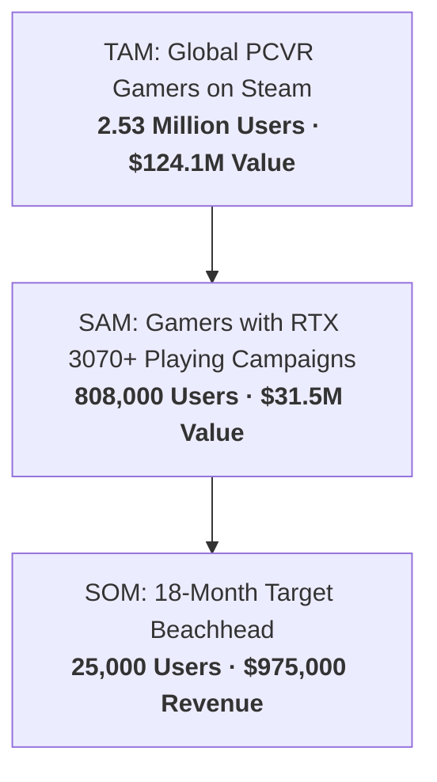

# 📈 Market Sizing: Real PCVR Numbers (TAM / SAM / SOM)

> 📌 **TL;DR**: 
> - **We do not pitch "30 Million VR users"**: That includes casual standalone Quest users playing *Beat Saber*.
> - **The Real Market**: ~2.5 Million active PCVR gamers on Steam.
> - **Our Beachhead (SOM)**: **25,000 paying gamers** spending $39 for a Founder Pass = **$975,000 in Year 1–2 Revenue**.

---

## 🎯 TAM, SAM, SOM Breakdown

### 1. TAM (Total Addressable Market): $124.1 Million
* **Who**: Every active PCVR gamer on Steam globally.
* **Math**: 132 Million Steam MAU $\times$ 1.92% PCVR headset adoption = **2,534,000 gamers**.
* **Value**: 2.53M users $\times$ $49 standard price = **$124.1M**.

### 2. SAM (Serviceable Available Market): $31.5 Million
* **Who**: PCVR gamers who have high-end GPUs (RTX 3070/4070 or better) and play single-player flat campaigns.
* **Math**: 2.53M PCVR gamers $\times$ 58% high-end GPU share $\times$ 55% single-player preference = **808,000 target gamers**.
* **Value**: 808,000 gamers $\times$ $39 Founder Pass = **$31.5M**.

### 3. SOM (Serviceable Obtainable Market): $975,000
* **Who**: Early adopters from the 320,000 members of Flat2VR and modding communities.
* **Target**: **25,000 paying customers** over 18 months (~3% of SAM).
* **Revenue**: 25,000 $\times$ $39 = **$975,000 Gross Revenue** (100% self-funded).

---

## 🚀 3 Key Market Tailwinds

1. **AAA Content Drought**: Game studios stopped spending $50M on native VR games. Gamers *must* convert flat games to get AAA experiences.
2. **Wi-Fi 6E Wireless PCVR**: Wireless Quest 3 latency is now under 20ms—no cables needed.
3. **GPU Compute Power**: DirectML and modern GPUs can run 4K 90 FPS stereoscopic reprojection under 1.5ms.
