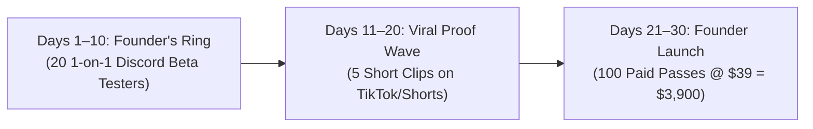

# 🚀 Go-to-Market Strategy & First 100 Customers

> 📌 **TL;DR**: 
> - **Core Acquisition Engine**: Viral 15-second "Before (Flat) vs After (VR)" short-form clips on TikTok and YouTube Shorts.
> - **Creator Affiliate Loop**: 20% commission ($7.80 per sale) to PCVR YouTubers.
> - **First 30 Days Target**: **100 Paid Founder Passes ($3,900 Gross Revenue)**.

---

## 📅 The 30-Day First 100 Customers Plan

### Stage 1: Founder's Ring (Days 1–10)
* Recruit 20 PCVR testers on Discord using `docs/FOUNDERS_RING_INVITATION.md`.
* Collect 5 authentic video reactions: *"I launched Sekiro in 10 seconds without touching an .ini file."*

### Stage 2: Viral Proof Content Wave (Days 11–20)
* Post 5 repeatable 15-second side-by-side clips on TikTok, YouTube Shorts, and r/virtualreality:
  1. *Clip 1*: "Playing Sekiro in VR on Quest 3 (zero mods)".
  2. *Clip 2*: "Why my VR headset is no longer collecting dust".
  3. *Clip 3*: "VorpX vs NexVR: 2 hours of modding vs 10 seconds".

### Stage 3: Founder Pass Opening (Days 21–30)
* Broadcast email invitation to waitlist members.
* Cap introductory **$39 Founder Lifetime Pass** to first 250 buyers.
* Reach milestone: **100 paid orders ($3,900 gross revenue)**.

---

## 📊 Channel Priority & CAC Matrix

| Channel | Expected Impact | Direct CAC | Priority |
| :--- | :---: | :---: | :---: |
| **Organic Short-Form Video (TikTok / Shorts)** | **Very High** | **$0** | **P0 (Immediate)** |
| **VR YouTube Affiliates (20% Rev-Share)** | **Very High** | **$7.80 / sale** | **P0 (Scale Engine)** |
| **Flat2VR & Reddit r/virtualreality** | High | $0 | **P1 (Community)** |
| **Paid Meta / Google Ads** | Low | $25+ | ⏸️ Skip for Now |
