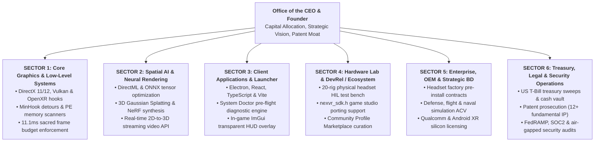
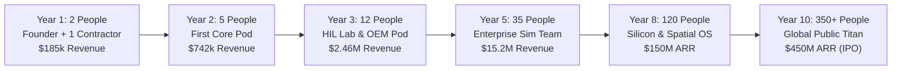

# 🏛️ Google-Style Organizational Architecture & Engineering Hiring Playbook
### Building the Deep-Tech Team for NexVR Engine (From Solo Founder to Category Titan)

> 📌 **Executive Overview**: 
> Modeled directly after the institutional engineering and organizational systems of **Google (Alphabet)**, **Meta (Reality Labs)**, and **NVIDIA**, this playbook details:
> 1. **The 6 Core Sectors/Divisions** required to build and operate a spatial deep-tech monopoly.
> 2. **The Exact Types of Programmers & Engineers to Hire** (job titles, technical stacks, responsibilities, and bar-raiser interview standards).
> 3. **The 10-Year Phased Headcount & Hiring Cadence** (scaling from 1 to 350+ personnel without premature equity dilution).
> 4. **Google Engineering Levels (L3 to L8)** and the cross-functional pod structure.

---

## 🧭 The 6 Core Sectors of a Deep-Tech Corporation

Google runs Alphabet by isolating specialized engineering disciplines while uniting them through autonomous cross-functional squads:



---

## 💻 The Exact Programmers You Must Hire (Technical Profiles)

You do **NOT** hire generic full-stack web developers to build graphics engine runtimes. You hire rare, high-conviction systems programmers:

---

### 1. Senior C++ Low-Level Systems & Reverse Engineer
* **Google Equivalent**: **L5 / L6 Senior Systems Engineer (Chrome OS / Android Core)**
* **What They Build**:
  - MinHook detours on `IDXGISwapChain::Present`, `D3D11CreateDevice`, and Vulkan instance layers.
  - Safe PE (Portable Executable) binary inspection to detect Easy Anti-Cheat, BattlEye, and Vanguard tripwires.
  - Process injection, memory offset patching, and headless crash recovery.
* **Required Technical Stack**:
  - Modern C++ (C++20/C++23), Windows Win32 API, MinHook, x64 Assembly, IDA Pro, Ghidra, x64dbg.
* **Bar-Raiser Interview Test**:
  > *"Write a bare-metal C++ hook that intercepts `ID3D11DeviceContext::DrawIndexed`, reads the current depth-stencil state, and modifies the viewport transform without causing a pipeline stall or dropping below 90 FPS."*

---

### 2. 3D Graphics & Shader Compiler Engineer
* **Google Equivalent**: **L5 / L6 Graphics Software Engineer (Google Stadia / Android GPU)**
* **What They Build**:
  - HLSL compute shaders (`cs_5_0` and `cs_6_0`) for stereoscopic camera unprojection.
  - Reverse-Z depth buffer linearizer and disparity displacement shaders.
  - DXC, FXC, and SPIR-V (`glslc`) build-time cross-compilation toolchains.
* **Required Technical Stack**:
  - DirectX 11, DirectX 12 (D3D12), Vulkan, HLSL, GLSL, SPIR-V, RenderDoc, NVIDIA Nsight Graphics, PIX on Windows.
* **Bar-Raiser Interview Test**:
  > *"Given a reverse-Z floating-point depth buffer in DirectX 12, write a compute shader that reconstructs world-space position for left and right eyes using asymmetric projection matrices with zero texture sampling stalls."*

---

### 3. OpenXR Runtime & Spatial Systems Engineer
* **Google Equivalent**: **L5 / L6 XR Systems Architect (Google ARCore / Android XR)**
* **What They Build**:
  - Low-latency OpenXR compositing layer submitting stereoscopic textures via `xrEndFrame`.
  - Eye-tracked foveated rendering (ETFR) integration via `XR_EXT_eye_gaze_interaction` and Variable Rate Shading (VRS).
  - 6DOF controller emulation procedurally mapping VR hand controllers to game inputs.
* **Required Technical Stack**:
  - OpenXR 1.0/1.1 SDK, SteamVR runtime, Meta OpenXR SDK, Variable Rate Shading (VRS Tier-2), C++, SIMD vector math.
* **Bar-Raiser Interview Test**:
  > *"How do you handle asynchronous time-warp (ATW) pose prediction when the game engine delivers a frame at 88 FPS instead of the requested 90 Hz display refresh?"*

---

### 4. Deep-Learning Spatial AI & DirectML Engineer
* **Google Equivalent**: **L5 / L6 Machine Learning Systems Engineer (Google DeepMind / Google Research)**
* **What They Build**:
  - Real-time 3D Gaussian Splatting and Neural Radiance Field (NeRF) inference running locally in < 1.0ms.
  - DirectML / TensorRT model quantization (FP8/INT4) for real-time disocclusion inpainting.
  - 2D-to-3D streaming video conversion API for YouTube/Twitch broadcasts.
* **Required Technical Stack**:
  - PyTorch, ONNX Runtime, Microsoft DirectML, NVIDIA TensorRT, CUDA, C++ ONNX C-API, 3D Gaussian Splatting mathematical optimization.
* **Bar-Raiser Interview Test**:
  > *"Quantize a monocular depth estimation transformer model to INT8 using DirectML, ensuring memory bandwidth consumption remains under 2.5 GB/s at 4K 90 FPS."*

---

### 5. Qualcomm DSP & Silicon Firmware Engineer (Hired Year 6–7)
* **Google Equivalent**: **L6 Staff Embedded Firmware Engineer (Google Pixel Silicon / Tensor SOC)**
* **What They Build**:
  - Low-level DSP/NPU microcode running directly on Qualcomm Snapdragon XR chipsets.
  - Sub-millisecond see-through optical waveguide distortion and chromatic aberration correction.
  - Android SurfaceFlinger compositor hardware hook.
* **Required Technical Stack**:
  - Embedded C, Qualcomm Hexagon DSP SDK, Android NDK / AOSP internal architecture, ARM NEON assembly, photonic waveguide optical math.

---

### 6. Client Platform & Desktop Architecture Engineer
* **Google Equivalent**: **L4 / L5 Client Software Engineer (Chrome / Google Drive Desktop)**
* **What They Build**:
  - The production Electron/React/TypeScript launcher (`nexvr-client/launcher/`).
  - System Doctor hardware diagnostic scanning engine (GPU driver verification, C++ runtime checks).
  - Real-time OTA manifest verification with Ed25519 cryptographic signatures.
* **Required Technical Stack**:
  - TypeScript, React, Vite, Node.js, Electron, PowerShell, C++ native node addons (N-API).

---

## 🏛️ Google Engineering Levels (L3 to L8 Structure)

To prevent title inflation and maintain high technical competence, NexVR adopts **Google's Technical Leveling System**:

| Google Level | Title at NexVR | Experience | Role & Scope of Responsibility |
| :---: | :--- | :---: | :--- |
| **L3** | **Software Engineer I** | 0–2 yrs | Writes clean, tested C++ code; implements bug fixes and individual game profiles. |
| **L4** | **Software Engineer II** | 2–5 yrs | Owns entire subsystems (e.g. System Doctor, shader build scripts, launcher UI). |
| **L5** | **Senior Software Engineer** | 5–8 yrs | Autonomous technical owner of graphics backends (DX11/12/Vulkan) or DirectML pipeline. |
| **L6** | **Staff Software Engineer** | 8–12 yrs | Designs system-wide architecture (RFCs), leads a cross-functional pod, sets the 11.1ms bar. |
| **L7** | **Senior Staff / Principal** | 12–15+ yrs| Industry-recognized graphics luminary; designs silicon microcode and 10-year tech roadmap. |
| **L8** | **Engineering Fellow** | 15+ yrs | Legendary architect (e.g. John Carmack / Tim Sweeney caliber); sets global spatial standards. |

---

## 🍕 Autonomous Cross-Functional Pods ("Two-Pizza Teams")

Rather than organizing into giant, slow departments, Google and Amazon structure engineering into **Autonomous Pods of 5 to 7 engineers**:

```
┌────────────────────────────────────────────────────────────────────────┐
│                   THE CORE GRAPHICS POD (Example)                      │
├────────────────────────────────────────────────────────────────────────┤
│ • 1 Tech Lead (L6 Staff C++ Systems Engineer)                          │
│ • 2 Graphics / Shader Engineers (L5 D3D11 / D3D12 Specialists)        │
│ • 1 OpenXR Runtime Specialist (L4/L5 VR Engineer)                      │
│ • 1 QA / Hardware-in-the-Loop Automation Engineer (L4 Test Lead)       │
│ • 1 Technical Product Manager (Technical PM / Systems Architect)       │
└────────────────────────────────────────────────────────────────────────┘
```
* Each pod operates like a self-contained startup: they write their own RFCs, run their own CI/CD tests, and are solely responsible for keeping their component within the 11.1ms frame budget.

---

## 📅 10-Year Headcount & Hiring Cadence

To protect founder equity and avoid the "startup hiring trap" (hiring too many people before product-market fit), hiring is gated strictly by **Audited Operating Revenue**:



### Detailed Annual Headcount Breakdown:

| Stage | Year | Total Headcount | Key Hires & Functional Additions | Annual Payroll Budget | Funded By |
| :---: | :---: | :---: | :--- | :---: | :---: |
| **Seed** | **Year 1** | **2** | Founder + 1 contract C++ graphics specialist | $30,000 | Founder Pass Sales |
| **Beachhead** | **Year 2** | **5** | +1 DX12 systems dev, +1 OpenXR dev, +1 DevRel lead | $180,000 | Cash Inflows ($742k) |
| **OEM Scale** | **Year 3** | **12** | +2 HIL Lab testers, +2 B2B studio engineers, +1 BD lead | $420,000 | Cash Inflows ($2.46M) |
| **Enterprise**| **Year 4** | **22** | +4 Defense sim devs, +2 Security/FedRAMP, +2 BD reps | $850,000 | EBITDA ($4.9M) |
| **Dominance** | **Year 5** | **35** | +4 DirectML AI devs, +2 Patent attorneys, +2 Operations | $1,400,000 | EBITDA ($11.8M) |
| **Spatial AI** | **Year 6** | **60** | +15 3D Gaussian / NeRF researchers, +10 API cloud engs | $4,500,000 | EBITDA ($28.1M) |
| **Silicon OS** | **Year 7** | **85** | +12 Qualcomm DSP firmware devs, +8 Waveguide optical engs | $9,000,000 | EBITDA ($52.0M) |
| **Billionaire**| **Year 8** | **120** | +20 Global OEM carrier engineers, +15 Enterprise sales | $18,000,000 | EBITDA ($110M) |
| **Reality Grid**| **Year 9** | **220** | +50 Robotics teleoperation devs, +20 Legal/SOX audit | $35,000,000 | EBITDA ($205M) |
| **NASDAQ IPO** | **Year 10**| **350+** | Global corporate infrastructure, Investor Relations | $60,000,000 | EBITDA ($325M) |

---

## 🎯 Google-Style Hiring Protocol: The "Bar-Raiser" Process

To guarantee that only the top 1% of systems programmers enter the company:

1. **Step 1: Resume Technical Screen (Zero HR Filtering)**:
   * Screened directly by senior engineers. Red flags: generic web devs who don't know pointer arithmetic or cache locality. Green flags: GitHub repositories with graphics shaders, emulator development, or game engine contributions.
2. **Step 2: Live C++ Systems Coding (60 Minutes)**:
   * Candidate must implement real memory manipulation, thread synchronization, or lockless queues in modern C++20 on a shared screen. No pseudo-code allowed.
3. **Step 3: Deep Architecture & Frame Pacing Interview (60 Minutes)**:
   * Candidate is asked to diagnose a real GPU pipeline stall or reverse-engineer a game rendering loop.
4. **Step 4: The "Bar-Raiser" Veto**:
   * An independent senior engineer from an unrelated pod who has no hiring pressure interviews the candidate solely for technical excellence and cultural alignment with the **11.1ms Law**. If the Bar-Raiser says "No", the candidate is rejected—even if the hiring manager wanted them.

---

## 📖 Glossary: Full Forms of All Short Forms in this Document

| Short Form | Full Form | Meaning / Description |
| :--- | :--- | :--- |
| **CEO** | **Chief Executive Officer** | Primary corporate executive leader. |
| **PM** | **Product Manager** | Professional responsible for guiding the success of a product. |
| **SWE** | **Software Engineer** | Computer programmer applying engineering principles to software. |
| **SRE** | **Site Reliability Engineer** | Engineer applying software practices to infrastructure operations. |
| **HIL** | **Hardware-in-the-Loop** | Testing technique utilizing physical hardware devices in test rigs. |
| **QA** | **Quality Assurance** | Systematic testing to ensure software quality standards. |
| **DevRel** | **Developer Relations** | Team dedicated to supporting third-party developers using an SDK. |
| **BD** | **Business Development** | Commercial deal-making, OEM partnerships, and enterprise sales. |
| **PE** | **Portable Executable** | Binary executable and DLL file format on Windows operating systems. |
| **DLL** | **Dynamic Link Library** | Shared binary library dynamically linked at runtime. |
| **SDK** | **Software Development Kit** | C++ developer package and headers (`nexvr_sdk.h`). |
| **API** | **Application Programming Interface** | Formal set of software protocols for communication. |
| **ABI** | **Application Binary Interface** | Low-level binary boundary between program modules. |
| **MinHook** | **Minimalistic x86/x64 API Hooking Library** | Lightweight detour library used by NexVR to redirect graphics calls. |
| **DX11 / DX12**| **Microsoft DirectX 11 / 12** | Core graphics APIs on Windows PCs. |
| **DXGI** | **DirectX Graphics Infrastructure** | Subsystem managing display swapchains on Windows. |
| **FXC / DXC** | **Effects Compiler / DirectX Shader Compiler** | Compilers converting HLSL code into GPU bytecode. |
| **HLSL** | **High-Level Shader Language** | Microsoft's proprietary shader programming language. |
| **SPIR-V** | **Standard Portable Intermediate Representation** | Binary intermediate language for Vulkan graphics shaders. |
| **OpenXR** | **Open Cross-Platform Standard for XR** | Royalty-free open standard developed by the Khronos Group. |
| **DirectML**| **Direct Machine Learning** | Microsoft's hardware-accelerated DirectX 12 machine learning API. |
| **ONNX** | **Open Neural Network Exchange** | Open-source ecosystem format for deep learning models (`.onnx`). |
| **NeRF** | **Neural Radiance Field** | Deep learning method synthesizing 3D views from 2D images. |
| **NPU** | **Neural Processing Unit** | Silicon hardware accelerator designed for AI neural inference. |
| **GPU** | **Graphics Processing Unit** | Silicon processor executing 3D rasterization. |
| **CPU** | **Central Processing Unit** | Primary electronic processor executing general system logic. |
| **DSP** | **Digital Signal Processor** | Specialized silicon microprocessor for real-time sensor processing. |
| **DMA** | **Direct Memory Access** | Hardware feature allowing memory access without CPU overhead. |
| **SIMD** | **Single Instruction, Multiple Data** | Parallel computing hardware instruction architecture. |
| **VRS** | **Variable Rate Shading** | GPU feature enabling foveated rendering by varying shading rates. |
| **ETFR** | **Eye-Tracked Foveated Rendering** | Rendering eye focal region in 4K, saving 40% peripheral GPU power. |
| **HUD** | **Heads-Up Display** | On-screen user interface elements (health bars, maps, crosshairs). |
| **FOV** | **Field of View** | The observable angular visible area through display lenses. |
| **FPS** | **Frames Per Second** | Render frame rate (90 FPS = 11.1ms frame budget). |
| **Hz** | **Hertz** | Unit of frequency equal to cycles per second. |
| **6DOF** | **Six Degrees of Freedom** | Tracking rotational (pitch/yaw/roll) AND positional (XYZ) movements. |
| **VR / AR / XR**| **Virtual Reality / Augmented Reality / Extended Reality** | The immersive spatial computing spectrum. |
| **RFC** | **Request for Comments** | Formal engineering design document describing system architecture. |
| **TRL** | **Technology Readiness Level** | NASA / DoD measurement system assessing technology maturity (1 to 9). |
| **SOC2** | **Service Organization Control 2** | Enterprise cybersecurity and data protection audit certification. |
| **FedRAMP** | **Federal Risk and Authorization Management Program** | US government cybersecurity authorization standard. |
| **SOX 404** | **Sarbanes-Oxley Act Section 404** | US federal law mandating strict internal financial accounting controls. |
| **IPO** | **Initial Public Offering** | The initial sale of company shares on a public stock exchange. |
| **NASDAQ** | **National Association of Securities Dealers Automated Quotations** | Leading US technology public stock exchange. |
| **ACV** | **Annual Contract Value** | Average annualized contract revenue per enterprise customer ($150k/yr). |
| **ARR** | **Annual Recurring Revenue** | Annualized recurring subscription and contract revenue. |
| **EBITDA** | **Earnings Before Interest, Taxes, Depreciation, and Amortization** | Operating profitability before non-cash adjustments. |

---

### 📂 Strategic Cross-References
* [**Master Glossary of All Terms & Full Forms**](../GLOSSARY.md)
* [**Big Tech Financial Architecture Blueprint**](../06-financial/big-tech-financial-architecture.md)
* [**The 10-Year Deep-Tech Operational Playbooks (Years 1–10)**](../10-year-playbook/README.md)
* [**Year-by-Year Master Goals (2026–2036)**](year-by-year-master-goals.md)
* [**The Billionaire Roadmap (8-Year Path)**](../06-financial/billionaire-roadmap.md)
* [**Strategic Knowledge Base Index**](../README.md)
