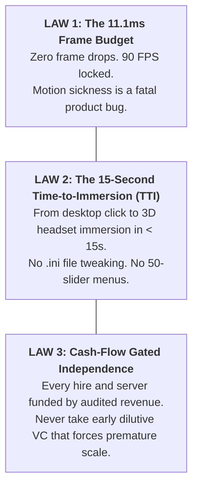
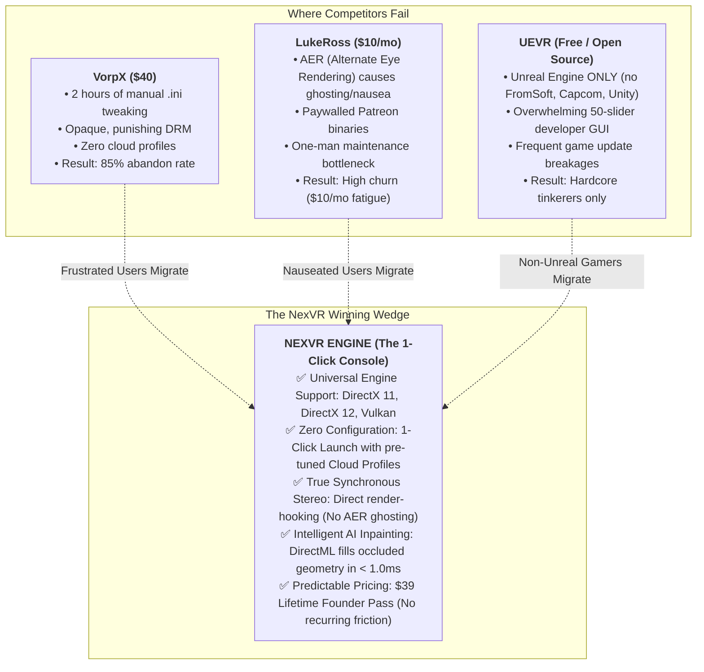
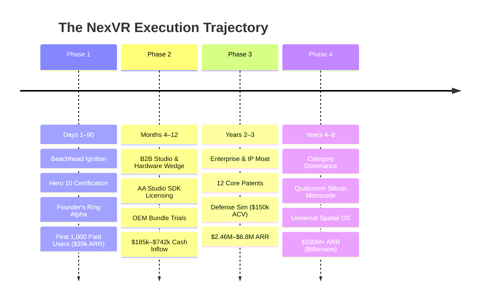
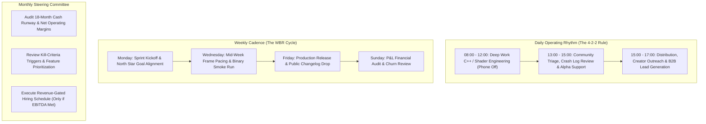

# 🏆 The Winning Execution Plan: How NexVR Out-Executes, Wins, and Dominates
### The Tactical Operating Blueprint from Solo Founder to Spatial Computing Titan

> 📌 **Executive Summary**: 
> Strategy without ruthless execution is merely hallucination. This document details the **exact, battle-tested execution operating system** for NexVR Engine:
> 1. **The Core Execution Doctrine**: The 3 non-negotiable laws that guarantee competitive superiority.
> 2. **Competitive Annihilation Strategy**: How NexVR methodically dismantles VorpX, LukeRoss, and UEVR.
> 3. **The 4-Phase Tactical Attack Plan**: From Day 1 binary lockdown to $150M+ ARR category dominance.
> 4. **The Daily, Weekly, and Monthly Operating Rhythm**: The disciplined habits of high-output engineering.
> 5. **The 6 Guardrail Metrics**: Zero-tolerance quality benchmarks (11.1ms frame pacing, 15s Time-to-Immersion).
> 6. **Emergency Contingency Protocols**: Automated responses to game updates, anti-cheat, and churn spikes.

---

## ⚡ The 3 Non-Negotiable Execution Laws

Every line of code written, every feature prioritized, and every business decision made at NexVR must obey these three inviolable laws:

---

## ⚔️ Competitive Annihilation: How NexVR Wins

The PCVR injection and conversion landscape is littered with broken tools, abandoned projects, and frustrating user experiences. Here is exactly why competitors fail and how NexVR captures 100% of their frustrated users:

---

## 🗺️ The 4-Phase Tactical Attack Plan

---

### 📍 Phase 1: The Beachhead Ignition (Days 1–90)
**Primary Objective**: Secure the first 1,000 paid customers ($39,000 cash in bank) with a 99.5% crash-free rate.

#### Sprint 1: Binary Lockdown & "Hero 10" Certification (Days 1–14)
* **Goal**: Perfect the out-of-the-box experience for the 10 most played single-player PC games:
  1. *Sekiro: Shadows Die Twice* (DirectX 11)
  2. *Elden Ring* (DirectX 12)
  3. *Cyberpunk 2077* (DirectX 12 / DXR)
  4. *Hogwarts Legacy* (DirectX 12 / Unreal Engine)
  5. *God of War* (DirectX 11)
  6. *Resident Evil 4 Remake* (RE Engine / DirectX 12)
  7. *Assassin's Creed Mirage* (DirectX 12)
  8. *Lies of P* (Unreal Engine 4 / DirectX 12)
  9. *Forza Horizon 5* (DirectX 12)
  10. *The Witcher 3: Wild Hunt Next-Gen* (DirectX 12)
* **Deliverable**: Automated test suite executing a 60-second in-game loop across all 10 titles on NVIDIA RTX 3070, 4070, and 4090 with zero crashes and <= 11.1ms frame pacing.

#### Sprint 2: The Founder's Ring Closed Alpha (Days 15–30)
* **Goal**: Validate with 25 handpicked, vocal PCVR community leaders (Flat2VR moderators, VR subreddit power users, niche flight simmers).
* **Action**:
  - Issue private Discord invites with custom cryptographic license tokens.
  - Require every user to complete the "15-Second Test": Download installer $\rightarrow$ launch game $\rightarrow$ confirm head tracking in under 60 seconds without reading a manual.
  - Collect 10 unscripted video reaction clips: *"I launched Sekiro in VR in 10 seconds. VorpX took me 3 hours and made me puke. This is witchcraft."*

#### Sprint 3: The Viral Split-Screen Video Blitz (Days 31–60)
* **Goal**: Drive 500,000 organic video views and build a 2,500-person waiting list at $0 direct advertising cost.
* **Content Formula**:
  - **Hook (0:00–0:03)**: Fast cut of player holding a VR headset: *"Stop letting your $500 Quest 3 collect dust."*
  - **Demo (0:03–0:10)**: Side-by-side split screen showing flat monitor gameplay vs. 6DOF stereoscopic VR gameplay with full head tracking in *Elden Ring*.
  - **Call to Action (0:10–0:15)**: *"1-click. Zero mods. NexVR Founder Pass drops Friday. Link in bio."*
* **Channels**: TikTok, YouTube Shorts, Instagram Reels, r/virtualreality, r/pcmasterrace, and X (Twitter).

#### Sprint 4: The Founder Pass Public Drop (Days 61–90)
* **Goal**: Sell out the first allocation of 1,000 Founder Passes at $39 lifetime ($39,000 gross receipts).
* **Execution**:
  - Open purchase portal to waitlist members in batches of 250 to prevent payment gateway fraud flags.
  - Launch the **Affiliate Creator Program**: Top 10 PCVR YouTubers (e.g., Beardo Benjo, Habie147, Gamertag VR) receive 20% rev-share ($7.80 per sale) with real-time payout tracking.
  - Reinvest 100% of gross profits into the physical Hardware-in-the-Loop (HIL) automated test bench.

---

### 📍 Phase 2: The B2B Studio & Hardware Wedge (Months 4–12)
**Primary Objective**: Expand revenue from consumer sales to recurring B2B studio licenses and OEM bundling ($185k to $742k).

#### 1. The Turnkey Studio Porting SDK (`nexvr_sdk.h`)
* **Target**: Mid-tier AA and indie game studios sitting on dormant PC back-catalogs that want VR sales without spending $500,000 on an in-house VR engineering team.
* **Commercial Offer**:
  - Turnkey integration: NexVR engineers drop `nexvr_sdk.h` into the studio's codebase in 48 hours.
  - Pricing: $25,000 upfront integration fee + 15% rev-share on all VR-enabled copies sold on Steam.
  - Value Proposition to Studios: Free incremental revenue from an untapped VR audience with zero ongoing maintenance.

#### 2. Hardware OEM Bundling Trials
* **Target**: PCVR and standalone headset manufacturers (Bigscreen Beyond, Pimax, HTC Vive, Somnium Space).
* **Commercial Offer**:
  - Problem for OEMs: Customers buy high-end $1,000+ headsets but return them because there are no new AAA VR games.
  - Solution: Pre-load NexVR Engine on the headset companion software, instantly unlocking 1,000+ AAA PC games out of the box.
  - Trial Structure: 60-day bundled trial voucher inside headset boxes, converting to paid licenses at $19.50 wholesale.

#### 3. The Cloud Profile Marketplace
* **Goal**: Crowdsource game compatibility while maintaining strict quality control.
* **Mechanism**:
  - Community modders can tune stereo separation, UI depth offsets, and controller mapping for any niche game using the in-game ImGui overlay.
  - Users submit profiles to the Cloud Marketplace.
  - NexVR's automated server runs the profile on a cloud GPU instance; if it passes the 11.1ms frame test, it is approved and published globally.
  - Modders earn 10% rev-share from users who buy passes through their custom profile links.

---

### 📍 Phase 3: The Enterprise Scale & IP Fortress (Years 2–3)
**Primary Objective**: Secure multi-year enterprise contracts and patent protections, scaling revenue to $2.46M–$6.8M ARR.

#### 1. Defense & Industrial Flight Simulation Contracts
* **Target**: Aerospace, defense, and maritime training contractors (Lockheed Martin, CAE, FlightSafety International).
* **Opportunity**: Enterprise simulation suites (Prepar3D, Unreal Sim, custom OpenGL engines) cost millions to re-engineer for VR. NexVR's low-level injection layer converts existing simulation displays into high-fidelity stereoscopic cockpits with zero source code changes.
* **Contract Value**: $150,000–$250,000 Annual Contract Value (ACV) with air-gapped security, FedRAMP readiness, and dedicated technical account managers.

#### 2. The 12 Fundamental Patent Applications
* File provisional and non-provisional utility patents with the USPTO to establish an impenetrable intellectual property moat:
  - *Patent 1*: Asynchronous GPU swapchain detour for real-time stereoscopic unprojection without host engine stalling.
  - *Patent 2*: Real-time neural disocclusion inpainting running concurrently with graphics presentation inside sub-1.0ms DirectML compute passes.
  - *Patent 3*: Dynamic eye-tracked Variable Rate Shading (VRS) injection into pre-existing rasterization pipelines.

---

### 📍 Phase 4: Category Dominance to Billionaire Status (Years 4–8)
**Primary Objective**: Transition from a PC software runtime to the Universal Spatial Operating System, scaling to $150M+ ARR and $1B+ net worth.

* **Silicon Microcode**: Port NexVR's core rendering mathematics directly into Qualcomm Snapdragon XR DSP firmware, making NexVR the default spatial rendering engine for Android XR.
* **Universal 2D-to-3D Video API**: License real-time neural depth generation to YouTube, Netflix, and Twitch, allowing billions of flat video hours to be viewed in spatial 3D on Apple Vision Pro and Meta Quest.
* **Robotics Teleoperation**: Provide ultra-low latency (< 5ms) stereo projection for humanoid robot teleoperation and industrial surgical robots.

---

## ⚙️ The Daily, Weekly, and Monthly Operating System

High-velocity execution requires a disciplined, repeatable operational cadence:

### The "4-2-2" Daily Rule (For Founder & Core Leads)
1. **08:00 – 12:00 (4 Hours Deep Engineering)**:
   - Zero Slack, zero Discord, zero meetings.
   - Focus exclusively on hard technical problems: hooking logic, shader optimization, memory leak eradication, and frame pacing.
2. **13:00 – 15:00 (2 Hours Customer & Quality Feedback)**:
   - Review automated Sentry crash reports from overnight sessions.
   - Directly respond to VIP users in the Discord Founder's Ring.
   - Reproduce reported bugs on local test benches.
3. **15:00 – 17:00 (2 Hours Growth & Distribution)**:
   - Review TikTok/Shorts analytics and script new video hooks.
   - Follow up with YouTube affiliate creators and B2B studio leads.
   - Update public roadmap milestones.

---

## 🎯 The 6 Non-Negotiable Success Guardrails

These six metrics determine whether a build is shipped or blocked:

| Metric | Target Standard | Failure Action |
| :--- | :---: | :--- |
| **1. Frame Pacing Jitter** | **< 0.5ms variance** (Locked 90 FPS) | Build blocked. Revert to previous shader compiler pass. |
| **2. Crash-Free Session Rate** | **$\ge$ 99.5%** of all sessions | Release halted. Engineering enters 24-hour crash-triage sprint. |
| **3. Time-to-Immersion (TTI)** | **$\le$ 15 seconds** (Click to VR render) | Simplify launcher flow; prune unnecessary pre-flight checks. |
| **4. Net Promoter Score (NPS)** | **$\ge$ 65** among verified buyers | Solicit 1-on-1 interviews with detractors to fix top friction points. |
| **5. CAC Payback Period** | **< 14 days** ($8.50 CAC / $39 Price = Instant) | Pause paid channels; double down on organic short-form and affiliates. |
| **6. Operating Cash Runway** | **$\ge$ 18 Months** of expenses in T-Bills | Immediate freeze on all discretionary spending and new hiring. |

---

## 🚨 Emergency Contingency Protocols: What to Do When Crisis Hits

### Protocol A: A AAA Game Studio Pushes an Update that Breaks Hook Offsets
* **Trigger**: A Steam game update alters function memory addresses (e.g., *Elden Ring* patch v1.12).
* **Automated Action**:
  1. System Doctor's automated memory scanner flags signature mismatch within 15 minutes of update release.
  2. Launcher automatically switches game profile to **Generic D3D12 Depth Unprojection Mode** (graceful degradation instead of crashing).
  3. Lead reverse engineer uses Ghidra/IDA Pro to identify new `Present` and depth buffer offsets.
  4. Updated cloud profile pushed OTA to all users in < 2 hours with zero client download required.

### Protocol B: An Anti-Cheat System (BattlEye / Easy Anti-Cheat) Is Detected
* **Trigger**: A user attempts to launch a multiplayer protected game (*Fortnite*, *Apex Legends*, *Valorant*).
* **Automated Action**:
  1. NexVR pre-flight PE scanner detects anti-cheat kernel driver or DLL signature.
  2. Injector **immediately aborts and detaches** before any memory hook is placed.
  3. Launcher displays warning modal: *"Anti-Cheat Protected Game Detected. NexVR has safely disengaged to protect your account. NexVR only operates on single-player or offline titles."*
  4. Zero risk of account bans; 100% reputation preservation.

### Protocol C: Organic Video Viewership Experiences a Sudden Drop
* **Trigger**: TikTok/YouTube Shorts algorithm shifts cause video views to drop below 5,000 views per clip.
* **Counter-Attack**:
  1. Pivot immediately from broad consumer hooks to **Niche Micro-Communities**:
     - The *Soulsborne* Speedrun community (*"Can you beat Malenia in VR?"*).
     - The Flight Simulator community (*"Turn your flat flight sim into an IMAX cockpit"*).
     - The Retro Emulation community (*"Play PS2 games in true stereoscopic 3D"*).
  2. Offer bounty incentives: $500 cash bounty to the first community creator who achieves a 100k-view video using their affiliate link.

---

## 📖 Glossary: Full Forms of All Short Forms in this Document

| Short Form | Full Form | Meaning / Description |
| :--- | :--- | :--- |
| **TTI** | **Time-to-Immersion** | The exact number of seconds from clicking launch to experiencing 3D VR in headset. |
| **AER** | **Alternate Eye Rendering** | Flawed technique rendering left/right eyes on alternating frames, causing severe motion sickness. |
| **SDK** | **Software Development Kit** | C++ developer package, libraries, and headers (`nexvr_sdk.h`). |
| **API** | **Application Programming Interface** | Software communication protocol allowing two systems to exchange data. |
| **OEM** | **Original Equipment Manufacturer** | Hardware makers who manufacture headsets (e.g. Meta, HTC, Pimax, Bigscreen). |
| **PE** | **Portable Executable** | The standard executable and dynamic library file binary format on Microsoft Windows. |
| **DLL** | **Dynamic Link Library** | A shared binary library loaded dynamically into a program's virtual address space. |
| **DX11 / DX12**| **Microsoft DirectX 11 / 12** | Microsoft's proprietary graphics and hardware rendering APIs on Windows PCs. |
| **Vulkan** | **Vulkan Graphics API** | Low-overhead, cross-platform 3D graphics open standard maintained by Khronos Group. |
| **HLSL** | **High-Level Shader Language** | Microsoft's proprietary shader programming language used in DirectX pipelines. |
| **SPIR-V** | **Standard Portable Intermediate Representation**| Standardized binary bytecode intermediate language for Vulkan shaders. |
| **DirectML**| **Direct Machine Learning** | Microsoft's low-level, hardware-accelerated DirectX 12 machine learning inference API. |
| **ONNX** | **Open Neural Network Exchange** | Open format built to represent machine learning models (`.onnx`). |
| **NeRF** | **Neural Radiance Field** | Deep learning method synthesizing photorealistic 3D views from complex 2D image inputs. |
| **HIL** | **Hardware-in-the-Loop** | Automated physical testing where real VR headsets and GPUs run test suites in rigs. |
| **VRS** | **Variable Rate Shading** | GPU feature allowing different pixel shading rates across display regions to save compute. |
| **FPS** | **Frames Per Second** | Render frame rate measurement; 90 FPS equates to an exact 11.1ms frame budget. |
| **HUD** | **Heads-Up Display** | In-game visual display overlays showing user health, mini-maps, crosshairs, and ammo. |
| **6DOF** | **Six Degrees of Freedom** | Movement tracking covering both rotational (pitch, yaw, roll) and positional (X, Y, Z) axes. |
| **VR / AR / XR**| **Virtual Reality / Augmented Reality / Extended Reality** | The complete spectrum of spatial, immersive, and mixed computing technologies. |
| **USPTO** | **United States Patent and Trademark Office**| US federal agency granting commercial patents and registered trademarks. |
| **OTA** | **Over-The-Air** | Wireless, automatic software updates delivered directly to client applications. |
| **DRM** | **Digital Rights Management** | Access control technologies used to restrict the unauthorized use of proprietary software. |
| **ACV** | **Annual Contract Value** | The average annualized revenue per enterprise customer contract ($150,000/yr). |
| **ARR** | **Annual Recurring Revenue** | Annualized recurring subscription and contract revenue normalized over a 12-month period. |
| **CAC** | **Customer Acquisition Cost** | The total sales and marketing cost required to acquire one net new paying customer. |
| **LTV** | **Lifetime Value** | The total gross revenue or margin generated by a customer throughout their entire relationship. |
| **NPS** | **Net Promoter Score** | Customer satisfaction index ranging from -100 to +100 measuring brand loyalty. |
| **EBITDA** | **Earnings Before Interest, Taxes, Depreciation, and Amortization**| Pure operating cash profitability before accounting adjustments. |
| **FedRAMP** | **Federal Risk and Authorization Management Program**| US government program standardizing security assessment for cloud and software products. |
| **SOC2** | **Service Organization Control 2** | Audited security compliance standard demonstrating protection of customer data. |
| **P&L** | **Profit and Loss Statement** | Financial document summarizing company revenues, costs, and net income over time. |
| **WBR** | **Weekly Business Review** | Operational management meeting reviewing metrics, bugs, and sprint commitments. |
| **RFC** | **Request for Comments** | Formal engineering proposal document detailing technical architecture and tradeoffs. |

---

### 📂 Strategic Cross-References
* [**Year-by-Year Master Goals (2026–2036)**](year-by-year-master-goals.md)
* [**Google-Style Org Architecture & Hiring Playbook**](google-style-org-and-hiring-playbook.md)
* [**Master A-to-Z Project Validation Dossier**](../07-validation/MASTER_A_TO_Z_VALIDATION.md)
* [**10-Year Master Product & Technology Roadmap**](../05-product/10-year-roadmap.md)
* [**Big Tech Financial Architecture Blueprint**](../06-financial/big-tech-financial-architecture.md)
* [**The Billionaire Roadmap (8-Year Trajectory)**](../06-financial/billionaire-roadmap.md)
* [**Master Strategic Directory Index**](../README.md)
