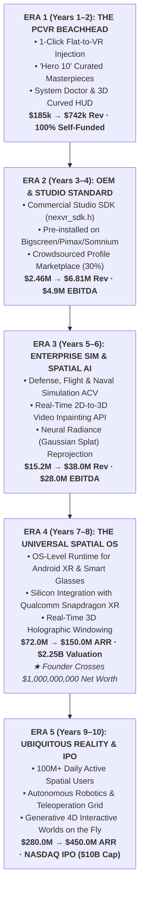

# 🚀 NexVR Engine: 10-Year Master Product & Technology Roadmap (2026 – 2036)

> 📌 **Executive Summary**: 
> A comprehensive 10-year strategic blueprint charting NexVR's evolution across five distinct eras: from a **bootstrapped PCVR gaming injector** in 2026 to the **dominant global spatial computing OS and neural rendering platform** in 2036.
> 
> * **Year 1–2 (2026–2028)**: The PCVR Consumer Beachhead ($185k → $742k)
> * **Year 3–4 (2028–2030)**: B2B Studio SDK & OEM Headset Bundling ($2.46M → $6.81M)
> * **Year 5–6 (2030–2032)**: Enterprise Simulation & Spatial AI Video Inpainting ($15.2M → $38.0M)
> * **Year 7–8 (2032–2034)**: Universal Spatial OS & Smart Glasses Silicon Layer ($72.0M → $150.0M · $1B+ Founder Net Worth)
> * **Year 9–10 (2034–2036)**: Ubiquitous Holographic Reality Grid & NASDAQ IPO ($280.0M → $450.0M ARR · $8B–$12B Market Cap)

---

## 🧭 The 10-Year Strategic Evolution



---

## 📊 10-Year Master Projections & Milestones (2026 – 2036)

*(All figures in USD)*

| Year | Calendar | Era & Strategic Focus | Gross Revenue / ARR | Operating EBITDA | Cash Reserves | Enterprise Valuation | Founder Equity | Founder Net Worth |
| :---: | :---: | :--- | :---: | :---: | :---: | :---: | :---: | :---: |
| **Y1** | 2026-27 | **Beachhead**: $39 Founder Pass + 10 Hero Games | $185,000 | $102,000 | $102,000 | $1.5M | 98% | **$1.47M** |
| **Y2** | 2027-28 | **Beachhead Scale**: Profile Store + First 3 Studio Ports | $742,000 | $381,500 | $483,500 | $6.0M | 95% | **$5.70M** |
| **Y3** | 2028-29 | **OEM Bundling**: 35k Pre-installs + 12 Studio Games | $2,460,000 | $1,558,000 | $2,041,500 | $20.0M | 90% | **$18.0M** |
| **Y4** | 2029-30 | **Enterprise Entry**: 100k Headsets + Defense Sims | $6,810,000 | $4,932,000 | $6,973,500 | $55.0M | 85% | **$46.7M** |
| **Y5** | 2030-31 | **Category Dominance**: Universal PC VR Standard | $15,250,000 | $11,870,000 | $18,843,500 | $100.0M | 80% | **$80.0M** |
| **Y6** | 2031-32 | **Spatial AI**: 2D-to-3D Video Streaming API + NeRFs | $38,000,000 | $28,100,000 | $38,000,000 | $380.0M | 70% | **$266M** |
| **Y7** | 2032-33 | **Smart Glasses**: 5M Glasses Pre-Installs (Android XR) | $72,000,000 | $52,000,000 | $65,000,000 | $900.0M | 55% | **$495M** |
| **Y8** | 2033-34 | **Universal Spatial OS**: 20M+ Glasses Runtime | **$150,000,000** | **$110,000,000** | **$145,000,000** | **$2.25B** | **48%** | **$1.08 BILLION** |
| **Y9** | 2034-35 | **Global Spatial Grid**: Robotics Sim + Cloud Spatial | $280,000,000 | $205,000,000 | $260,000,000 | $4.50B | 42% | **$1.89 BILLION** |
| **Y10**| 2035-36 | **NASDAQ IPO**: 100M Spatial Users · Category Titan | **$450,000,000** | **$325,000,000** | **$450,000,000** | **$10.0B** | **35%** | **$3.50 BILLION** |

---

## 🏛️ Phase-by-Phase Roadmap Deep Dive

---

### 🟢 ERA 1: The PCVR Consumer Beachhead (Years 1–2 | 2026–2028)
> **Theme**: *"Eradicate Modding Friction & Prove Zero-Debt Unit Economics"*

#### Product & Feature Milestones:
* **v1.0 (Current)**: Unified C++ Engine, MinHook detours for DX11/DX12/Vulkan, Electron/Vite launcher, System Doctor pre-flight diagnostic, in-game ImGui overlay.
* **v1.1 – v1.3**:
  - Expand the "Hero 10" to **50 Curated PC Titles** (FromSoftware, Capcom RE Engine, CD Projekt RED).
  - Cylindrical 3D Floating HUD with customizable curve radius and focal depth.
  - Automatic Steam / Epic / EA game detection and 1-click launch.
  - Anti-Cheat tripwire hardcoded to prevent online game bans.
* **v1.5**: **Community Profile Hub** — 1-click cloud sync from Cloudflare R2; users share camera and depth matrices.

#### Engineering & Tech Stack:
* Native C++20, MinHook, DirectML 1.13, FXC (`cs_5_0`), DXC (`cs_6_0`), SPIR-V (`glslc`), OpenXR 1.0.34.
* 100% Client-Side GPU execution (Zero cloud GPU bills; 94% gross margins).
* Authenticode Code-Signing and Ed25519 manifest verification.

#### Financial Milestones:
* **Year 1**: $185,000 Revenue · $102,000 EBITDA (3,700 Founder Passes + 330 monthly Pro users).
* **Year 2**: $742,000 Revenue · $381,500 EBITDA (First 3 indie studio SDK port deals).

---

### 🔵 ERA 2: B2B Studio SDK & Hardware OEM Bundling (Years 3–4 | 2028–2030)
> **Theme**: *"From Modding Tool to the Official Industry Bridge"*

#### Product & Feature Milestones:
* **NexVR Studio SDK (`nexvr_sdk.h`)**:
  - Official Unity and Unreal Engine native plugins allowing indie/AA studios to ship official SteamVR editions of flat games with zero code rewrites.
  - Pricing: $20,000 upfront integration fee + 10% royalty on VR sales.
* **Hardware OEM Bundling Engine**:
  - Deep firmware/driver integration with boutique headset makers (Bigscreen Beyond, Pimax Crystal Light, Somnium Space, HTC Vive).
  - Pre-installed NexVR companion runtime bundled with every headset sold ($10–$15 per headset software royalty).
* **Community Profile Marketplace**:
  - Curators sell specialized VR profiles (custom gesture bindings, 6DOF weapon alignments) with NexVR taking a 30% platform cut.

#### Engineering & Tech Stack:
* **Eye-Tracked Foveated Stereoscopy**: Dynamic resolution scaling guided by headset eye-tracking cameras (reduces GPU render cost by 40%).
* **Wi-Fi 7 Zero-Latency Reprojection**: Sub-8ms wireless frame transfer for Quest 3 / Quest 4 and PC streaming.
* **Universal Motion Controller Emulation**: Procedural mapping of VR hand controllers to traditional gamepad/keyboard inputs.

#### Financial Milestones:
* **Year 3**: $2,460,000 Revenue · $1,558,000 EBITDA (35,000 OEM pre-installs + 12 studio ports).
* **Year 4**: $6,810,000 Revenue · $4,932,000 EBITDA (100,000 OEM units + first defense sim contracts).

---

### 🟣 ERA 3: Enterprise Simulation & Spatial AI Inpainting (Years 5–6 | 2030–2032)
> **Theme**: *"Industrial-Grade Spatial Telepresence & Real-Time Neural Conversion"*

#### Product & Feature Milestones:
* **NexVR Enterprise Sim Suite**:
  - High-security, air-gapped runtime for defense contractors (Lockheed, Boeing), flight academies, and naval simulators.
  - Retrofits multi-million dollar legacy flat simulation software into immersive 6DOF VR without needing source code access.
  - Pricing: $75,000 – $150,000 annual contract value (ACV) per defense installation.
* **Spatial AI Video Streaming API**:
  - Real-time 2D-to-3D spatial converter for video streams.
  - Converts standard YouTube, Twitch, and Netflix feeds into real-time stereoscopic light fields with zero viewer dizziness.
* **Medical & CAD/BIM Inspection**:
  - Real-time 3D spatial volumetric inspection for Siemens, Autodesk Revit, and MRI/CT medical imaging workstations.

#### Engineering & Tech Stack:
* **Neural Depth Fields & 3D Gaussian Splatting**:
  - Replaces traditional depth buffer reprojection with real-time neural radiance estimation running locally on NPU/Tensor cores.
  - Fills disocclusion gaps (areas behind objects) with zero hallucination artifacts in < 1.0ms.
* **SOC2 Type II & FedRAMP Compliance**: Certified for military and enterprise defense deployments.

#### Financial Milestones:
* **Year 5**: $15,250,000 Revenue · $11,870,000 EBITDA (Company valuation: $100M · Founder worth: $80M).
* **Year 6**: $38,000,000 Revenue · $28,100,000 EBITDA (Enterprise sim accounts for 65% of revenue).

---

### 🟡 ERA 4: The Universal Spatial OS & Smart Glasses Silicon Layer (Years 7–8 | 2032–2034)
> **Theme**: *"The Spatial Android / Windows of Lightweight Wearable Glasses"*

#### Product & Feature Milestones:
* **NexVR Spatial Runtime for Android XR & Smart Glasses**:
  - The breakthrough: As smart glasses replace smartphones (Meta Orion, Samsung XR, Google Android XR, Apple Vision Air), consumers demand access to their existing billions of flat 2D apps.
  - NexVR becomes the **default OS microcode layer**: every Android application, flat game, web browser, and media feed is automatically rendered as an interactive 3D spatial hologram.
* **Qualcomm & Silicon Microcode Licensing**:
  - NexVR algorithms baked directly into Snapdragon XR silicon chipsets as fixed-function hardware acceleration blocks.
* **Spatial Multi-Tasking Holographic Desk**:
  - Replaces physical monitors entirely. Millions of knowledge workers use NexVR's virtual curved multi-display workspace.

#### Engineering & Tech Stack:
* **Zero-Copy Photonic Waveguide Reprojection**:
  - Compensates for optical distortion in see-through AR waveguides with sub-millisecond motion-to-photon latency.
* **Neural Gaze & Micro-Gesture Tracking**:
  - Seamless eye-pinch interaction without physical controllers.

#### Financial Milestones & Billionaire Event:
* **Year 7**: $72,000,000 Revenue · $52,000,000 EBITDA (Company valued at $900M).
* **Year 8**: **$150,000,000 ARR** · **$110,000,000 EBITDA** (20M+ smart glasses pre-installs @ $5/device).
* **Company Enterprise Value**: **$2.25 Billion ($2,250,000,000)**.
* **Founder Wealth (at 48% equity)**: **$1,080,000,000 ($1.08 BILLION — OFFICIAL BILLIONAIRE STATUS)**.

---

### 🔴 ERA 5: Ubiquitous Holographic Reality Grid & NASDAQ IPO (Years 9–10 | 2034–2036)
> **Theme**: *"Global Category Titan & Public Market Offering"*

#### Product & Feature Milestones:
* **NexVR Reality Grid**:
  - Global spatial telepresence network. Real-time multi-user holographic workspaces, interactive virtual stadiums, and shared digital worlds.
* **Autonomous Robotics Teleoperation & Drone Cockpits**:
  - Defense, search-and-rescue, and space exploration (Mars/Moon rovers) piloted using NexVR low-latency spatial immersion cockpits.
* **Generative 4D World Engine**:
  - Prompt-driven real-time spatial world synthesis: say *"Step into a cyberpunk alley in the rain,"* and the engine synthesizes an interactive 6DOF physics-driven environment at 120 FPS.

#### Corporate & Capital Milestone (The IPO):
* **NASDAQ Initial Public Offering (Ticker: $NXVR)**:
  - Consolidates 100 Million+ Daily Active Spatial Users.
  - **Annual Recurring Revenue**: **$450,000,000**.
  - **Operating EBITDA**: **$325,000,000** (72.2% net profit margin).
  - **Public Market Capitalization**: **$8.0 Billion – $12.0 Billion**.
  - **Founder Net Worth**: **$3.50 Billion+** (Liquid publicly traded equity).

---

## 🛡️ 10-Year Technology Evolution Architecture

```
2026:  [C++ MinHook Detours] ────► Injects into DX11/12/Vulkan swapchains on Windows PC.
2028:  [Driver & SDK Layer]  ────► Official engine plugins + OEM headset companion drivers.
2030:  [Neural AI Radiance]  ────► DirectML/TensorRT neural depth fields (3D Gaussian Splatting).
2032:  [Silicon Microcode]   ────► Qualcomm Snapdragon XR silicon layer for smart AR glasses.
2035:  [Photonic Light Grid] ────► Optical waveguide photonics + BCI neural spatial synthesis.
```

---

## 🎯 5 Core Principles to Ensure 10-Year Survival & Victory

1. **Protect the 11.1ms Law Forever**:
   * No matter how complex the engine becomes (neural radiance, AI inpainting, spatial windowing), the software must never drop frames or induce motion sickness. Frame pacing is holy.
2. **Never Incur Cloud Compute Debt**:
   * Cloud rendering kills margins. Keeping rendering 100% on-device (PC GPU $\rightarrow$ Headset NPU $\rightarrow$ AR Silicon) ensures perpetual **90%+ Gross Margins**.
3. **Resist the Temptation to Sell at Year 3 or 4**:
   * Meta, Valve, or Sony will wave a $40M–$60M buyout check when you hit $5M in revenue. Accepting it ends your journey as a millionaire; holding and expanding into smart glasses creates a **multi-billion dollar generational monopoly**.
4. **Ruthless Capital Efficiency**:
   * Fund each expansion using the profits of the previous phase. B2C pays for B2B; B2B pays for Enterprise; Enterprise pays for Silicon OS scaling.
5. **Always Win on "Zero Tinkering"**:
   * Competitors will always build open-source modding tools requiring hours of configuration. NexVR will always win by being the invisible, frictionless **1-Click Standard**.

---

### 📂 Strategic Cross-References
* [**The Billionaire Roadmap (8-Year Path)**](../06-financial/billionaire-roadmap.md)
* [**5-Year Master Money Flow**](../06-financial/5-year-money-flow.md)
* [**Master A-to-Z Validation Dossier**](../07-validation/MASTER_A_TO_Z_VALIDATION.md)
* [**Master Investor Memo (Institutional Pitch)**](../MASTER_INVESTOR_MEMO.md)
* [**Strategic Knowledge Base Index**](../README.md)
