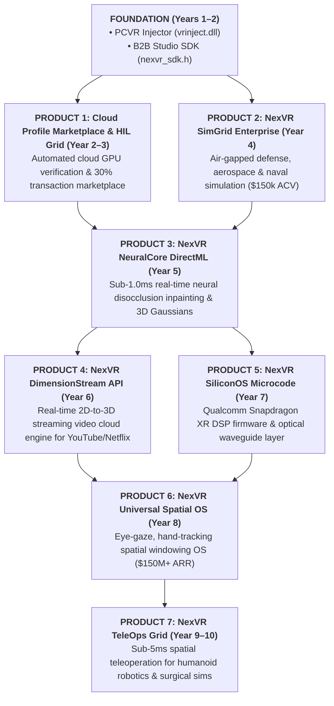
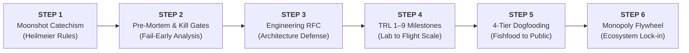
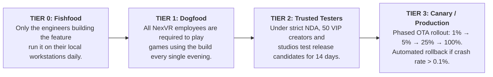
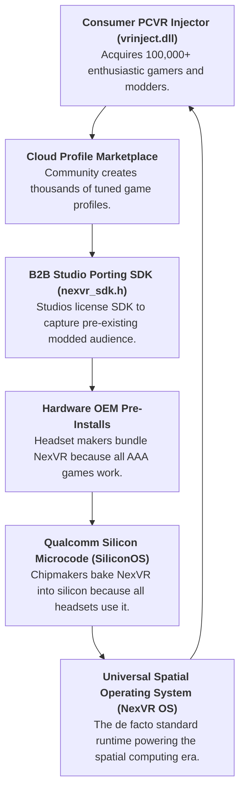

# 🏛️ The Future Product Matrix & Google-Style R&D Lifecycle
### How NexVR Invents, Validates, and Builds a Multi-Billion Dollar Spatial Computing Ecosystem

> 📌 **Executive Overview**: 
> The consumer PCVR injector (`vrinject.dll`) and B2B developer SDK (`nexvr_sdk.h`) are merely the beachhead foundation. Real tech titans (like Google, Apple, and NVIDIA) build self-reinforcing product ecosystems where each breakthrough funds and accelerates the next.
> 
> This document details:
> 1. **The 7 Future Products**: Complete technical specs, architecture, target markets, and revenue models for every future product in NexVR's 10-year portfolio.
> 2. **The Google / Alphabet R&D Engine**: How world-class deep-tech teams use the **Heilmeier Catechism**, **TRL 1–9 Milestones**, **Pre-Mortems**, **RFC Architecture Reviews**, and the **4-Tier Dogfooding Cadence** to invent and ship zero-fail technologies.
> 3. **The Unassailable Monopoly Flywheel**: How our products interconnect to lock out competitors permanently.

---

## 🧭 The 7 Future Products Beyond the Injector & SDK



---

## 🔬 Product-by-Product Deep Technical Dossiers

---

### Product 1: The Cloud Profile Marketplace & Autonomous HIL Test Grid (Years 2–3)
* **What It Is**: A global cloud platform and community marketplace that crowdsources game compatibility while automatically verifying frame timing on real hardware.
* **Target Customer**: 800,000+ PCVR gamers and 5,000+ indie modders wanting instant VR support for niche titles.
* **Technical Architecture**:
  - **In-Launcher Profile Store**: Integrated directly into the Electron/React launcher with one-click install.
  - **Autonomous HIL Test Farm**: 20 rack-mounted test rigs with physical headsets and GPUs (NVIDIA RTX 3060 to 4090). When a community creator uploads a profile, a cloud worker boots the game, runs an automated 60-second camera sweep, and records frame pacing jitter.
  - **Ed25519 Cryptographic Signing**: Only profiles with zero crashes and < 0.5ms frame jitter receive cryptographic approval and go live globally.
* **Monetization**: Modders set their price ($1.99–$4.99 per profile) or offer them free; NexVR takes an automated **30% platform transaction fee**.

---

### Product 2: NexVR SimGrid Enterprise (Year 4)
* **What It Is**: An air-gapped, FedRAMP-certified spatial injection platform for defense, commercial flight, and maritime training simulators.
* **Target Customer**: Defense contractors (Lockheed Martin, CAE, Northrop Grumman) and flight schools operating legacy multi-million dollar simulation cockpits (Prepar3D, FlightSafety).
* **The Problem It Solves**: Rebuilding military flight simulators for VR natively costs $10M+ and takes 3 years. NexVR SimGrid hooks into existing simulation graphics pipes in real-time, delivering stereoscopic cockpit depth with zero source-code modifications.
* **Technical Architecture**:
  - Air-gapped on-premise licensing (zero cloud telemetry calls for classified military networks).
  - Multi-channel synchronized projection unwarping for curved dome simulator retrofitting.
  - Sub-millisecond cockpit instrument panel depth isolation so pilots can read analog dials with crystal clarity.
* **Monetization**: Enterprise B2B SaaS seat licenses ($150,000 to $250,000 ACV) with 24/7 dedicated defense support contracts.

---

### Product 3: NexVR NeuralCore DirectML Tensor Engine (Year 5)
* **What It Is**: A hardware-accelerated machine learning runtime that performs real-time neural disocclusion inpainting and 3D Gaussian Splatting inside the render pipeline.
* **The Problem It Solves**: In stereoscopic 3D, shifting camera views for the second eye reveals hidden geometry behind objects (occlusion holes). Traditional geometry extrapolation leaves visual smearing or black edges.
* **Technical Architecture**:
  - **DirectML / ONNX Runtime Integration**: Runs directly on GPU Tensor Cores or NPU silicon via Microsoft DirectML.
  - **Sub-1.0ms Inpainting Latency**: Asynchronous compute queues run inference concurrently with DirectX 12 presentation passes without pipeline stalls.
  - **3D Gaussian Surface Synthesis**: Reconstructs dense photometric 3D volume representations from sparse 2D depth buffers.
* **Monetization**: Bundled into NexVR Pro ($9.99/mo) and licensed as a high-margin module to enterprise CAD/simulation clients ($50k/year).

---

### Product 4: NexVR DimensionStream Cloud Video API (Year 6)
* **What It Is**: An ultra-low-latency cloud streaming API that converts flat 2D streaming video into true 6DOF spatial stereoscopic 3D in real time.
* **Target Customer**: Streaming platforms (YouTube, Netflix, Twitch), sports broadcasters (NBA, FIFA, Formula 1), and VR headset OEMs.
* **Technical Architecture**:
  - **Massive Cloud Tensor Pipeline**: Deployed on NVIDIA GPU clusters. Ingests 4K 60 FPS video streams, computes per-pixel monocular depth maps via transformer models in < 8ms, and generates stereoscopic left/right eye video streams.
  - **WebRTC / AV1 Low-Latency Streaming**: Delivers the reconstructed spatial video stream to Quest 3 and Apple Vision Pro headsets with < 50ms end-to-end glass-to-glass latency.
* **Monetization**: Usage-based cloud infrastructure pricing (**$0.015 per streamed viewer-hour**). At 50M streaming hours/month = **$9M/year ARR**.

---

### Product 5: NexVR SiliconOS Microcode (Year 7)
* **What It Is**: Embedded firmware and DSP microcode designed specifically for Qualcomm Snapdragon XR2 Gen 2 and Snapdragon XR2+ silicon chipsets.
* **Target Customer**: Smart glasses and standalone spatial headset OEMs (Meta, Samsung, Google Android XR partners).
* **Technical Architecture**:
  - **Hexagon DSP / NPU Hardware Level**: Hooks directly into the Android SurfaceFlinger hardware compositor, bypassing user-space OS overhead.
  - **Optical Waveguide Distortion Engine**: Real-time chromatic aberration correction and photon-to-motion latency reduction to < 4ms.
  - **Direct Silicon Eye-Tracking VRS**: Hardware-level Variable Rate Shading dynamically controlled by eye gaze at the silicon bus layer.
* **Monetization**: Per-device silicon license fee (**$2.50 to $5.00 per chipset shipped**), paid directly by hardware OEMs.

---

### Product 6: NexVR Universal Spatial OS (Year 8)
* **What It Is**: A complete spatial computing operating system layer that bridges legacy desktop computing with wearable AR/VR smart glasses.
* **The Problem It Solves**: Users want to replace multiple physical monitors with infinite, floating, high-resolution spatial virtual displays that follow them anywhere.
* **Technical Architecture**:
  - **Spatial Windowing Compositor**: Renders unlimited floating 4K virtual monitors with sub-pixel text rendering (ClearType Spatial).
  - **Multimodal Eye-Gaze + Micro-Gesture Interaction**: Combines eye gaze for targeting and thumb-index pinch for selection with zero latency.
  - **Cross-Hardware Runtime**: Runs identically on Windows PCs, Android XR smart glasses, and standalone headsets.
* **Monetization**: Consumer and Enterprise OS Subscription (**$14.99/month per active user**). 2M active users = **$360M ARR**.

---

### Product 7: NexVR TeleOps Spatial Robotics Grid (Years 9–10)
* **What It Is**: An ultra-reliable, deterministic spatial teleoperation platform allowing human operators to control humanoid robots, industrial cranes, and surgical robots in real-time 3D from thousands of miles away.
* **Target Customer**: Industrial manufacturing giants (Tesla, Boston Dynamics, Amazon Robotics), logistics hubs, and defense teleoperation units.
* **Technical Architecture**:
  - **Sub-5ms Deterministic Video Pipeline**: Encrypted zero-jitter video streaming using custom QUIC/UDP protocols.
  - **Bilateral Force-Feedback Haptic Loop**: Translates robotic arm resistance into operator hand controller resistance in real time.
  - **Photorealistic Digital Twin Integration**: Reconstructs the remote physical factory into a 3D Gaussian Splatting digital twin, allowing operators to freely move their viewpoint around obstacles.
* **Monetization**: Mission-critical industrial licensing (**$5,000 per robot per year** + $500,000 platform base fee).

---

## 🏛️ The Google / Alphabet R&D, Validation, & Launch Operating System

To create breakthrough technology that actually works (and doesn't end up as vaporware), NexVR implements the **exact product creation lifecycle used by Google X, Google Research, and DeepMind**:



---

### Step 1: The DARPA / Google Moonshot Catechism (Heilmeier Questions)
Before any engineer writes a single line of code for a new product, the Technical Lead must submit a formal 3-page memo answering George Heilmeier’s 8 fundamental questions:

| # | Heilmeier Question | Google / NexVR Engineering Standard |
| :---: | :--- | :--- |
| **1** | **What are you trying to do?** | Articulate your objectives using absolutely no jargon. |
| **2** | **How is it done today?** | What are the severe limitations of current commercial practice? |
| **3** | **What is new in your approach?** | Why do you think it will succeed where others failed? What is the unfair technical breakthrough? |
| **4** | **Who cares?** | If you succeed, what difference does it make to customer lives and company revenue? |
| **5** | **What are the risks?** | What are the physical, mathematical, and market failure points? |
| **6** | **How much will it cost?** | Exact financial and engineering head-hour budget. |
| **7** | **How long will it take?** | Explicit timeline with intermediate checkpoints. |
| **8** | **What are the mid-term and final exams?** | Measurable pass/fail criteria to prove success. |

---

### Step 2: The Google Pre-Mortem & Stage-Gate Kill Review
Most startups fail because they fall in love with their ideas and ignore obvious flaws. Google conducts a mandatory **Pre-Mortem exercise**:
* **The Exercise**: The engineering team gathers in a room and assumes: *"It is exactly 18 months from today, and this product has been canceled after burning $2,000,000. Why did it die?"*
* **The Output**: A prioritized matrix of failure risks (e.g., *"GPU memory bandwidth was exceeded"*, *"Game updates broke hook offsets"*, *"Anti-cheat sued us"*).
* **Kill-Criteria**: Quantitative triggers where the project is **instantly killed or pivoted** (e.g., if NeuralCore cannot run inference in under 1.5ms on an RTX 3070 by Month 6, the project is terminated immediately).

---

### Step 3: The Engineering RFC (Request for Comments) Architecture Defense
At Google, code is never written based on a vague Jira ticket. Systems engineers write an **RFC Document** (15 to 30 pages):
* **Contents**: C++ API function signatures, memory layout, thread-safety models, cache locality analysis, network protocols, and backward compatibility.
* **The Review Meeting**: The RFC is defended live in front of a committee of **Google L6/L7 Staff Engineers**.
* **The Rule**: Engineers do not critique the author personally; they attack the architecture ruthlessly. Once approved, the RFC becomes the binding engineering blueprint.

---

### Step 4: The NASA / DoD TRL 1 to 9 Progression Ladder
Deep-tech hardware and graphics software advance through the strict **Technology Readiness Level (TRL)** scale:

```
TRL 1: Basic principles observed and reported (Whitepapers, mathematical formulation)
TRL 2: Technology concept formulated (Shader pseudocode, pipeline block diagram)
TRL 3: Analytical & experimental proof of concept (C++ offline prototype, non-real-time)
TRL 4: Component validation in lab environment (Real-time render loop inside test harness)
TRL 5: Component validation in relevant environment (Runs inside a real game engine like Unreal 5)
TRL 6: System/subsystem model in operational environment (Alpha build running on 10 games)
TRL 7: System prototype demonstration in operational environment (Closed beta with 250 testers)
TRL 8: Actual system completed and qualified (Release candidate passing HIL automated tests)
TRL 9: Actual system proven through successful mission operations (Public production deployment)
```

---

### Step 5: Google’s 4-Tier Dogfooding Protocol



1. **Fishfood**: Developers use their own code within 24 hours of writing it.
2. **Dogfood**: The entire company uses the product daily. If an engineer breaks the build, no one can play, creating immediate social pressure to fix bugs.
3. **Trusted Tester**: External alpha users under NDA report edge cases.
4. **Canary Deployment**: Over-the-air deployment scales incrementally (1% $\rightarrow$ 5% $\rightarrow$ 25% $\rightarrow$ 100%). If Sentry reports crash anomalies exceeding 0.1%, the build automatically rolls back worldwide in under 60 seconds.

---

### Step 6: The Self-Reinforcing Product Monopoly Flywheel

Google wins because its products do not stand alone: Google Search feeds Android; Android feeds Google Play; Google Play feeds Cloud Infrastructure. 

NexVR executes the same **monopolistic flywheel**:



---

## 📖 Glossary: Full Forms of All Short Forms in this Document

| Short Form | Full Form | Meaning / Description |
| :--- | :--- | :--- |
| **R&D** | **Research and Development** | Activities directed toward innovation, introduction, and improvement of products. |
| **SDK** | **Software Development Kit** | C++ developer package, libraries, and headers (`nexvr_sdk.h`). |
| **API** | **Application Programming Interface** | Software communication protocol allowing applications to interact. |
| **HIL** | **Hardware-in-the-Loop** | Automated testing technique using physical headsets and GPUs in server racks. |
| **OEM** | **Original Equipment Manufacturer** | Physical hardware manufacturers (e.g. Meta, HTC, Pimax, Samsung). |
| **OS** | **Operating System** | System software that manages computer hardware, software resources, and common services. |
| **DSP** | **Digital Signal Processor** | Specialized silicon microprocessor optimized for real-time sensor processing. |
| **NPU** | **Neural Processing Unit** | Dedicated silicon hardware accelerator designed for machine learning inference. |
| **GPU** | **Graphics Processing Unit** | Specialized silicon processor designed to accelerate 3D computer graphics rasterization. |
| **CPU** | **Central Processing Unit** | The primary processor that executes general software program instructions. |
| **DirectML**| **Direct Machine Learning** | Microsoft's hardware-accelerated DirectX 12 machine learning inference API. |
| **ONNX** | **Open Neural Network Exchange** | Open-source ecosystem format for deep learning models (`.onnx`). |
| **NeRF** | **Neural Radiance Field** | Deep learning technique that synthesizes novel 3D views from complex 2D image inputs. |
| **VRS** | **Variable Rate Shading** | GPU feature that varies shading frequency across different regions of a frame. |
| **6DOF** | **Six Degrees of Freedom** | Tracking rotational (pitch, yaw, roll) and translational (X, Y, Z) motion. |
| **VR / AR / XR**| **Virtual Reality / Augmented Reality / Extended Reality** | Spectrum of immersive and mixed reality spatial computing technologies. |
| **ACV** | **Annual Contract Value** | Average annualized contract revenue per enterprise customer ($150k/yr). |
| **ARR** | **Annual Recurring Revenue** | Annualized recurring subscription and contract revenue normalized over 12 months. |
| **TRL** | **Technology Readiness Level** | NASA / DoD measurement system assessing technology maturity from concept (1) to flight (9). |
| **RFC** | **Request for Comments** | Formal engineering design proposal documenting technical architecture. |
| **POC** | **Proof of Concept** | Small-scale technical experiment demonstrating the feasibility of an idea. |
| **NDA** | **Non-Disclosure Agreement** | Legally binding contract protecting confidential proprietary company information. |
| **OTA** | **Over-The-Air** | Automated software updates delivered directly to client devices via the internet. |
| **SaaS** | **Software as a Service** | Software licensing and delivery model on a recurring subscription basis. |
| **FedRAMP** | **Federal Risk and Authorization Management Program** | US government cybersecurity authorization standard for cloud products. |
| **CAD** | **Computer-Aided Design** | Software used by engineers to create precision 3D architectural and mechanical models. |
| **AV1** | **AOMedia Video 1** | Open, royalty-free video coding format designed for video streaming. |
| **WebRTC** | **Web Real-Time Communication** | Free, open-source technology enabling web applications to capture and stream media. |
| **QUIC** | **Quick UDP Internet Connections** | Multiplexed transport layer network protocol designed by Google. |
| **UDP** | **User Datagram Protocol** | Low-latency, connectionless computer networking communication protocol. |
| **IPO** | **Initial Public Offering** | The initial sale of company shares to the public on a formal stock exchange. |
| **NASDAQ** | **National Association of Securities Dealers Automated Quotations** | Leading US technology electronic public stock exchange. |

---

### 📂 Strategic Cross-References
* [**10-Year Master Product & Technology Roadmap**](10-year-roadmap.md)
* [**The Winning Execution Plan**](../03-strategy/winning-execution-plan.md)
* [**Google-Style Org Architecture & Engineering Hiring Playbook**](../03-strategy/google-style-org-and-hiring-playbook.md)
* [**Big Tech Financial Architecture Blueprint**](../06-financial/big-tech-financial-architecture.md)
* [**B2B SDK Royalty Calculation Guide & Contract Framework**](../06-financial/b2b-sdk-royalty-calculation-guide.md)
* [**Master Strategic Directory Index**](../README.md)
