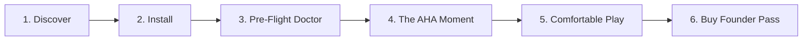

# 🗺️ User Journey & Aha-Moment Map

> 📌 **TL;DR**: 
> - **The Aha Moment**: The first 10 seconds of launching *Sekiro* in VR—standing in Ashina Castle in 3D scale with a comfortable curved HUD and zero nausea.
> - **Drop-off Shield**: System Doctor prevents startup crashes before the game opens.

---

## 🚀 The 6-Stage User Journey

1. **Discover**: Sees 15-second viral video on TikTok showing flat monitor vs. in-headset Quest 3 gameplay.
2. **Install**: Downloads signed `NexVR-Engine-Setup-0.1.98.exe`. Installs in 5 seconds.
3. **Pre-Flight Doctor**: Launcher automatically scans Steam/Epic/EA libraries and verifies OpenXR and GPU drivers.
4. **The AHA! Moment**: Clicks "Launch in VR". Snaps headset on. Flat screen vanishes—they are standing inside the game world at locked 90 FPS.
5. **Comfortable Play**: The curved floating HUD floats 2 meters away. No eye strain, no headache.
6. **Convert**: Loves the experience and buys the $39 Founder Pass to unlock all 10 Hero Profiles and lifetime updates.
