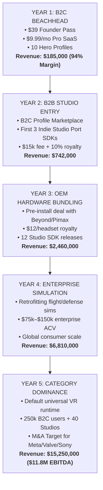

# 💰 NexVR Engine: 5-Year Master Money Flow (B2C to B2B)

> 📌 **Executive Overview**: 
> A complete, 5-year financial architecture and cash flow trajectory detailing how NexVR transitions from a **consumer-funded B2C beachhead** into an **enterprise B2B spatial computing engine**.
> 
> - **Year 1**: $185,000 (100% B2C Bootstrapped Cash Flow)
> - **Year 2**: $742,000 (B2C Scale + First B2B Indie Studio SDK Contracts)
> - **Year 3**: $2,460,000 (Hardware OEM Bundling + Studio VR Editions)
> - **Year 4**: $6,810,000 (Enterprise Sim Licensing + Marketplace Flywheel)
> - **Year 5**: $15,250,000 (Category Dominance · $11.8M EBITDA · $80M–$120M Enterprise Valuation)

---

## 🧭 The 5-Year Strategic Evolution (The Trojan Horse Flywheel)



---

## 📊 5-Year Master Pro-Forma Income Statement (2026 – 2031)

*(All figures in USD)*

| Financial Line Item | **Year 1 (2026-27)** | **Year 2 (2027-28)** | **Year 3 (2028-29)** | **Year 4 (2029-30)** | **Year 5 (2030-31)** |
| :--- | :---: | :---: | :---: | :---: | :---: |
| **B2C Consumer Revenue** | | | | | |
| • Founder Lifetime Passes | $145,000 | $320,000 | $550,000 | $850,000 | $1,200,000 |
| • Pro Monthly SaaS ($9.99–$14.99/mo) | $40,000 | $182,000 | $460,000 | $960,000 | $1,850,000 |
| • Community Profile Marketplace (30% cut)| $0 | $40,000 | $150,000 | $400,000 | $900,000 |
| **Total B2C Revenue** | **$185,000** | **$542,000** | **$1,160,000** | **$2,210,000** | **$3,950,000** |
| | | | | | |
| **B2B Commercial & Enterprise Revenue** | | | | | |
| • Studio VR Porting SDK (Upfront Fees) | $0 | $60,000 | $240,000 | $600,000 | $1,200,000 |
| • Studio Game Royalties (10% rev-share)| $0 | $40,000 | $360,000 | $1,200,000 | $3,100,000 |
| • Hardware OEM Bundling Royalties | $0 | $100,000 | $450,000 | $1,300,000 | $3,000,000 |
| • Enterprise & Defense Simulation ACV | $0 | $0 | $250,000 | $1,500,000 | $4,000,000 |
| **Total B2B Revenue** | **$0** | **$200,000** | **$1,300,000** | **$4,600,000** | **$11,300,000** |
| | | | | | |
| **CONSOLIDATED GROSS REVENUE** | **$185,000** | **$742,000** | **$2,460,000** | **$6,810,000** | **$15,250,000** |
| **Cost of Goods Sold (COGS)** | | | | | |
| • Payment Gateway & Merchant Fees (5.5%)| ($10,200) | ($35,000) | ($95,000) | ($210,000) | ($420,000) |
| • Cloudflare R2 / CDN & Serverless Edge | ($1,800) | ($4,500) | ($12,000) | ($28,000) | ($55,000) |
| • Code-Signing & Security Audits | ($1,500) | ($5,000) | ($15,000) | ($30,000) | ($50,000) |
| **Total COGS** | **($13,500)** | **($44,500)** | **($122,000)** | **($268,000)** | **($525,000)** |
| **GROSS PROFIT** | **$171,500** | **$697,500** | **$2,338,000** | **$6,542,000** | **$14,725,000** |
| *Gross Margin %* | *92.7%* | *94.0%* | *95.0%* | *96.1%* | *96.6%* |
| | | | | | |
| **Operating Expenses (OPEX)** | | | | | |
| • Creator Affiliate Commissions (20% B2C)| ($29,000) | ($84,000) | ($160,000) | ($280,000) | ($450,000) |
| • Engineering & Reverse-Engineering Payroll| ($30,000) | ($180,000) | ($420,000) | ($850,000) | ($1,400,000) |
| • Hardware Compatibility Test Lab | ($5,000) | ($15,000) | ($35,000) | ($50,000) | ($75,000) |
| • Sales, BD & Legal (Enterprise/OEM Contracts)| ($2,500) | ($25,000) | ($120,000) | ($320,000) | ($650,000) |
| • General & Administrative (G&A) | ($3,000) | ($12,000) | ($45,000) | ($110,000) | ($280,000) |
| **Total OPEX** | **($69,500)** | **($316,000)** | **($780,000)** | **($1,610,000)** | **($2,855,000)** |
| | | | | | |
| **OPERATING PROFIT (EBITDA)** | **$102,000** | **$381,500** | **$1,558,000** | **$4,932,000** | **$11,870,000** |
| *EBITDA Margin %* | *55.1%* | *51.4%* | *63.3%* | *72.4%* | *77.8%* |
| **Cumulative Cash in Bank** | **$102,000** | **$483,500** | **$2,041,500** | **$6,973,500** | **$18,843,500** |

---

## 📈 Revenue Composition Shift (B2C vs. B2B)

```
YEAR 1:  [████████████████████] 100% B2C  |   0% B2B
YEAR 2:  [██████████████░░░░░░]  73% B2C  |  27% B2B
YEAR 3:  [█████████░░░░░░░░░░░]  47% B2C  |  53% B2B
YEAR 4:  [██████░░░░░░░░░░░░░░]  32% B2C  |  68% B2B
YEAR 5:  [█████░░░░░░░░░░░░░░░]  26% B2C  |  74% B2B
```

---

## 🔍 Detailed Year-by-Year Financial Engine

### Year 1: The Consumer Beachhead (100% B2C)
* **Goal**: Validate consumer demand, maintain zero debt, and build community trust.
* **Volume**: 3,700 Founder Passes sold ($39 introductory) + 330 monthly Pro subscribers.
* **Cash Flow Dynamics**:
  - $185,000 gross inflows directly via LemonSqueezy/Stripe.
  - COGS are negligible ($13.5k) because Cloudflare R2 has zero egress fees.
  - Generates **$102,000 in net cash profit**, completely eliminating the need for early dilutive venture capital.

---

### Year 2: B2C Scale + The B2B Studio Wedge
* **Goal**: Expand consumer base and launch the B2B Studio Porting SDK (DEC-020 Model B).
* **The B2B Wedge**:
  - Indie studios developing on Unreal Engine or Unity realize that building native VR ports costs $250k+.
  - NexVR licenses its C++ / Unity bridge SDK (`include/nexvr_sdk.h`) to **3 indie studios** at **$20,000 upfront + 10% royalty**.
  - Signs early OEM integration pilot with a boutique headset maker (Bigscreen Beyond) distributing 8,000 bundled licenses at **$12.50 / unit**.
* **Financial Result**: **$742,000 Gross Revenue ($381,500 EBITDA)**.

---

### Year 3: The OEM Bundling & Publisher Scale Engine
* **Goal**: Shift majority of revenue into high-margin B2B recurring royalties.
* **B2B Drivers**:
  - **OEM Pre-installs**: 35,000 headsets shipped with NexVR pre-installed (Bigscreen Beyond, Pimax Crystal Light, Somnium Space) $\rightarrow$ **$450,000 in pure software royalties**.
  - **Studio Releases**: 12 games launched on Steam with NexVR's official VR bridge generating **$600,000 in upfront fees and royalties**.
  - **Enterprise Entry**: First 2 defense/aviation simulation contracts ($125k ACV) retrofitting legacy training software into OpenXR VR headsets $\rightarrow$ **$250,000**.
* **Financial Result**: **$2,460,000 Gross Revenue ($1,558,000 EBITDA)**.

---

### Year 4: Enterprise Simulation & Global Platform Scale
* **Goal**: Capture massive industrial simulation budgets while expanding consumer marketplace.
* **Revenue Drivers**:
  - **Enterprise Simulation (Industrial & Defense)**: 12 enterprise contracts retrofitting flight and vehicle simulators without source code access $\rightarrow$ **$1,500,000 ACV**.
  - **OEM Hardware Expansion**: 100,000 headsets bundled across 4 hardware partners $\rightarrow$ **$1,300,000**.
  - **Consumer Marketplace**: 30% take-rate on crowdsourced community profile sales $\rightarrow$ **$400,000**.
* **Financial Result**: **$6,810,000 Gross Revenue ($4,932,000 EBITDA — 72.4% Net Margin)**.

---

### Year 5: Market Category Dominance (Exit / Acquisition Window)
* **Goal**: Become the universal spatial conversion standard for flat PC software.
* **The Numbers**:
  - **$15,250,000 Consolidated Gross Revenue**.
  - **$11,870,000 Net Operating Profit (EBITDA)**.
  - **$18.8M Cash Reserves in Bank** (100% debt-free).
* **Enterprise Valuation Multiple**:
  - Gaming & Spatial infrastructure software trades at **6x to 10x EBITDA** or **5x to 8x ARR**.
  - **Implied Valuation**: **$75 Million – $120 Million**.
  - **Logical Acquirers**: Meta (Reality Labs), Valve (SteamVR), Sony Interactive Entertainment, Epic Games (Unreal Spatial Engine).

---

## 🛡️ Defensibility & Cash Preservation Rules

1. **Zero Cloud GPU Compute Debt**: Unlike cloud-streaming companies (Shadow, Xbox Cloud) that burn millions on cloud servers, NexVR runs 100% locally on the user's PC GPU. Our marginal delivery cost never scales with gameplay hours.
2. **Infinite Self-Funded Runway**: Because fixed costs remain under $1,000/mo in the early years, the company can never run out of money or be forced into a predatory down-round.
3. **Cash-Flow Compounding**: B2C revenue pays for ongoing shader R&D; B2B contracts generate large non-dilutive balance-sheet reserves.
