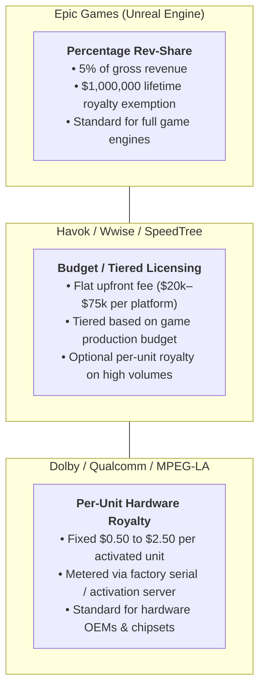
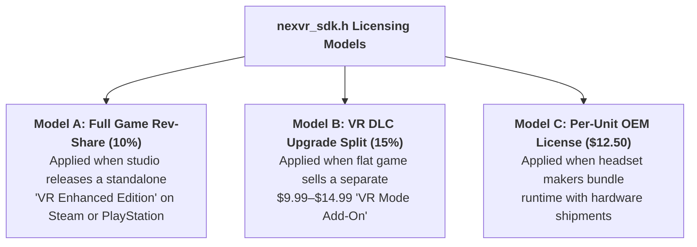

# 📐 B2B SDK Royalty Calculation Guide & Contract Framework
### How to Structure, Price, Calculate, and Audit Software Royalties for `nexvr_sdk.h`

> 📌 **Executive Overview**: 
> A B2B Software Development Kit (SDK) royalty is an ongoing license fee paid by a game studio, publisher, or hardware Original Equipment Manufacturer (OEM) to NexVR for incorporating our spatial rendering runtime (`nexvr_sdk.h`) into their commercial products.
> 
> This guide details:
> 1. **Industry Benchmarks**: How Epic Games (Unreal Engine), Havok, Audiokinetic Wwise, and Dolby structure royalties.
> 2. **The 3 Core Royalty Models for NexVR**: Rev-Share, DLC Add-On, and Per-Unit Hardware OEM.
> 3. **The Exact Mathematical Formulas**: Gross vs. Net Revenue, allowable deductions, and calculation engines.
> 4. **Step-by-Step Numerical Case Studies**: Real numbers on Steam sales, DLC packs, and tiered volume discounts.
> 5. **Contract Protection & Audit Clauses**: Defending against "Hollywood accounting", defining audit rights, and late fees.

---

## 🏛️ 1. Industry Benchmarks: How Big Tech Licenses SDKs

Software engine and middleware companies structure royalties using three standard archetypes:



### NexVR's Competitive Positioning:
* **The Problem for Studios**: Hiring a VR porting agency costs **$250,000 to $500,000 upfront** and takes 9–14 months.
* **The NexVR Value Proposition**: Drop `nexvr_sdk.h` into an existing C++ / Unreal / Unity project in 48 hours. Pay a modest setup fee ($20,000) and share **10% of incremental VR revenue**. Zero financial risk for the studio.

---

## ⚙️ 2. The 3 Royalty Models for NexVR B2B SDK



---

## 🧮 3. The Mathematical Formulas

### A. The Inviolable Definition of "Net Revenue"
In software licensing, the biggest point of dispute is the definition of **Gross Revenue** vs. **Net Revenue**. Studios will attempt to deduct internal payroll, marketing spend, and overhead ("Hollywood accounting"). 

> ⚠️ **The Golden Contract Rule**: Net Revenue must strictly mean **actual gross cash proceeds received from the digital storefront (e.g. Steamworks, PlayStation Network) minus strictly verifiable external platform fees and statutory taxes.**

$$\text{Net Revenue} = \text{Gross Sales} - \Big(\text{Storefront Fees} + \text{Statutory Taxes} + \text{Actual Customer Refunds}\Big)$$

#### 1. Allowable Deductions:
* **Storefront Fees**: Standard platform commission (Valve Steam 30%, Epic Games Store 12%, Sony PlayStation Network 30%).
* **Statutory Taxes**: Value Added Tax (VAT), Goods and Services Tax (GST), or sales taxes collected and remitted to governments.
* **Returns & Refunds**: Genuine refunds and chargebacks processed by the storefront.

#### 2. Strictly Prohibited Deductions (Non-Allowable):
* ❌ Studio internal development costs or salaries.
* ❌ Marketing, advertising, public relations, or influencer spend.
* ❌ Publisher distribution fees or overhead allocations.
* ❌ Payment processing fees already covered under the storefront cut.

---

### B. Standard Royalty Formula (Model A & B)

$$\text{Royalty Due} = \text{Net Revenue} \times \text{Contracted Royalty Rate } (R)$$

Where:
* $R = 10.0\%$ for full standalone game editions.
* $R = 15.0\%$ for optional VR DLC upgrade packs.

---

### C. Tiered Volume Royalty Formula (For AAA Blockbusters)

To attract major AAA studios selling millions of units, offer volume discounting:

$$\text{Total Royalty} = \sum_{i=1}^{n} (\text{Net Revenue in Tier } i \times R_i)$$

| Revenue Tier | Net Revenue Range | Royalty Rate ($R$) | Rationale |
| :---: | :---: | :---: | :--- |
| **Tier 1** | First $0 to $1,000,000 | **12.0%** | Recoups early integration and technical support overhead. |
| **Tier 2** | $1,000,001 to $5,000,000 | **8.0%** | Competitive commercial growth rate. |
| **Tier 3** | Exceeding $5,000,000 | **5.0%** | Matches Epic Games Unreal rate; incentivizes blockbuster hits. |

---

## 📊 4. Step-by-Step Calculation Case Studies

---

### Case Study 1: Standalone Steam Release ("VR Enhanced Edition")
* **Scenario**: An indie horror studio uses `nexvr_sdk.h` to launch *Haunted Echoes: VR Edition* on Steam.
* **Retail Price**: **$29.99**
* **Units Sold (Quarter 1)**: **50,000 copies**

```
Step 1: Calculate Gross Storefront Receipts
Gross Revenue = 50,000 units × $29.99 = $1,499,500.00

Step 2: Subtract Allowable Deductions
- Steam Platform Fee (30%):            -$449,850.00
- Customer Returns / Chargebacks (4%):   -$59,980.00
- VAT / Statutory Sales Taxes (avg 5%):  -$74,975.00
Total Allowable Deductions:             -$584,805.00

Step 3: Calculate Net Cash Proceeds
Net Revenue = $1,499,500.00 - $584,805.00 = $914,695.00

Step 4: Apply NexVR Royalty Rate (10%)
Royalty Due = $914,695.00 × 0.10 = $91,469.50
```
* **Result**: The studio generates **$823,225.50** in new net cash; NexVR collects **$91,469.50** in high-margin royalty revenue.

---

### Case Study 2: VR DLC Upgrade Add-On (Flat Game + VR Mode)
* **Scenario**: A studio already sells a flat PC combat title for $49.99. They do not want to divide their community, so they release an optional **$9.99 "VR Mode DLC"** powered by `nexvr_sdk.h`.
* **DLC Retail Price**: **$9.99**
* **DLC Units Sold**: **35,000 copies**

```
Step 1: Calculate Gross DLC Receipts
Gross Revenue = 35,000 units × $9.99 = $349,650.00

Step 2: Subtract Allowable Deductions
- Steam Storefront Fee (30%):          -$104,895.00
- Customer Refunds (2%):                 -$6,993.00
- Taxes / VAT (5%):                     -$17,482.50
Total Allowable Deductions:             -$129,370.50

Step 3: Calculate Net DLC Revenue
Net Revenue = $349,650.00 - $129,370.50 = $220,279.50

Step 4: Apply NexVR DLC Royalty Rate (15%)
Royalty Due = $220,279.50 × 0.15 = $33,041.93
```
* **Result**: NexVR collects **$33,041.93** on a single DLC add-on with zero customer support burden.

---

### Case Study 3: Hardware OEM Pre-Install Royalty (Bigscreen / Pimax)
* **Scenario**: A boutique micro-OLED headset maker bundles a tailored NexVR runtime inside every hardware shipment.
* **Volume**: **8,000 headsets** shipped in Year 2.
* **Royalty Structure**: Fixed **$12.50 per activated unit** (metered at first hardware device handshake).

$$\text{OEM Royalty} = 8,000 \text{ headsets} \times \$12.50 = \mathbf{\$100,000.00}$$
* **Payment Terms**: 50% ($50,000) invoiced upon signing; 50% reconciled quarterly based on hardware serial activation telemetry.

---

## ⚖️ 5. Contractual Protections & Legal Clauses

To ensure NexVR gets paid accurately and on time, every B2B SDK license agreement must include these four protective covenants:

### 1. The Minimum Guarantee (MG) / Upfront Integration Fee
* **Rule**: NexVR charges a non-refundable upfront fee of **$20,000** upon contract execution.
* **Treatment**: This fee covers dedicated engineering onboarding and profile certification. It is **non-recoupable** (does not offset future royalties), ensuring NexVR is never cash-negative on an integration.

### 2. Quarterly Accounting & Reporting Schedule
* Studio must deliver a detailed sales statement within **30 calendar days** following the close of each calendar quarter (Q1: April 30, Q2: July 31, Q3: October 31, Q4: January 31).
* Statements must include official raw export reports from **Steamworks Sales & Activations** or **PlayStation Partner Portal**.

### 3. The Right to Audit ("The 5% Penalty Clause")
```markdown
"NexVR reserves the right, upon fifteen (15) business days written notice, to appoint an independent certified public accountant (CPA) to inspect Licensee’s financial books and storefront reports. 

If such audit reveals an underpayment exceeding five percent (5%) of the royalties due for the audited period, Licensee shall immediately pay:
(a) The full deficiency amount;
(b) An interest penalty of 1.5% per month (or maximum statutory rate);
(c) The full reasonable cost of the audit."
```

### 4. Direct Storefront Splitting (The Steam Value Split Protocol)
* **Best Practice**: Whenever possible, set up Valve Steam's built-in **"Steamworks Revenue Split"** feature.
* **Benefit**: Valve automatically deposits 10% directly into NexVR's corporate bank account and 90% into the studio's bank account on the 21st of every month. This eliminates studio invoice delays, reconciliation disputes, and collection risk entirely.

---

## 📈 6. Summary Comparison Table of B2B Royalty Models

| Feature | Model A: Standalone VR Edition | Model B: VR DLC Upgrade | Model C: Hardware OEM Bundle |
| :--- | :---: | :---: | :---: |
| **Target Partner** | Indie / AA Game Studios | Active Live-Service Flat Games | Headset Manufacturers |
| **Upfront Fee** | $20,000 (Non-recoupable) | $15,000 (Non-recoupable) | $50,000 (Pilot deposit) |
| **Royalty Base** | Net Game Revenue | Net DLC Revenue | Shipped / Activated Units |
| **Royalty Rate** | **10%** (or tiered 12%/8%/5%) | **15%** | **$12.50 / headset** |
| **Payment Cadence** | Quarterly (Net 30) or Steam Split | Quarterly (Net 30) or Steam Split | Milestone / Net 30 |
| **Reporting Requirement** | Storefront CSV export | Storefront CSV export | Hardware Serial Telemetry |
| **Annual Target (Y2)** | 3 Studios = $100,000 | 2 Studios = $50,000 | 1 OEM = $100,000 |

---

## 📖 Glossary: Full Forms of All Short Forms in this Document

| Short Form | Full Form | Meaning / Description |
| :--- | :--- | :--- |
| **B2B** | **Business-to-Business** | Commercial transactions between businesses (e.g. NexVR licensing to game studios). |
| **SDK** | **Software Development Kit** | A collection of software tools, libraries, and headers (`nexvr_sdk.h`) used for development. |
| **OEM** | **Original Equipment Manufacturer** | Companies that manufacture physical hardware devices (e.g. Bigscreen, Pimax, HTC). |
| **DLC** | **Downloadable Content** | Additional digital content released for an existing video game (e.g. "VR Mode DLC"). |
| **VAT** | **Value Added Tax** | Consumption tax assessed on the value added to goods and services in foreign jurisdictions. |
| **GST** | **Goods and Services Tax** | Comprehensive multi-stage sales tax levied on manufactured and sold items. |
| **MG** | **Minimum Guarantee** | Upfront non-refundable cash paid by a licensee guaranteeing minimum payment to licensor. |
| **REV-SHARE**| **Revenue Sharing** | Distribution of operating profits or sales proceeds between cooperating business partners. |
| **CPA** | **Certified Public Accountant** | Statutory professional accounting designation licensed to perform formal financial audits. |
| **AAA** | **Triple-A (High-Budget Games)** | Video games produced and distributed by mid-sized or major game publishers with high budgets. |
| **AA** | **Double-A (Mid-Tier Games)** | Independent games with moderate budgets ($2M–$15M) and high production value. |
| **API** | **Application Programming Interface** | Formal set of software protocols enabling distinct applications to communicate. |
| **ABI** | **Application Binary Interface** | Low-level binary interface between two software modules or operating system components. |
| **C++** | **C Plus Plus Programming Language** | High-performance compiled programming language used in game engines and low-level runtimes. |
| **UPM** | **Unity Package Manager** | Modular management system used to distribute Unity plugins and assets. |
| **CSV** | **Comma-Separated Values** | Delimited plain text file format commonly used for exporting spreadsheet financial reports. |
| **TRL** | **Technology Readiness Level** | NASA / DoD framework measuring the maturity of a technology from concept (1) to flight (9). |
| **EBITDA** | **Earnings Before Interest, Taxes, Depreciation, and Amortization** | Operating profitability metric reflecting pure cash generation before accounting adjustments. |
| **ARR** | **Annual Recurring Revenue** | Normalized annualized recurring subscription or contractual software revenue. |
| **VR / AR / XR**| **Virtual Reality / Augmented Reality / Extended Reality** | Spectrum of immersive computing hardware and spatial software applications. |
| **OpenXR** | **Open Cross-Platform Standard for XR** | Royalty-free open standard developed by the Khronos Group for spatial computing. |
| **G-Buffer** | **Geometric Buffer** | Render target array containing depth, normals, and surface color in deferred rendering. |
| **URP** | **Universal Render Pipeline** | Scriptable render pipeline in Unity optimized for multi-platform graphical performance. |

---

### 📂 Strategic Cross-References
* [**Year 2 Operational Playbook (B2B Studio SDK & OEM Pilot)**](../10-year-playbook/year-02-b2b-studio-sdk.md)
* [**Big Tech Financial Architecture Blueprint**](big-tech-financial-architecture.md)
* [**Revenue Model & Pricing Mechanics**](revenue-model.md)
* [**The Winning Execution Plan**](../03-strategy/winning-execution-plan.md)
* [**Master Strategic Directory Index**](../README.md)
