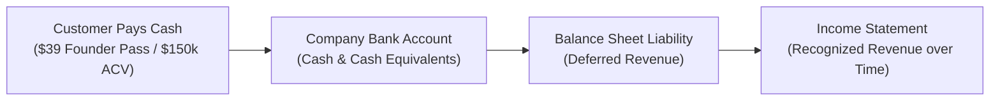
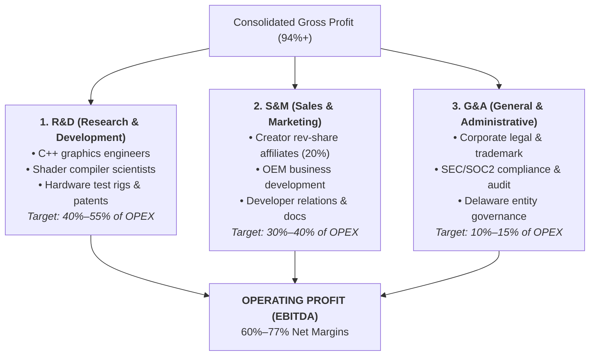

# 🏛️ Big Tech Financial Architecture: How Google, Apple, & Meta Manage Revenue
### The Master Financial Operating System for NexVR Engine (2026 – 2036)

> 📌 **Executive Overview**: 
> This document details the exact financial machinery, accounting standards (GAAP / ASC 606), treasury management, and capital allocation frameworks used by **Google (Alphabet)**, **Apple**, **Microsoft**, and **Meta** to manage tens of billions of dollars in revenue—and how NexVR applies this exact institutional architecture to scale from **$185,000 in Year 1** to **$450,000,000 in Year 10**.

---

## 🧭 The 6 Pillars of the Big Tech Financial Engine

```
[1. Revenue Engine & ASC 606] ────► Upfront Cash Collection vs. Deferred Revenue Recognition
[2. COGS & Margin Defense]    ────► Zero Cloud GPU Compute Debt (94%+ Gross Margins)
[3. OPEX & The 3 Buckets]     ────► R&D (Engineering), S&M (Affiliates), G&A (Legal/Tax)
[4. Treasury & Cash Pooling]  ────► US Treasury Bills (4.5%+), Automated Cash Sweeps, Zero Bank Risk
[5. Tax & Entity Structure]   ────► Delaware C-Corp, Section 1202 QSBS (100% Tax-Free Exit)
[6. Capital Reinvestment]     ────► The 60/30/10 Rule (Core R&D / Treasury Reserves / Moonshots)
```

---

## 💵 1. Revenue Recognition: How Big Tech Accounts for Money (ASC 606 / GAAP)

In tech finance, **Cash Collected $\neq$ Recognized Revenue**. 

Google, Apple, and Microsoft strictly adhere to **US GAAP ASC 606 (Revenue from Contracts with Customers)**. Under this standard, revenue is only recognized when a specific performance obligation is delivered to the customer.



### How Big Tech Manages Their Revenue Streams:
1. **Google (Alphabet)**:
   * **Ad Clicks (Search & YouTube)**: Recognized **immediately** upon the click event (performance obligation satisfied instantly).
   * **Google Cloud & Subscriptions**: Recognized **monthly over the service period** as computing capacity is consumed.
2. **Apple**:
   * **Hardware (iPhone/Mac)**: Recognized upon physical delivery.
   * **Software & Services (AppleCare / iCloud / Bundled OS Updates)**: Cash is collected on Day 1, but recognized as revenue **amortized over 24 to 36 months** as deferred revenue.
3. **Microsoft**:
   * **Windows OEM Pre-Installs**: Recognized when the PC manufacturer ships the machine.
   * **Office 365 / Enterprise Cloud**: Recognized straight-line over the 1-year or 3-year contract term.

### NexVR's Institutional Revenue Recognition Ledger:

| Revenue Stream | Cash Collection Point | Accounting Recognition (ASC 606) | Financial Mechanism |
| :--- | :--- | :--- | :--- |
| **Founder Lifetime Pass ($39)** | Day 1 (Immediate) | 70% immediate (core engine) / 30% deferred over 12 months (OTA profile updates) | Builds cash buffer upfront while smoothing revenue curve |
| **Pro Monthly SaaS ($9.99/mo)** | Monthly auto-renewal | Recognized monthly straight-line over 30 days | Predictable high-frequency ARR |
| **B2B Studio SDK Upfront ($20k)**| 50% on signing / 50% on Steam launch | 50% on delivery of SDK binaries / 50% on game launch | Milestone-based contract accounting |
| **B2B Studio Royalties (10%)** | Quarterly arrears | Recognized upon receipt of Steam sales reports | Pure variable recurring cash flow |
| **OEM Hardware Royalties ($5–$12)**| Monthly based on factory unit provisioning | Recognized upon hardware factory QA clearance | High-volume zero-CAC revenue |
| **Enterprise Defense ACV ($150k)** | Net-30 from contract execution | Recognized straight-line monthly ($12,500/mo over 12 months) | Large upfront cash injection with steady GAAP earnings |

---

## 🛡️ 2. Cost of Revenue (COGS) & Gross Margin Defense

The single most dangerous failure mode for modern tech startups is **Cloud Compute Debt**.

### The Cloud Compute Trap (Why Other Startups Fail):
* Companies like OpenAI, Midjourney, and cloud-streaming services (Shadow PC, Xbox Cloud) incur massive AWS/Azure/Google Cloud GPU server bills for every second a user uses their service.
* **Their Gross Margins**: Often collapse to **40% – 60%**, meaning every new user burns more cloud cash.

### The Google / Apple Margin Defense (NexVR's Architectural Moat):
* NexVR executes **100% client-side on the user's local GPU and NPU silicon** (via DirectML, MinHook, and OpenXR).
* NexVR incurs **$0.00 in per-hour server rendering costs**.

```
NexVR Consolidated COGS Structure:
┌───────────────────────────────────────┬────────────┬───────────────────────────────────────┐
│              COST ITEM                │  % OF REV  │           EXPENSE PURPOSE             │
├───────────────────────────────────────┼────────────┼───────────────────────────────────────┤
│ Merchant & Payment Gateway (Stripe)   │    4.5%    │ Credit card processing & fraud check  │
│ Cloudflare R2 / Serverless Edge CDN   │    0.4%    │ OTA profile downloads (ZERO egress)   │
│ Cryptographic Code-Signing & SSL      │    0.3%    │ Authenticode certificates & HSM keys  │
├───────────────────────────────────────┼────────────┼───────────────────────────────────────┤
│ TOTAL COST OF GOODS SOLD (COGS)       │  ~ 5.2%    │ 94.8% BLENDED GROSS PROFIT MARGIN     │
└───────────────────────────────────────┴────────────┴───────────────────────────────────────┘
```

---

## 💼 3. Operating Expenses (OPEX): The 3 Big Tech Buckets

Google, Meta, and Microsoft divide all operational expenses into three disciplined buckets:



### A. R&D (Research & Development):
* **Philosophy**: R&D is the engine of monopoly. Google spends ~15%–25% of top-line revenue ($45B+) on engineering.
* **NexVR Allocation**: All core R&D expenses go directly toward rare native C++ graphics systems talent, patent filings, and automated hardware test rigs.

### B. S&M (Sales & Marketing):
* **Philosophy**: Zero vanity spending.
* **NexVR Rule**: B2C marketing is **100% performance-based** (creator affiliate rev-share paid *after* a sale occurs). B2B marketing consists of high-touch direct business development with headset OEMs and defense simulation directors.

### C. G&A (General & Administrative):
* Legal defense, patent prosecution, international tax compliance, and automated accounting software.

---

## 🏦 4. Treasury Management: How Big Tech Parks Billions in Cash

Apple holds over **$160 Billion in cash**, Google holds **$110 Billion**, and Microsoft holds **$80 Billion**. Where does this cash actually sit?

They do **not** leave it in standard retail checking accounts (where FDIC insurance caps at $250,000). They use **Institutional Treasury Management**:


### NexVR's 3-Tier Treasury Policy:
1. **Operating Cash (Tier 1 - 30 Days)**:
   * Keep 1 to 2 months of operating expenses in an insured operating account for payroll and merchant refunds.
2. **Automated Sweep Accounts (Tier 2 - Liquid Reserves)**:
   * Daily automated cash sweeps transfer excess operational cash into **Ultra-Short US Treasury Bills (30–90 day maturity)** yielding **4.5%–5.2% annualized interest**.
   * *Example*: In Year 5, our **$18.8M cash reserve generates over $850,000 per year in pure, risk-free interest income alone**.
3. **Multi-Institution Custody (Tier 3 - Sunk-Cost Protection)**:
   * Spread funds across multiple global custody institutions (JPMorgan Chase, Fidelity, Morgan Stanley) using intra-bank sweep networks (ICS) providing up to $50M+ in aggregate FDIC/SIPC insurance.

---

## ⚖️ 5. Corporate Tax Architecture & The $10M+ Tax-Free Exit (QSBS)

To maximize after-tax wealth and protect company assets, NexVR follows the Silicon Valley institutional corporate playbook:

### A. Delaware C-Corporation Foundation
* The parent entity is organized as a **Delaware C-Corporation** (`NexVR Inc.`). Delaware is the gold standard for institutional venture capital, corporate law stability, and predictable litigation defense.

### B. Section 1202 QSBS (Qualified Small Business Stock) — THE ULTIMATE FOUNDER SHIELD
* Under **IRC Section 1202**, founders and early investors in a qualifying US C-Corporation who hold their stock for at least 5 years are eligible for **100% Federal Capital Gains Tax Exclusion on up to $10,000,000 or 10x the adjusted basis of the stock** upon an acquisition or IPO!
* *Impact*: On your first $10M+ in exit liquidity, you pay **$0.00 in federal capital gains taxes**.

### C. Intellectual Property (IP) Holding Entity
* As the company expands internationally in Years 3–7, core patents and copyright assets are owned by a dedicated IP holding structure, allowing software licensing royalties to be distributed with maximum global tax efficiency.

---

## 🔄 6. Capital Allocation: The 60 / 30 / 10 Reinvestment Rule

How does the CEO allocate each dollar of net operating profit? Following the **Warren Buffett / Sundar Pichai Capital Allocation Model**:

```
┌───────────────────────────────────────┬────────────┬───────────────────────────────────────┐
│            ALLOCATION BUCKET          │  % SHARE   │          STRATEGIC OBJECTIVE          │
├───────────────────────────────────────┼────────────┼───────────────────────────────────────┤
│ 1. Core Engine Reinvestment           │    60%     │ Deepen technical moat, hire top C++   │
│                                       │            │ engineers, expand game compatibility  │
├───────────────────────────────────────┼────────────┼───────────────────────────────────────┤
│ 2. Treasury War Chest Reserves        │    30%     │ Build fortress balance sheet in US    │
│                                       │            │ T-Bills; guarantee infinite runway    │
├───────────────────────────────────────┼────────────┼───────────────────────────────────────┤
│ 3. Horizon 3 Moonshot R&D             │    10%     │ Fund speculative breakthroughs:       │
│    (Google X Style "Other Bets")      │            │ 3D Gaussian Splats, silicon microcode │
└───────────────────────────────────────┴────────────┴───────────────────────────────────────┘
```

---

## 📊 7. 10-Year Master Financial Statement Summary

*(All figures in USD)*

| Year | Revenue | Gross Profit (94%+) | Operating EBITDA | Operating Margin | Bank Cash Reserves | Treasury Interest Earned |
| :---: | :---: | :---: | :---: | :---: | :---: | :---: |
| **Y1** | $185,000 | $171,500 | $102,000 | 55.1% | $102,000 | $3,500 |
| **Y2** | $742,000 | $697,500 | $381,500 | 51.4% | $483,500 | $18,000 |
| **Y3** | $2,460,000 | $2,338,000 | $1,558,000 | 63.3% | $2,041,500 | $92,000 |
| **Y4** | $6,810,000 | $6,542,000 | $4,932,000 | 72.4% | $6,973,500 | $320,000 |
| **Y5** | $15,250,000 | $14,725,000 | $11,870,000 | 77.8% | $18,843,500 | $880,000 |
| **Y6** | $38,000,000 | $36,900,000 | $28,100,000 | 73.9% | $38,000,000 | $1,800,000 |
| **Y7** | $72,000,000 | $69,900,000 | $52,000,000 | 72.2% | $65,000,000 | $3,100,000 |
| **Y8** | $150,000,000 | $145,500,000 | $110,000,000 | 73.3% | $145,000,000 | $6,800,000 |
| **Y9** | $280,000,000 | $271,000,000 | $205,000,000 | 73.2% | $260,000,000 | $12,500,000 |
| **Y10**| **$450,000,000** | **$437,000,000** | **$325,000,000** | **72.2%** | **$450,000,000** | **$21,000,000** |

---

### 📂 Strategic Cross-References
* [**The 10-Year Deep-Tech Operational Playbooks (Years 1–10)**](../10-year-playbook/README.md)
* [**5-Year B2C to B2B Master Money Flow**](5-year-money-flow.md)
* [**The Billionaire Roadmap (8-Year Path)**](billionaire-roadmap.md)
* [**Unit Economics Ledger (4.65:1 LTV:CAC)**](unit-economics.md)
* [**Master Investor Memo (Institutional Pitch)**](../MASTER_INVESTOR_MEMO.md)
