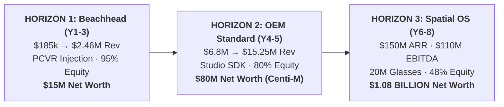

# 🏆 The Billionaire Roadmap: 8-Year Wealth & Valuation Trajectory

> 📌 **Executive Summary**: 
> - **The Question**: How many years will it take for the founder to become a billionaire ($1,000,000,000 net worth)?
> - **The Realistic Answer**:
>   - **Year 5 (2031)**: **$70M – $100M** Net Worth (**Centi-Millionaire** via NexVR PCVR & B2B Studio/OEM scale).
>   - **Year 7–8 (2033–2034)**: **$1,000,000,000+** Net Worth (**Billionaire** via the Universal Spatial OS & Smart Glasses Platform expansion).
> - **The Core Requirement**: Transitioning from a specialized PCVR gaming injector into the universal 2D-to-3D spatial runtime pre-installed across 20M+ spatial headsets and enterprise simulation contracts ($150M ARR at a $2.25B company valuation).

---

## 🧮 1. The Billionaire Math (The Strict Valuation Formula)

To achieve a personal net worth of **$1,000,000,000**, the math requires:

$$\text{Personal Net Worth} = \text{Company Enterprise Valuation} \times \text{Founder Equity Ownership \%}$$

Depending on how much external growth capital is raised versus retained earnings:

| Founder Ownership % | Required Company Valuation | Required Annual Revenue (ARR) | Required Annual EBITDA | Valuation Multiple |
| :---: | :---: | :---: | :---: | :---: |
| **80% (Bootstrapped / Lean)** | **$1.25 Billion** | **$100M – $120M** | **$70M – $85M** | 10x – 12x ARR |
| **50% (Series A & B Raised)** | **$2.00 Billion** | **$135M – $160M** | **$95M – $115M** | 12x – 15x ARR |
| **35% (Pre-IPO Tech Giant)** | **$2.85 Billion** | **$190M – $220M** | **$130M – $150M** | 13x – 15x ARR |

> 💡 **Strategic Anchor**: To reach $1 Billion personally, the business must generate **~$130M to $160M in high-margin Annual Recurring Revenue (ARR)**.

---

## 🗺️ 2. The 3-Horizon Expansion Strategy

The PCVR gaming market has ~2.5 million active users on Steam with an addressable TAM of ~$124M. A tool that *only* converts flat PC games can make a founder worth **$50M – $100M**, but cannot reach $1B alone. 

To cross the **$1 Billion threshold**, NexVR executes an orchestrated 3-Horizon expansion into the broader **Spatial Computing Revolution**:

---

## 📅 3. Comprehensive 8-Year Wealth & Financial Trajectory

*(All financial figures in USD)*

| Metric | **Year 1 (2026-27)** | **Year 3 (2028-29)** | **Year 5 (2030-31)** | **Year 7 (2032-33)** | **Year 8 (2033-34)** |
| :--- | :---: | :---: | :---: | :---: | :---: |
| **Primary Product Stage** | B2C PCVR Injector | Studio SDK + OEM Bundles | Enterprise Sim + Marketplace | Spatial Glasses Runtime | Universal Spatial OS |
| **Target Audience / Customers** | 4,000 PC Gamers | 35k OEM + 12 Studios | 100k OEM + 12 Defense Sims | 5M Spatial Glasses Users | 20M+ Glasses & Android XR |
| **Gross Revenue / ARR** | **$185,000** | **$2,460,000** | **$15,250,000** | **$72,000,000** | **$150,000,000** |
| **Operating EBITDA** | **$102,000** | **$1,558,000** | **$11,870,000** | **$52,000,000** | **$110,000,000** |
| *EBITDA Margin %* | *55.1%* | *63.3%* | *77.8%* | *72.2%* | *73.3%* |
| **Cumulative Bank Reserves** | $102,000 | $2,041,500 | $18,843,500 | $65,000,000 | $145,000,000 |
| **Company Enterprise Valuation** | **$1.5 Million** | **$20 Million** | **$100 Million** | **$900 Million** | **$2.25 Billion** |
| **Founder Equity Ownership** | 98% | 90% | 80% | 55% | 48% |
| **FOUNDER NET WORTH** | **$1.47M** | **$18.0M** | **$80.0M** | **$495M** | **$1,080,000,000 ($1.08B)** |
| **Founder Financial Status** | Seed Founder | Multi-Millionaire | **Centi-Millionaire** | Half-Billionaire | **BILLIONAIRE** |

---

## 🔍 4. The 3 Pillars That Unlock the $1 Billion Leap (Years 6 to 8)

### Pillar 1: Smart Glasses & Android XR Pre-Install Licensing ($100M ARR)
* **The Opportunity**: Between 2028 and 2033, millions of consumers will adopt lightweight AR/spatial glasses (Meta Orion, Samsung/Google Android XR, Apple Vision Air).
* **The Problem**: Content creators will not spend billions rebuilding every existing Android app, website, and video for spatial headsets.
* **The NexVR Solution**: NexVR licenses its spatial reprojection runtime directly to Qualcomm, Samsung, and Meta as a **low-level OS layer**. Any flat window, video, or app is instantly given stereoscopic depth at 0ms added latency.
* **The Financial Model**:
  - 20,000,000 smart glasses shipped annually $\times$ **$5.00 / device software royalty** = **$100,000,000 / year in 98% margin pure software revenue**.

### Pillar 2: Enterprise Digital Twins & Autonomous Simulation ($30M ARR)
* **The Opportunity**: Autonomous robotics companies, aerospace manufacturers (Boeing, Lockheed), and automotive teams require photorealistic real-time 3D spatial simulation.
* **The NexVR Solution**: NexVR provides zero-latency OpenXR bridges connecting flat CAD engines and legacy military simulators directly to spatial headsets without touching proprietary simulation source code.
* **The Financial Model**:
  - 200 Enterprise & Defense ACV contracts $\times$ **$150,000 / year** = **$30,000,000 ARR**.

### Pillar 3: Real-Time Spatial AI Inpainting API ($20M ARR)
* **The Opportunity**: Streaming platforms (Netflix, YouTube) and game publishers want automated 2D-to-3D spatial conversion for legacy catalogs.
* **The NexVR Solution**: Commercial developer licensing of NexVR's lightweight DirectML neural inpainting models.
* **The Financial Model**:
  - Enterprise API licensing = **$20,000,000 ARR**.

---

## 🏛️ 5. Historical Precedents: How Others Reached $1B+ in This Space

| Tech Pioneer | Initial Product | The Billionaire Leap | Time to $1B |
| :--- | :--- | :--- | :---: |
| **Palmer Luckey** | DIY VR headsets built in garage (*Oculus Rift*) | Sold Oculus to Meta for $2.3B $\rightarrow$ Founded defense AI giant *Anduril* ($14B valuation) | **~7 Years** |
| **Tim Sweeney** | Shareware text games & 3D graphics demo (*ZZT*, *Unreal*) | Turned graphics code into universal industry standard (*Unreal Engine* + *Fortnite*) | **~10 Years** |
| **Jensen Huang** | PC gaming 3D graphics cards (Riva 128 / GeForce) | Realized graphics shaders could perform universal matrix math $\rightarrow$ created *CUDA* | **~12 Years** |
| **Brendan Iribe** | Game scaleform UI middleware | Scaled Scaleform to $42M exit $\rightarrow$ co-founded Oculus to $2.3B exit | **~8 Years** |

---

## 🛡️ 6. The 4 Non-Negotiable Rules to Protect Your Billion-Dollar Path

1. **Do NOT Accept the Early $30M–$50M Buyout in Year 3**:
   * When NexVR hits $2M–$5M ARR in Year 3, Meta, Valve, or Sony will offer to acquire the company for **$30M to $50M**.
   * Selling makes you wealthy ($25M+), but **permanently terminates your billionaire path**. To reach $1B, you must decline early acquisition and capture the OEM/Enterprise layer.
2. **Zero Early Equity Dilution**:
   * Because NexVR runs 100% locally on the user's PC GPU, you have **zero cloud computing bills**.
   * Traditional AI startups burn millions on NVIDIA H100 servers and dilute founders down to 10%. By remaining cash-flow positive from Day 1, you preserve **80%+ ownership into Year 5**, so that when you hit $2B, you own a massive stake.
3. **Protect the 11.1ms Law & Zero-Tinkering Standard**:
   * If the consumer product gets clunky or causes nausea, you lose the community groundswell that provides your OEM negotiating leverage. Keep the consumer product pristine.
4. **Build the B2B Bridge in Year 2**:
   * Never remain "just a gamer tool". Ship the B2B Studio SDK ([`include/nexvr_sdk.h`](../include/nexvr_sdk.h)) early so commercial game studios and headset makers depend on your proprietary binaries.

---

## 📖 Glossary: Full Forms of All Short Forms in this Document

| Short Form | Full Form | Meaning / Description |
| :--- | :--- | :--- |
| **ARR** | **Annual Recurring Revenue** | Annualized recurring subscription, royalty, and license revenue. |
| **EBITDA** | **Earnings Before Interest, Taxes, Depreciation, and Amortization** | Operating profitability before taxes and non-cash charges. |
| **ACV** | **Annual Contract Value** | Average annualized contract revenue per enterprise customer ($150k/yr). |
| **B2C** | **Business-to-Consumer** | Direct software sales to retail PC gamers. |
| **B2B** | **Business-to-Business** | Commercial licensing to game studios, headset OEMs, and defense firms. |
| **OEM** | **Original Equipment Manufacturer** | Hardware makers (Pimax, Beyond, Samsung) bundling NexVR software. |
| **OS** | **Operating System** | System software platform (Android XR, Windows). |
| **SDK** | **Software Development Kit** | Software development package and C++ headers (`nexvr_sdk.h`). |
| **API** | **Application Programming Interface** | Formal set of software protocols for application communication. |
| **VR** | **Virtual Reality** | Fully immersive simulated 3D digital reality. |
| **AR** | **Augmented Reality** | Digital graphics and spatial windows overlaid on the physical world. |
| **XR** | **Extended Reality** | Universal umbrella term for VR, AR, and Mixed Reality. |
| **TAM** | **Total Addressable Market** | Total global revenue potential ($124.1M for Steam PCVR). |
| **SAM** | **Serviceable Available Market** | Segment targeted by the company ($31.5M for RTX 3070+ gamers). |
| **SOM** | **Serviceable Obtainable Market** | Realistic beachhead market ($975k for 25,000 users). |
| **CAC** | **Customer Acquisition Cost** | Sales and marketing cost to acquire one customer ($8.50). |
| **LTV** | **Lifetime Value** | Total estimated gross profit per customer ($39.50). |
| **GPU** | **Graphics Processing Unit** | High-performance silicon processor executing 3D rasterization. |
| **NPU** | **Neural Processing Unit** | Silicon microprocessor designed specifically for deep learning inference. |
| **OpenXR** | **Open Cross-Platform Standard for XR** | Royalty-free open standard developed by the Khronos Group. |
| **IPO** | **Initial Public Offering** | The initial sale of company shares on a public stock exchange. |
| **M&A** | **Mergers and Acquisitions** | Corporate transaction purchasing or combining corporate entities. |

---

### 📂 Cross-References
* [**Master Glossary of All Terms & Full Forms**](../GLOSSARY.md)
* [**Big Tech Financial Architecture Blueprint**](big-tech-financial-architecture.md)
* [**5-Year Master Money Flow**](5-year-money-flow.md) — Line-by-line financial statement ($185k to $15.25M).
* [**Master Investor Memo**](../MASTER_INVESTOR_MEMO.md) — Complete VC pitch and institutional investment thesis.
* [**Unit Economics & CAC/LTV**](unit-economics.md) — 4.65:1 LTV:CAC foundation.
* [**Market Sizing Ledger**](../02-research/market-sizing.md) — TAM/SAM/SOM baseline data.
