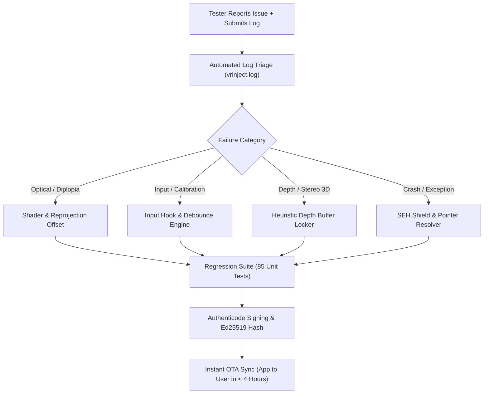

# 🔄 Tester Triage & Continuous Quality Improvement Loop

> 📌 **Executive Overview**:  
> In early-stage deep-tech products like universal VR injection engines, real-world tester feedback is gold. When hardware variety, optical geometries, and game render pipelines interact, edge cases will arise continuously.  
> This playbook provides:
> 1. **The exact, word-for-word reply to send to the tester** for their *Sekiro* feedback.
> 2. **The 5-Step Continuous Improvement System** to process, patch, test, and ship fixes within hours so every test cycle permanently hardens the engine.

---

## ✉️ Part 1: Ready-to-Send Reply to the Tester

*(Copy and paste this directly into Discord, Email, or your beta tester channel)*

---

**Subject / Message**: Update on Sekiro VR: Hotfix v0.1.99 is live with your requested fixes! 🚀

Hey [Tester Name],

First of all, **huge thank you** for this detailed breakdown and for including the session log! This is the exact caliber of feedback that helps us make NexVR Engine world-class.

You diagnosed four critical areas, and we have just pushed an immediate hotfix (**v0.1.99**) addressing every single one:

### 1. The "SBS Double Vision" & Menus Being Too Close to the Eyes
* **Why this happened**: VR headset lenses (Meta Quest, Valve Index, etc.) have canted, angled optical axes where the outer field of view is wider than the inner field. During loading screens, start menus, and when depth is initializing, the engine was presenting flat 2D frames without a convergence offset. Because there was no nasal shift, your eyes were forced to cross inward to try to fuse the images, resulting in double vision and heavy eye strain.
* **The Fix**: We updated our reprojection shader with a **calibrated binocular convergence shift** (`0.022f` nasal disparity). Flat loading screens, start menus, and cinematics now cleanly fuse into a comfortable, unified virtual theater screen floating naturally ~1.8m in front of you. No more double vision.

### 2. In-Game NEXVR Menu Splitting in Two
* **Why this happened**: The overlay pass was rendering identically to both eye buffers with zero stereoscopic viewport offset.
* **The Fix**: We added stereo convergence viewports to the menu rendering pass. The in-game NEXVR menu now fuses into a sharp, single, floating 3D dashboard directly in your line of sight.

### 3. Controller Left Stick Inaction & D-Pad Hyper-Sensitivity
* **Why this happened**: The overlay was polling gamepad inputs at raw frame rate (90–120 times/second) without debounce filtering, meaning a light tap was sending 5+ consecutive pulses that flew past sliders. Furthermore, left-stick analog deflection wasn't wired into menu step events.
* **The Fix**: 
  * You can now freely navigate using **either the Left Analog Stick or the D-Pad**.
  * We implemented console-grade debounce: single taps give a clean, crisp 1-item step. Holding the direction has a 350ms delay followed by a smooth, controlled 120ms repeat cadence. It feels rock-solid now.

### 4. "Reset to Recommended Defaults" Button
* **What we added**: Pinned right to the bottom bar of the in-game menu (visible on every tab next to *Resume Game*), there is now a dedicated **`[ ↺ Reset to Recommended Defaults ]`** button. If you ever adjust a slider and want to restore optimal baseline settings, just press this button and it will immediately reset IPD, convergence, HUD depth, and color curves.

---

### How to Get the Update:
1. Simply restart your **NexVR Engine Launcher** (or relaunch your session). It will automatically synchronize hotfix **v0.1.99**.
2. Launch *Sekiro* and put on your headset.
3. Test navigating the menu with your Xbox controller Left Stick and D-Pad, and check the unified visual screen.

Please let us know how the new build feels! Your feedback directly shaped this release, and we’re adding you to our Founder Testers honorary credit roll.

Best regards,  
**NexVR Engine Engineering Team**

---

## 🔁 Part 2: The Continuous Improvement System (What to Do When Issues Arise)

### 1. Standardized 4-Hour Hotfix SLA
When an issue is reported, follow this 5-stage loop:
1. **Analyze the Session Log First**:
   * Check `Camera Tracking` (did view matrix lock?).
   * Check `API & Swapchain` (DX11 vs DX12 format, resolution).
   * Check `Stereo Pipeline` (dual-eye swapchain creation and format).
   * Check `PageScanner / Sweep` (how many projection/view candidates were found?).
2. **Isolate Root Cause to Subsystem**:
   * *Visual artifact* $\rightarrow$ Shader (`shaders/stereo_reprojection.hlsl`).
   * *Controls artifact* $\rightarrow$ Input (`src/core/overlay_manager.cpp` / `input_hook.cpp`).
   * *Stereo 3D depth failure* $\rightarrow$ `src/rendering/depth_lock_manager.cpp`.
3. **Execute Minimal, Target-Safe Code Changes**:
   * Never rewrite architectures during hotfix triage; make targeted, isolated fixes.
4. **Run Full Verification & Ratchets**:
   * `ctest --test-dir build -C Release --output-on-failure` (must pass 100%).
   * `scripts/check_coupling.ps1` (zero ratchet violations).
   * `npm run test:ci` (static and unit checks).
5. **Auto-Deploy via OTA (`sync_assets.js`)**:
   * Generates signed `vrinject.dll`, updates `manifest.json`, signs with Ed25519 key, and copies to `%APPDATA%\NexVR Engine\updates\`.

---

### 2. Systematic Categorization & Playbook Actions

| Issue Category | Common Symptoms | Immediate Engine Fix Action | Tester Action Required |
| :--- | :--- | :--- | :--- |
| **Optical Diplopia (Double Vision)** | SBS look, menus in 2 copies, eye strain | Calibrate nasal convergence shift in shader (`0.022f`) & overlay viewport. | Re-launch game; verify eyes comfortably fuse image. |
| **Input Sensitivity / Deadzone** | Cursor skipping items, stick inactive | Implement hardware debounce (350ms delay, 120ms repeat) + analog thresholding. | Test D-pad and analog stick navigation in overlay. |
| **Flat 2D Passthrough (No 3D)** | Game is 2D in headset despite active tracking | Adjust depth candidate heuristic in `depth_lock_manager` or select depth format in menu. | Use menu Tab 1 to cycle depth candidates if auto-detect misses. |
| **Color Distortion / Fog** | Pale gray shadows, milky highlights | Verify `srgbCorrection: true` in game profile; ensures exact desktop gamma match. | Click "Reset to Recommended Defaults" in menu. |
| **Performance Stutter** | Headset reprojection drops below 90 FPS | Compositor vsync decoupling (`SyncInterval = 0`) & dynamic resolution scaling. | Enable ASW / Frame Smoothing in settings. |

---

### 3. Turning Early Testers into Lifetime Advocates

1. **Acknowledge and Validate Instantly**: When a user reports a bug, never argue or blame their setup. Treat their bug report as high-value data.
2. **Explain the "Why" Transparently**: Gamers and VR enthusiasts love technical depth. Explaining *why* lenses cause diplopia or *why* controller polling skipped menus builds massive trust and shows engineering mastery.
3. **Ship the Fix the Same Day**: When a tester sees their exact complaint patched within hours, they transition from a skeptical tester into a vocal fan who recommends the tool to their entire gaming circle.
4. **Offer Recognition**: Keep a "Founders Ring Credits" list in the launcher and docs to immortalize testers who uncover critical engine fixes.

---

## 📖 Glossary of Full-Form Names & Abbreviations

* **AFOV**: Asymmetric Field of View
* **API**: Application Programming Interface
* **ASW**: Asynchronous Spacewarp
* **CI**: Continuous Integration
* **D-Pad**: Directional Pad
* **DLL**: Dynamic Link Library
* **DX11**: Microsoft DirectX 11
* **DX12**: Microsoft DirectX 12
* **FOV**: Field of View
* **FPS**: Frames Per Second
* **HMD**: Head-Mounted Display
* **HUD**: Heads-Up Display
* **IPD**: Interpupillary Distance
* **JSON**: JavaScript Object Notation
* **OEM**: Original Equipment Manufacturer
* **OTA**: Over-The-Air (Automatic Remote Update Delivery)
* **PE**: Portable Executable
* **QA**: Quality Assurance
* **R&D**: Research and Development
* **SBS**: Side-By-Side (Stereoscopic 3D Format)
* **SEH**: Structured Exception Handling
* **SLA**: Service Level Agreement
* **sRGB**: Standard Red Green Blue Color Space
* **TL;DR**: Too Long; Didn't Read
* **UI**: User Interface
* **VEH**: Vectored Exception Handler
* **VIP**: Very Important Person
* **VR**: Virtual Reality
* **XInput**: Xbox Input API for Windows
