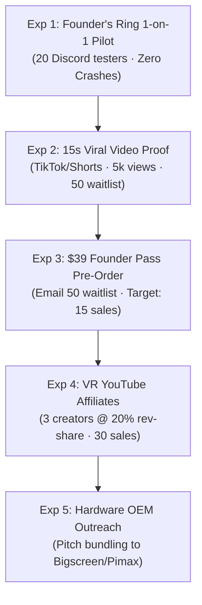

# 🔬 Validation Playbook: 5 Lean Experiments

> 📌 **TL;DR**: 
> - 5 sequential experiments ordered from **fastest & free** to **commercial scaling**.
> - **Immediate Goal**: Validate clean hardware launch (Exp 1) $\rightarrow$ drive viral waitlist (Exp 2) $\rightarrow$ sell first 20 Founder Passes (Exp 3).

---

## 🧪 The 5 Validation Experiments

---

## 📋 Experiment Summary Table

| Experiment | What It Tests | Success Target | Cost | Timeline |
| :--- | :--- | :--- | :---: | :---: |
| **1. Hardware Pilot** | Does it run with 0 crashes on clean PCs? | $\ge 8/10$ launch in < 60s | $0 | Days 1–7 |
| **2. Viral Video Proof** | Do gamers want this without ad spend? | $\ge 5,000$ views, $\ge 50$ waitlist | $0 | Days 8–15 |
| **3. Founder Pass Sale** | Will users pay $39 upfront? | $\ge 15$ paid orders ($585+) | $0 | Days 16–25 |
| **4. Creator Affiliates** | Can creators scale acquisition at 20%? | $\ge 30$ sales across 3 creators | Rev-Share | Days 26–45 |
| **5. OEM Bundling** | Will headset makers bundle NexVR? | 1 evaluation pilot agreement | $0 | Days 45–60 |
