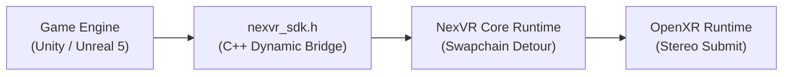

# 📘 Year 2 Operational Playbook (2027 – 2028)
## The B2B Studio SDK Wedge & OEM Bundling Pilot

> 📌 **Executive Overview**: 
> Year 2 executes the critical commercial pivot: transforming NexVR from an external consumer injection tool into an **official enterprise C++ SDK (`nexvr_sdk.h`)** licensed to game publishers, alongside our first **hardware OEM bundling contract**.
> 
> * **The North Star**: Launch the official commercial SDK and close the first 3 indie game studio VR edition contracts.
> * **The Kill/Pass Metric**: **3 Signed Studio SDK Deals ($20k fee + 10% royalty)** + **1st Hardware OEM Contract (8k units)** = **$742,000 Revenue ($381,500 EBITDA)**.
> * **Technology Readiness**: Advance the developer SDK from **TRL 5** to **TRL 8** (Commercial Qualification).
> * **Founder Net Worth**: **$5,700,000** (Retaining 95% equity).

---

## 🔬 1. The Heilmeier R&D Catechism (Year 2)

| Question | Executive Answer |
| :--- | :--- |
| **1. What are you trying to do?** | Provide a drop-in C++ / Unity / Unreal SDK that allows game studios to launch an official SteamVR edition of their flat game in under 1 week with zero native VR rewrites. |
| **2. How is it done today?** | Studios hire specialized VR porting agencies costing **$250,000 to $500,000 upfront**, requiring 9–14 months of development, or they completely abandon the VR audience due to cost. |
| **3. What is new in our approach?** | We abstract the entire OpenXR stereo compositing and motion-controller translation into a clean C++ header (`nexvr_sdk.h`). 1 line of initialization code activates full 6DOF VR inside their existing game engine. |
| **4. Who cares? If successful, what difference will it make?** | Mid-tier game publishers gain a new high-margin revenue stream on SteamVR with near-zero R&D expense; headset makers get instant content bundles for their hardware. |
| **5. What are the core technical risks?** | Unreal Engine 5 Nanite/Lumen stereo reprojection artifacts; Unity Universal Render Pipeline (URP) shader graph hook stability. |
| **6. How much will it cost?** | $180,000 in dedicated graphics engineering payroll, fully financed by Year 1 retained cash reserves ($102k) and early B2B contract deposits. |
| **7. How long will it take?** | 6 months to SDK developer release; 6 months to first 3 commercial game launches on Steam. |
| **8. What are the success exams?** | 3 published Steam games utilizing `nexvr_sdk.h` with "Very Positive" user reviews and 8,000 OEM bundled headsets shipped. |

---

## 🛠️ 2. Deep-Tech R&D & SDK Architecture



### A. The Clean C++ API Interface (`include/nexvr_sdk.h`)
* Provide an unmanaged C-ABI interface for 100% interoperability across C++, C# (Unity), and Rust:
```cpp
extern "C" {
    NEXVR_API bool NexVR_Initialize(const NexVR_Config* config);
    NEXVR_API void NexVR_SetCameraMatrices(const float* viewMatrix, const float* projMatrix);
    NEXVR_API void NexVR_RenderStereoFrame(void* nativeTextureHandle);
    NEXVR_API void NexVR_Shutdown();
}
```

### B. Unreal Engine 5 & Unity Plugins
* **Unreal Engine**: Develop `UNexVRSubsystem` that automatically hooks into `UGameViewportClient` to capture the post-processing G-Buffer and camera transform hierarchy.
* **Unity Engine**: Package a native UPM (Unity Package Manager) plugin utilizing `CommandBuffer.IssuePluginEvent` to detour render passes before final blit.

### C. Community Profile Marketplace Engine
* Launch an in-launcher digital marketplace allowing community modders to sell tuned game profiles (custom motion controller weapon offsets, vehicle cockpits).
* Cryptographic signature verification (Ed25519) on all downloaded profiles. NexVR takes an automated **30% platform transaction fee**.

---

## 📢 3. Go-To-Market & Commercial Contract Structuring

### A. The Studio Port Licensing Agreement (Model B)
* **Target**: Mid-tier indie publishers on Steam with titles that sold 200k–1M copies (e.g., single-player horror, RPG, combat campaigns).
* **Financial Terms**:
  - **$20,000 Upfront Integration Fee** (covers technical support and profile tuning).
  - **10% Ongoing Royalty** on all copies sold with VR support activated.
* **Volume**: 3 closed contracts in Year 2 = **$60,000 upfront + $40,000 royalties = $100,000**.

### B. The Hardware OEM Bundling Pilot (Bigscreen Beyond)
* Boutique micro-OLED headset manufacturers struggle with content availability.
* **The Deal**: NexVR bundles a specialized companion runtime with every Bigscreen Beyond unit.
* **Terms**: 8,000 units $\times$ **$12.50 / headset software license** = **$100,000 in pure software revenue**.

---

## 📊 4. Year 2 Financials & Gate Review Criteria

| Line Item | Year 1 (Actual) | Year 2 (Target) | Growth % |
| :--- | :---: | :---: | :---: |
| **B2C Consumer Revenue (Passes + SaaS)** | $185,000 | **$542,000** | +193% |
| • Community Profile Marketplace (30% cut)| $0 | **$40,000** | New |
| **B2B Commercial Revenue (SDK + OEM)** | $0 | **$200,000** | New |
| • Studio Upfront SDK Fees (3 Studios) | $0 | $60,000 | New |
| • Studio Game Royalties (10% rev-share)| $0 | $40,000 | New |
| • OEM Hardware Bundling (8k units) | $0 | $100,000 | New |
| **CONSOLIDATED GROSS REVENUE** | **$185,000** | **$742,000** | **+301%** |
| Cost of Goods Sold (COGS) | ($13,500) | ($44,500) | 94.0% Margin |
| Operating Expenses (Payroll & R&D) | ($69,500) | ($316,000) | Lean Expansion |
| **OPERATING PROFIT (EBITDA)** | **$102,000** | **$381,500** | **51.4% Margin** |
| **Cumulative Bank Reserves** | **$102,000** | **$483,500** | **Zero Debt** |
| **Company Valuation** | $1.5M | **$6.0 Million** | 8x ARR Multiple |
| **FOUNDER NET WORTH** | **$1.47M** | **$5,700,000** | Retaining 95% |

### 🚦 Year 2 Stage-Gate Exit Criteria (To Unlock Year 3):
1. ✅ Complete delivery and documentation of `nexvr_sdk.h` for Unity & Unreal Engine.
2. ✅ Minimum 3 commercial studio games launched on Steam utilizing the SDK.
3. ✅ Bigscreen Beyond OEM pilot completed with $\ge 90\%$ user satisfaction.
4. ✅ Cumulative company bank reserves exceed **$450,000**.
