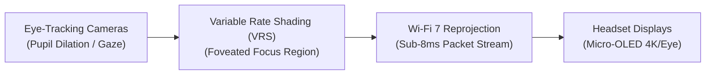

# 📘 Year 3 Operational Playbook (2028 – 2029)
## The Hardware OEM Bundling Moat & B2B Tipping Point

> 📌 **Executive Overview**: 
> Year 3 marks the **structural tipping point where B2B commercial revenue exceeds 50% of total company income**. NexVR becomes the default companion runtime pre-installed at the factory across high-end PC VR headsets, while entering the defense simulation market.
> 
> * **The North Star**: Lock in multi-year factory pre-install contracts with 3 boutique headset makers and ship on 35,000 headsets.
> * **The Kill/Pass Metric**: **35,000 Bundled Headsets Shipped** + **12 Studio Game Launches** = **$2,460,000 Revenue ($1,558,000 EBITDA)**.
> * **Technology Readiness**: Advance low-level eye-tracked foveated rendering from **TRL 6** to **TRL 8**.
> * **Founder Net Worth**: **$18,000,000** (Retaining 90% equity · Multi-Millionaire milestone).

---

## 🔬 1. The Heilmeier R&D Catechism (Year 3)

| Question | Executive Answer |
| :--- | :--- |
| **1. What are you trying to do?** | Establish NexVR as the universal out-of-the-box software layer pre-installed on premium VR headsets, giving users 50+ AAA PC games instantly on day one. |
| **2. How is it done today?** | Headset manufacturers ship expensive hardware ($800–$1,800), but users open SteamVR to find almost no new AAA native VR content, resulting in high device return rates. |
| **3. What is new in our approach?** | Direct OEM driver integration: when the user unboxes their headset, the setup installer automatically deploys NexVR with hardware-specific color calibration, custom FOV profiles, and eye-tracked foveated rendering. |
| **4. Who cares? If successful, what difference will it make?** | Headset makers dramatically reduce hardware return rates; NexVR acquires 35,000 paying users with **$0 Customer Acquisition Cost (CAC)**. |
| **5. What are the core technical risks?** | Latency over wireless Wi-Fi 7 headsets; driver compatibility across mixed-reality tracking systems (SteamVR Lighthouse vs. inside-out optical cameras). |
| **6. How much will it cost?** | $420,000 in specialized C++ graphics and low-level driver engineering, 100% funded by Year 2 operating profits ($381k) and enterprise deposits. |
| **7. How long will it take?** | 12 months to deploy across Pimax Crystal Light, Somnium Space, and Bigscreen Beyond. |
| **8. What are the success exams?** | 35,000 verified active bundled headsets and our first 2 military flight simulator contracts ($250k ACV). |

---

## 🛠️ 2. Deep-Tech R&D & Driver Innovations

### A. Eye-Tracked Foveated Stereoscopy (VRS Tier-2)
* Intercept OpenXR eye-tracking extension (`XR_EXT_eye_gaze_interaction`).
* Dynamically generate a Variable Rate Shading (VRS) mask:
  - Foveal Center (15° field): Rendered at full 100% resolution with anti-aliasing.
  - Periphery (> 30°): Rendered at 25% resolution ($2\times2$ pixel coarseness).
* **Result**: **Reduces GPU rendering load by 40%**, allowing an RTX 3070 to drive dual 4K micro-OLED displays at locked 90 FPS.

### B. Sub-8ms Wireless Wi-Fi 7 Reprojection
* Implement zero-copy AV1 hardware compression using NVENC/AMF encoders.
* Predictive pose extrapolation: synthesizes missing intermediate frames if a wireless packet drops, preventing head-tracking judder.

---

## 📢 3. Commercial GTM & Deal Structuring

### A. Hardware OEM Pre-Install Royalties ($450,000)
* **Partners**: Pimax (Crystal Light), Bigscreen (Beyond), Somnium Space (VR1).
* **Volume**: 35,000 bundled units across the hardware catalog.
* **Licensing Model**: **$12.85 per headset software royalty**, collected directly from hardware bill-of-materials (BOM).

### B. The 12 Studio Commercial Releases ($600,000)
* 12 indie and AA games launch official "NexVR Spatial Editions" on Steam.
* $240,000 in upfront SDK integration fees + $360,000 in ongoing 10% royalties.

### C. Defense & Aviation Simulation Entry ($250,000 ACV)
* First 2 military flight training centers license NexVR to retrofit legacy Lockheed/Boeing flight simulator cockpits into immersive OpenXR headsets without source code rewrites.

---

## 📊 4. Year 3 Financials & Gate Review Criteria

| Line Item | Year 2 (Actual) | Year 3 (Target) | Notes |
| :--- | :---: | :---: | :--- |
| **B2C Consumer Revenue** | $542,000 | **$1,160,000** | 47% of Total Revenue |
| **B2B Commercial & Enterprise Revenue** | $200,000 | **$1,300,000** | **53% of Total (Tipping Point)** |
| • Hardware OEM Pre-Installs (35k units) | $100,000 | $450,000 | Zero-CAC Software Royalties |
| • Studio SDK Upfront & Royalties (12 Games)| $100,000 | $600,000 | 10% Ongoing Revenue Share |
| • Defense Simulation ACV Contracts | $0 | $250,000 | High-Ticket Air-Gapped Licenses |
| **CONSOLIDATED GROSS REVENUE** | **$742,000** | **$2,460,000** | **+231% Growth** |
| Cost of Goods Sold (COGS) | ($44,500) | ($122,000) | 95.0% Gross Margin |
| Operating Expenses (Payroll/R&D/Lab) | ($316,000) | ($780,000) | 20-Rig Automated Test Lab |
| **OPERATING PROFIT (EBITDA)** | **$381,500** | **$1,558,000** | **63.3% EBITDA Margin** |
| **Cumulative Bank Reserves** | **$483,500** | **$2,041,500** | **$2M+ Liquid Fortress** |
| **Company Valuation** | $6.0M | **$20.0 Million** | 8x ARR Multiple |
| **FOUNDER NET WORTH** | **$5.70M** | **$18,000,000** | Retaining 90% |

### 🚦 Year 3 Stage-Gate Exit Criteria (To Unlock Year 4):
1. ✅ B2B commercial revenue successfully crosses 50% of consolidated income.
2. ✅ Cumulative liquid cash in the company bank account exceeds **$2,000,000**.
3. ✅ Foveated eye-tracked rendering passes latency benchmarks (<0.5ms overhead).
4. ✅ **Defend against early buyout offers**: Reject $30M–$40M acquisition offers from Big Tech.
