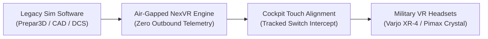

# 📘 Year 4 Operational Playbook (2029 – 2030)
## Industrial Defense Scale & 100,000 Headsets Bundled

> 📌 **Executive Overview**: 
> Year 4 scales the high-margin enterprise simulation division, deploying NexVR's air-gapped runtime into military flight cockpits, naval simulators, and industrial training facilities, while surpassing **100,000 factory-bundled OEM consumer headsets**.
> 
> * **The North Star**: Capture $1.5M in recurring enterprise defense simulation ACV and bundle 100,000 headsets.
> * **The Kill/Pass Metric**: **$1,500,000 in Enterprise ACV** + **100,000 OEM Bundles** = **$6,810,000 Revenue ($4,932,000 EBITDA)**.
> * **Technology Readiness**: Advance secure air-gapped enterprise spatial runtime to **TRL 9** (Mission Proven).
> * **Founder Net Worth**: **$46,700,000** (Retaining 85% equity).

---

## 🔬 1. The Heilmeier R&D Catechism (Year 4)

| Question | Executive Answer |
| :--- | :--- |
| **1. What are you trying to do?** | Provide an air-gapped, high-security spatial runtime that allows defense and aerospace organizations to retrofit multi-million dollar legacy cockpit simulators into 6DOF OpenXR headsets without touching proprietary code. |
| **2. How is it done today?** | Flight and combat academies spend **$5M to $20M per cockpit** on curved projector domes and hydraulic hardware simulators that require massive physical hangars. |
| **3. What is new in our approach?** | NexVR injects directly at the GPU driver layer of simulation software (Lockheed Martin Prepar3D, X-Plane, DCS Combat, Siemens CAD) with zero cloud network traffic, delivering instant 1:1 photorealistic cockpit telepresence. |
| **4. Who cares? If successful, what difference will it make?** | Flight schools and military contractors cut simulator deployment costs by **85%** and can train pilots anywhere using portable high-resolution VR headsets. |
| **5. What are the core technical risks?** | Strict DoD FedRAMP and air-gapped security audits; ultra-precise sub-millimeter cockpit instrument interaction. |
| **6. How much will it cost?** | $850,000 in dedicated systems engineering, government compliance, and defense BD personnel, funded entirely by operating cash flows ($2.0M+ in bank). |
| **7. How long will it take?** | 12 months to pass government security compliance and deploy across 12 defense simulation installations. |
| **8. What are the success exams?** | 12 active defense contracts ($1.5M ACV) and 100,000 cumulative OEM bundled headsets. |

---

## 🛠️ 2. Enterprise Defense Architecture & Compliance

### A. Air-Gapped Security Hardening
* **Zero Telemetry Mandate**: All automatic update checks, OTA manifests, and diagnostics are permanently disabled in enterprise binaries.
* **Cryptographic Code Integrity**: Binaries signed with hardware-isolated FIPS 140-3 HSM certificates. Memory space protected against code injection and memory dumping.
* **Certifications**: Complete **SOC2 Type II** and **DoD FedRAMP Moderate** compliance accreditation.

### B. Tracked Cockpit Switch & Instrument Reprojection
* Virtual-to-Physical Switch Alignment: Calibrate the physical cockpit controls (throttle, yoke, switches) to virtual 3D mesh coordinates within **$\pm 1.0\text{mm}$ accuracy**.
* Tactile Haptic Passthrough: The pilot touches real physical switches while seeing photorealistic virtual switchboards in the headset.

---

## 📢 3. Enterprise Contracting & Deal Mechanics

### A. Enterprise Simulation ACV ($1,500,000)
* **Contract Structure**: Annual Enterprise License ($75,000 to $150,000 ACV per base/facility) including custom cockpit matrix profiles and dedicated on-site engineering support.
* **Clients**: Aerospace prime contractors, commercial aviation flight academies, and naval bridge simulators.
* **Scale**: 12 signed annual contracts in Year 4.

### B. OEM Hardware Expansion ($1,300,000)
* Expand factory pre-installs to 100,000 units across 4 major hardware partners (including enterprise headsets like HTC Vive Focus and Varjo).

---

## 📊 4. Year 4 Financials & Gate Review Criteria

| Line Item | Year 3 (Actual) | Year 4 (Target) | Margin / Share |
| :--- | :---: | :---: | :---: |
| **B2C Consumer Revenue (Passes/SaaS/Market)** | $1,160,000 | **$2,210,000** | 32% Share |
| **B2B Commercial & Enterprise Revenue** | $1,300,000 | **$4,600,000** | **68% Share** |
| • Enterprise & Defense Simulation ACV | $250,000 | $1,500,000 | High-Ticket Recurring |
| • OEM Hardware Bundling (100k Units) | $450,000 | $1,300,000 | High-Margin Royalties |
| • Studio SDK Licenses & Royalties | $600,000 | $1,800,000 | Expanding Catalog |
| **CONSOLIDATED GROSS REVENUE** | **$2,460,000** | **$6,810,000** | **+177% Growth** |
| Cost of Goods Sold (COGS) | ($122,000) | ($268,000) | 96.1% Gross Margin |
| Operating Expenses (R&D/Sales/Legal) | ($780,000) | ($1,610,000) | Operating Leverage |
| **OPERATING PROFIT (EBITDA)** | **$1,558,000** | **$4,932,000** | **72.4% Net Margin** |
| **Cumulative Bank Reserves** | **$2,041,500** | **$6,973,500** | **$6.9M Cash Vault** |
| **Company Valuation** | $20.0M | **$55.0 Million** | 8x ARR Multiple |
| **FOUNDER NET WORTH** | **$18.0M** | **$46,700,000** | Retaining 85% |

### 🚦 Year 4 Stage-Gate Exit Criteria (To Unlock Year 5):
1. ✅ Complete full SOC2 Type II and FedRAMP security audits.
2. ✅ Surpass 10 active recurring defense simulation contracts ($1.5M+ ACV).
3. ✅ Cumulative liquid company cash reserves exceed **$6,500,000**.
4. ✅ Prepare corporate governance and patent IP portfolio for Horizon 3 spatial expansion.
