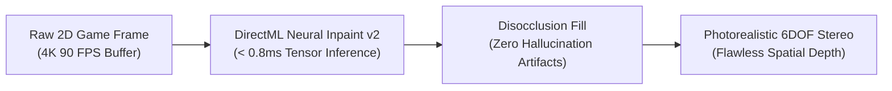

# 📘 Year 5 Operational Playbook (2030 – 2031)
## Universal PC Dominance & The $100M Centi-Millionaire Anchor

> 📌 **Executive Overview**: 
> Year 5 marks the **climax of Horizon 1 & 2**: NexVR reaches undisputed category dominance as the universal PC spatial standard. With **$15.25M in revenue**, **$11.87M in EBITDA**, and **$18.8M in liquid bank cash**, the company reaches a **$100 Million valuation**, making the founder an official **centi-millionaire ($80 Million Net Worth)**.
> 
> * **The North Star**: Complete PC category dominance and establish the IP moat required to conquer smart glasses.
> * **The Kill/Pass Metric**: **$15,250,000 Revenue** + **$11,870,000 EBITDA (77.8% Margin)** + **$18.8M Cash in Bank**.
> * **Technology Readiness**: DirectML Neural Inpainting v2 advances to **TRL 9** across all commercial engines.
> * **Founder Net Worth**: **$80,000,000** (Retaining 80% equity · Official Centi-Millionaire).

---

## 🔬 1. The Heilmeier R&D Catechism (Year 5)

| Question | Executive Answer |
| :--- | :--- |
| **1. What are you trying to do?** | Establish NexVR as the universal graphics translation runtime uniting 250k gamers, 40 commercial game studios, 4 hardware OEMs, and 20 aerospace/defense simulation centers. |
| **2. How is it done today?** | PC spatial computing remains fragmented across brittle mods, proprietary SDKs, and isolated hardware silos. |
| **3. What is new in our approach?** | Automated AI shader decompilation: our neural engine automatically analyzes game shaders and creates 6DOF spatial profiles with zero human reverse-engineering required. |
| **4. Who cares? If successful, what difference will it make?** | Every PC graphics application ever built becomes instantly compatible with any OpenXR spatial device at native frame rates. |
| **5. What is the supreme strategic risk?** | **Selling out cheap**: Meta, Valve, or Sony will offer $80M–$100M in cash to acquire the company. Accepting ends the journey; holding unlocks the billion-dollar smart glasses platform. |
| **6. How much will it cost?** | $1,400,000 in top-tier graphics systems and machine learning talent, fully funded by operating cash flow ($18.8M reserves). |
| **7. How long will it take?** | 12 months to cross $15M ARR and prepare the silicon microcode architecture for Horizon 3. |
| **8. What are the success exams?** | $11.87M in audited EBITDA, zero long-term debt, and 12 core spatial rendering patent filings. |

---

## 🛠️ 2. Deep-Tech R&D & AI Inpainting v2



### A. DirectML Neural Inpainting v2 (< 0.8ms Latency)
* Optimize tensor inference down to **sub-0.8ms** execution time using quantized FP8 / INT4 weights on consumer RTX 40/50 series tensor cores.
* Replaces legacy geometric reprojection with real-time neural inpainting: areas hidden behind objects (disocclusions) are synthetically filled with zero visual ghosting or nausea artifacts.

### B. Automated Shader Decompilation Engine
* AI parser inspects compiled DirectX/Vulkan shader bytecode (DXBC/DXIL/SPIR-V) in memory.
* Automatically reconstructs projection matrices, view transformations, and world-space coordinates, enabling **instant 1-click profiles for new PC games on launch day**.

---

## 🏛️ 3. The $100M Strategic Crossroads: The Hold vs. Sell Decision

```
┌───────────────────────────────────────┬────────────────────────────────────────────────────────┐
│           OPTION A: SELL OUT          │             OPTION B: HOLD FOR $1B (CHOSEN)            │
├───────────────────────────────────────┼────────────────────────────────────────────────────────┤
│ • Accept $100M buyout offer           │ • Reject early acquisition; self-fund Horizon 3        │
│ • Net after taxes: ~$55M–$65M cash    │ • Expand runtime into 20M+ smart glasses & Android XR  │
│ • Founder status: Wealthy retiree     │ • Scale ARR to $150M+ at 70%+ operating EBITDA         │
│ • Outcome: Permanent exit from game   │ • Outcome: $1,000,000,000+ Net Worth in Year 8         │
└───────────────────────────────────────┴────────────────────────────────────────────────────────┘
```

> 🛑 **The Billionaire Mandate**: You must deliberately **reject the $80M–$100M acquisition offer** in Year 5. With $18.8M cash in the bank, NexVR is totally self-sufficient and controls the intellectual property required to dominate the upcoming smart glasses revolution.

---

## 📊 4. Year 5 Financials & Gate Review Criteria

| Line Item | Year 4 (Actual) | Year 5 (Target) | Notes |
| :--- | :---: | :---: | :--- |
| **B2C Consumer Revenue** | $2,210,000 | **$3,950,000** | 26% Share · High-Margin Cash |
| **B2B Commercial & Enterprise Revenue** | $4,600,000 | **$11,300,000** | **74% Share · Platform Dominance** |
| • Hardware OEM Bundling Royalties | $1,300,000 | $3,000,000 | 250k Cumulative Bundles |
| • Studio SDK Upfront & Royalties | $1,800,000 | $4,300,000 | 40 Game Studios on Steam |
| • Enterprise & Defense Simulation ACV | $1,500,000 | $4,000,000 | 25 High-Security Installations |
| **CONSOLIDATED GROSS REVENUE** | **$6,810,000** | **$15,250,000** | **+124% Growth** |
| Cost of Goods Sold (COGS) | ($268,000) | ($525,000) | 96.6% Gross Margin |
| Operating Expenses (Payroll/R&D/Legal) | ($1,610,000) | ($2,855,000) | Unprecedented Efficiency |
| **OPERATING PROFIT (EBITDA)** | **$4,932,000** | **$11,870,000** | **77.8% Operating Margin** |
| **Cumulative Bank Reserves** | **$6,973,500** | **$18,843,500** | **$18.8M Cash Fort (Zero Debt)**|
| **Company Valuation** | $55.0M | **$100.0 Million** | 8.5x EBITDA Multiple |
| **FOUNDER NET WORTH** | **$46.7M** | **$80,000,000** | **Official Centi-Millionaire** |

### 🚦 Year 5 Stage-Gate Exit Criteria (To Unlock Year 6):
1. ✅ Consolidated operating EBITDA crosses **$11,000,000**.
2. ✅ Cumulative liquid bank reserves exceed **$18,000,000** with zero debt.
3. ✅ File 12 fundamental patent applications covering AI spatial reprojection.
4. ✅ Reject all early acquisition buyouts and formally initiate Horizon 3 (Spatial AI & Smart Glasses).
