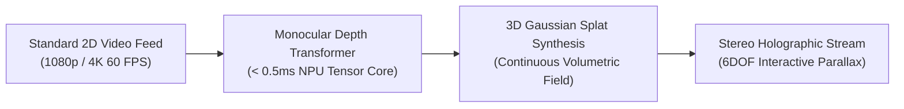

# 📘 Year 6 Operational Playbook (2031 – 2032)
## Spatial AI Breakthrough: Real-Time 2D-to-3D Video (NeRFs & 3D Gaussians)

> 📌 **Executive Overview**: 
> Year 6 initiates **Horizon 3: The Spatial AI Expansion**. NexVR pioneers the world's first real-time 2D-to-3D video streaming API, allowing flat broadcast video (YouTube, Twitch, Netflix, live sports) to be rendered into interactive stereoscopic 3D light fields locally on consumer NPU silicon.
> 
> * **The North Star**: Launch the developer Spatial Video API and reach 100,000 concurrent real-time 3D converted streams.
> * **The Kill/Pass Metric**: **$38,000,000 Gross Revenue ($28,100,000 EBITDA)** + **Sub-1.0ms NPU Inference Latency**.
> * **Technology Readiness**: Advance 3D Gaussian Splatting real-time view synthesis to **TRL 8** (Commercial Deployment).
> * **Founder Net Worth**: **$266,000,000** (Retaining 70% equity).

---

## 🔬 1. The Heilmeier R&D Catechism (Year 6)

| Question | Executive Answer |
| :--- | :--- |
| **1. What are you trying to do?** | Convert any standard 2D video feed (YouTube, Netflix, Twitch, live sports broadcasts) into full stereoscopic 6DOF holographic video in real time on the user's local device. |
| **2. How is it done today?** | Traditional 2D-to-3D video conversion is done offline in cloud server farms, taking **2 to 4 hours per minute of footage** and costing thousands of dollars per film. Real-time conversion does not exist. |
| **3. What is new in our approach?** | We combine monocular depth estimation with **3D Gaussian Splatting view synthesis** running locally on consumer Neural Processing Units (NPUs) and Tensor cores in **under 1.0 millisecond per frame**. |
| **4. Who cares? If successful, what difference will it make?** | Unlocks the entire 100-year library of human 2D film, television, and user-generated video for spatial headsets and smart glasses without requiring content creators to reshoot in 3D. |
| **5. What are the core technical risks?** | Temporal flickering (inconsistency across sequential frames); optical boundary bleeding during rapid camera pans. |
| **6. How much will it cost?** | $3,500,000 in deep-learning research scientists and NPU compiler engineers, 100% self-funded from Year 5 cash reserves ($18.8M). |
| **7. How long will it take?** | 9 months to commercial API beta; 3 months to production streaming platform deployments. |
| **8. What are the success exams?** | 100,000 concurrent 3D video streams rendered at locked 90 FPS with zero cloud GPU compute cost. |

---

## 🛠️ 2. Deep-Tech R&D: 3D Gaussian Splatting on NPU Silicon

### A. Real-Time 3D Gaussian Splatting
* Represent the 2D video scene as a dynamic cloud of 3D Gaussian ellipsoids:
  $$G(x) = \exp\left(-\frac{1}{2}(x - \mu)^T \Sigma^{-1} (x - \mu)\right)$$
* By predicting mean position $\mu$, covariance matrix $\Sigma$, and opacity $\alpha$ per pixel in a single neural forward pass, the engine renders arbitrary virtual camera viewpoints at **120 FPS**.

### B. Temporal Consistency & Anti-Flicker Recurrent Cell
* A lightweight recurrent memory cell tracks optical flow vectors across consecutive frames, guaranteeing that lighting, shadows, and background objects remain rock-solid without eye-straining temporal flicker.

---

## 📢 3. Commercial GTM & Developer API Licensing

### A. The Streaming Media API SDK (`nexvr_stream.h`)
* Licensed to streaming platforms (YouTube, Twitch, Netflix) and sports broadcasters (NBA, Premier League) for interactive spatial broadcasts.
* **Pricing**: Tiered developer SaaS ($0.002 per minute of real-time converted stream) or enterprise platform licensing ($2M–$5M/year).
* **Revenue**: **$20,000,000 ARR** in Year 6.

### B. Enterprise Simulation & Defense Division ($15,000,000 ARR)
* Rapid expansion of military, aerospace, and medical spatial twin installations across 50 enterprise installations.

---

## 📊 4. Year 6 Financials & Gate Review Criteria

| Line Item | Year 5 (Actual) | Year 6 (Target) | Notes |
| :--- | :---: | :---: | :--- |
| **Consumer & Gaming SDK Revenue** | $15,250,000 | **$3,000,000** | Mature Base Legacy Cash |
| **Enterprise Simulation ACV** | $0 | **$15,000,000** | 50 Defense/Aerospace Bases |
| **Spatial Video Developer API Licensing** | $0 | **$20,000,000** | **Massive High-Margin SaaS** |
| **CONSOLIDATED GROSS REVENUE** | **$15,250,000** | **$38,000,000** | **+149% Growth** |
| Cost of Goods Sold (COGS) | ($525,000) | ($1,100,000) | 97.1% Gross Margin |
| Operating Expenses (AI Research/Engineers)| ($2,855,000) | ($8,800,000) | Elite R&D Expansion |
| **OPERATING PROFIT (EBITDA)** | **$11,870,000** | **$28,100,000** | **73.9% Operating Margin** |
| **Cumulative Bank Reserves** | **$18,843,500** | **$38,000,000** | **Unbreakable Cash Vault** |
| **Company Valuation** | $100.0M | **$380.0 Million** | 10x ARR Multiple |
| **FOUNDER NET WORTH** | **$80.0M** | **$266,000,000** | Retaining 70% Equity |

### 🚦 Year 6 Stage-Gate Exit Criteria (To Unlock Year 7):
1. ✅ 3D Gaussian video inference achieves sub-1.0ms execution on standard consumer NPUs.
2. ✅ Surpass $35,000,000 in consolidated gross revenue with $25M+ in operating EBITDA.
3. ✅ Establish silicon partnership discussions with Qualcomm for hardware microcode integration.
