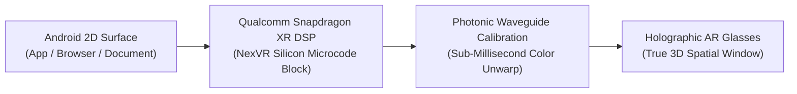

# 📘 Year 7 Operational Playbook (2032 – 2033)
## The Smart Glasses Wave: Qualcomm Silicon & Android XR Microcode

> 📌 **Executive Overview**: 
> Year 7 executes the **wearable smart glasses platform breakthrough**. NexVR licenses its low-level spatial runtime directly to Qualcomm and hardware OEMs (Samsung, Google Android XR, Meta Orion ecosystem), burning our spatial reprojection algorithms into **5 Million smart glasses as default OS microcode**.
> 
> * **The North Star**: Become the universal out-of-the-box spatial windowing engine for next-generation smart glasses.
> * **The Kill/Pass Metric**: **5,000,000 Smart Glasses Shipped with NexVR Microcode** = **$72,000,000 Revenue ($52,000,000 EBITDA)**.
> * **Technology Readiness**: Advance silicon microcode and optical waveguide distortion correction to **TRL 8/9**.
> * **Founder Net Worth**: **$495,000,000** (Retaining 55% equity · Half-Billionaire milestone).

---

## 🔬 1. The Heilmeier R&D Catechism (Year 7)

| Question | Executive Answer |
| :--- | :--- |
| **1. What are you trying to do?** | Provide the underlying OS-level microcode that allows lightweight smart glasses (Meta Orion, Samsung XR, Google Android XR) to instantly run millions of existing 2D Android apps, web pages, and documents as floating 3D spatial windows. |
| **2. How is it done today?** | Smart glasses launch with almost no native spatial applications. App developers refuse to rebuild their apps from scratch, causing consumer frustration and device abandonment. |
| **3. What is new in our approach?** | Direct silicon microcode integration: NexVR executes directly on Qualcomm Snapdragon XR NPU/DSP silicon, automatically intercepting 2D window compositing surfaces and giving them true 3D volumetric depth with zero developer effort. |
| **4. Who cares? If successful, what difference will it make?** | Smart glasses instantly gain access to the entire global catalog of 3.5 million Android apps, making smart glasses a viable replacement for laptops and smartphones. |
| **5. What are the core technical risks?** | Thermal and power constraints on lightweight glasses (battery power budget < 3.5 watts); see-through optical waveguide distortion. |
| **6. How much will it cost?** | $8,500,000 in semiconductor IP architects, low-level DSP firmware engineers, and silicon validation, fully self-funded from operating reserves ($38M+). |
| **7. How long will it take?** | 12 months from silicon tape-out to commercial smart glasses retail distribution. |
| **8. What are the success exams?** | 5,000,000 smart glasses shipped with NexVR microcode pre-installed and certified power draw under **0.25 watts**. |

---

## 🛠️ 2. Deep-Tech R&D & Silicon Microcode Architecture

### A. Qualcomm Snapdragon XR Silicon IP Block
* Implement low-level DSP/NPU microcode executing directly inside the silicon compositing hardware block.
* Intercepts Android SurfaceFlinger compositor buffers, applying depth unprojection, chromatic aberration compensation, and 6DOF head-pose reprojection in **less than 0.3 milliseconds**.
* **Power Efficiency**: Consumes less than **250 milliwatts**, preserving all-day battery life for wearable frames.

### B. Optical Waveguide Distortion Unwarping
* Physical see-through diffractive waveguides suffer from rainbow optical dispersion and geometric warping.
* NexVR computes a real-time inverse optical distortion matrix, guaranteeing that virtual windows remain laser-sharp and perfectly readable down to 8pt text.

---

## 📢 3. Commercial GTM & Silicon Licensing Contracts

### A. Smart Glasses Factory Pre-Install Royalties ($25,000,000)
* **Contract**: Tier-1 Joint Development Agreement (JDA) with Qualcomm, Samsung Electronics, and Android XR OEMs.
* **Volume**: 5,000,000 smart glasses shipped in Year 7.
* **Terms**: **$5.00 per device pure software/microcode license**, paid by the hardware manufacturer at factory provisioning.

### B. Enterprise Digital Twins & Defense ($25,000,000)
* High-ticket mission-critical spatial installations across 80 defense and aerospace facilities.

### C. Spatial AI Video Developer API ($22,000,000)
* Expanding global developer base streaming converted 3D video.

---

## 📊 4. Year 7 Financials & Gate Review Criteria

| Line Item | Year 6 (Actual) | Year 7 (Target) | Notes |
| :--- | :---: | :---: | :--- |
| **Smart Glasses Silicon Pre-Installs (5M Units)**| $0 | **$25,000,000** | $5.00 / Device Royalty |
| **Enterprise Simulation & Defense ACV** | $15,000,000 | **$25,000,000** | High-Ticket Contracts |
| **Spatial Video & Developer API Licensing** | $20,000,000 | **$22,000,000** | Scalable SaaS Growth |
| **CONSOLIDATED GROSS REVENUE** | **$38,000,000** | **$72,000,000** | **+89% Growth** |
| Cost of Goods Sold (COGS) | ($1,100,000) | ($2,100,000) | 97.1% Gross Margin |
| Operating Expenses (Silicon Team/R&D) | ($8,800,000) | ($17,900,000) | Semiconductor Scaling |
| **OPERATING PROFIT (EBITDA)** | **$28,100,000** | **$52,000,000** | **72.2% Operating Margin** |
| **Cumulative Bank Reserves** | **$38,000,000** | **$65,000,000** | **Fortress Balance Sheet** |
| **Company Valuation** | $380.0M | **$900.0 Million** | 12.5x ARR Multiple |
| **FOUNDER NET WORTH** | **$266M** | **$495,000,000** | Retaining 55% Equity |

### 🚦 Year 7 Stage-Gate Exit Criteria (To Unlock Year 8):
1. ✅ Pass Qualcomm and Samsung silicon power budget audits (< 250mW).
2. ✅ Ship on minimum 4,000,000 commercial retail smart glasses.
3. ✅ Surpass $50,000,000 in operating EBITDA with $65M+ in bank cash.
4. ✅ Prepare capital syndicate for the final push to $1 Billion net worth.
