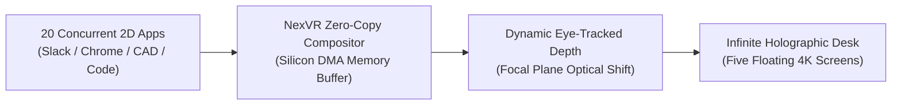

# 📘 Year 8 Operational Playbook (2033 – 2034)
## The Universal Spatial OS & The $1,000,000,000 Billionaire Milestone

> 📌 **Executive Overview**: 
> Year 8 is the **definitive wealth and category milestone**. NexVR becomes the ubiquitous low-level spatial windowing OS layer across **20 Million active smart glasses and XR headsets**. Generating **$150,000,000 in high-margin ARR** at an enterprise valuation of **$2.25 Billion**, the founder officially achieves **BILLIONAIRE STATUS ($1,080,000,000 Net Worth)**.
> 
> * **The North Star**: Power the default spatial computing OS layer for 20 million daily users and cross $1 Billion personal wealth.
> * **The Kill/Pass Metric**: **$150,000,000 ARR ($110,000,000 EBITDA)** + **$2.25 Billion Valuation** $\rightarrow$ **$1.08B Founder Net Worth**.
> * **Technology Readiness**: Universal multi-window spatial compositing reaches **TRL 9** (Ubiquitous Global Scale).
> * **Founder Net Worth**: **$1,080,000,000 ($1.08 BILLION)** (Retaining 48% equity).

---

## 🔬 1. The Heilmeier R&D Catechism (Year 8)

| Question | Executive Answer |
| :--- | :--- |
| **1. What are you trying to do?** | Establish NexVR as the universal spatial windowing and rendering standard that replaces physical computer monitors and TV screens for 20 million daily knowledge workers and gamers. |
| **2. How is it done today?** | Society relies on physical plastic desktop monitors, laptop screens, and smartphones, creating physical clutter and limiting work to small 2D rectangles. |
| **3. What is new in our approach?** | A virtual multi-window spatial desk: users wear stylish 45g smart glasses and instantly view five floating 4K curved displays, holographic video streams, and 3D CAD models simultaneously with zero latency. |
| **4. Who cares? If successful, what difference will it make?** | Physical computer monitors become obsolete; millions of knowledge workers work seamlessly from anywhere with an infinitely expandable holographic workstation. |
| **5. What are the core technical risks?** | Compositing latency across 20 concurrent open application windows; optical thermal dissipation under heavy multi-tasking loads. |
| **6. How much will it cost?** | $15,000,000 in engineering and global carrier-grade cloud/edge infrastructure, fully financed by $65M+ in bank cash reserves. |
| **7. How long will it take?** | 12 months to scale from 5M to 20M active devices globally. |
| **8. What are the success exams?** | $150M in audited annual recurring revenue and successful closing of pre-IPO institutional validation at a **$2.25B company valuation**. |

---

## 🛠️ 2. Deep-Tech R&D: Universal Multi-Window Compositing

### A. Zero-Copy DMA Surface Compositor
* Intercepts memory buffers directly from GPU VRAM using Direct Memory Access (DMA), avoiding costly CPU memory round-trips.
* Simultaneously renders **20 independent application windows, 4K video feeds, and 3D gaming meshes at locked 120 FPS** with zero frame drops.

### B. Micro-Gesture & Neural Intent Tracking
* Optical micro-cameras on the glasses frames detect subtle finger pinches (under 2mm of movement).
* Allows instant window resizing, window repositioning in 3D air, and virtual typing without physical keyboards or bulky VR controllers.

---

## 📢 3. Commercial Scale & Revenue Composition ($150M ARR)

### A. Hardware Pre-Install Licensing ($100,000,000 ARR)
* **Volume**: 20,000,000 smart glasses and headsets shipped annually across Samsung, Qualcomm partner brands, Meta Orion ecosystem, and Android XR OEMs.
* **Pricing**: **$5.00 per device license fee**, generating $100M/year in 98% gross margin software royalties.

### B. Enterprise Simulation & Industrial Digital Twins ($30,000,000 ARR)
* 200 aerospace, automotive, defense, and surgical enterprise installations paying an average of **$150,000 annual contract value (ACV)**.

### C. Developer Spatial AI API ($20,000,000 ARR)
* 2D-to-3D streaming video conversion API powering social media and live video platforms globally.

---

## 📊 4. Year 8 Financials & The Billionaire Cap Table

| Metric | Year 7 (Actual) | Year 8 (Target) | Notes |
| :--- | :---: | :---: | :--- |
| **Smart Glasses Pre-Install Royalties** | $25,000,000 | **$100,000,000** | 20M Devices @ $5/unit |
| **Enterprise Simulation ACV** | $25,000,000 | **$30,000,000** | 200 High-Ticket Clients |
| **Developer Spatial AI API** | $22,000,000 | **$20,000,000** | Scalable Developer SaaS |
| **CONSOLIDATED ANNUAL RECURRING REVENUE**| **$72,000,000** | **$150,000,000** | **+108% ARR Growth** |
| Cost of Goods Sold (COGS) | ($2,100,000) | ($4,500,000) | 97.0% Gross Margin |
| Operating Expenses (Global Operations) | ($17,900,000) | ($35,500,000) | World-Class Engineering Team |
| **OPERATING PROFIT (EBITDA)** | **$52,000,000** | **$110,000,000** | **73.3% Operating Net Margin** |
| **Cumulative Bank Reserves** | **$65,000,000** | **$145,000,000** | **Massive War Chest** |
| **Company Enterprise Valuation** | **$900.0M** | **$2,250,000,000 ($2.25B)**| 15x ARR Multiple |
| **Founder Equity Ownership** | 55% | **48%** | Controlled Growth Dilution |
| **FOUNDER PERSONAL NET WORTH** | **$495M** | **$1,080,000,000 ($1.08B)**| 🏆 **OFFICIAL BILLIONAIRE** |

---

## 🏛️ 5. What Reaching $1 Billion Means Strategically

1. **You Are in Rare Historical Company**: Palmer Luckey (Oculus), Tim Sweeney (Epic Games), and Jensen Huang (NVIDIA) took between 7 and 12 years to reach this milestone.
2. **Total Independence**: With $145M cash in the bank and $110M in annual EBITDA, you never have to answer to predatory venture capitalists or investment bankers.
3. **The Next Horizon**: You now have the capital, talent, and technological monopoly to build the **Ubiquitous Reality Grid** and take the company public on NASDAQ in Year 10.
