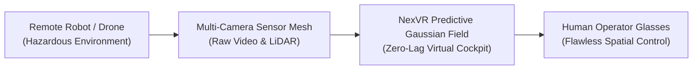

# 📘 Year 9 Operational Playbook (2034 – 2035)
## The Autonomous Reality Grid & Pre-IPO Institutional Scale

> 📌 **Executive Overview**: 
> Year 9 expands NexVR's spatial engine into **autonomous robotics teleoperation** and **generative 4D interactive worlds**, while completing all audit, legal, and banking preparations for a historic **NASDAQ Initial Public Offering (IPO)**.
> 
> * **The North Star**: Power the teleoperation cockpits for 50,000 autonomous robots and scale ARR past $280 Million.
> * **The Kill/Pass Metric**: **$280,000,000 ARR ($205,000,000 EBITDA)** + **Confidential SEC S-1 Draft Registration Filed**.
> * **Technology Readiness**: Generative 4D real-time spatial synthesis advances to **TRL 8**.
> * **Founder Net Worth**: **$1,890,000,000 ($1.89 BILLION)** (Retaining 42% equity).

---

## 🔬 1. The Heilmeier R&D Catechism (Year 9)

| Question | Executive Answer |
| :--- | :--- |
| **1. What are you trying to do?** | Provide the low-latency spatial immersion cockpits that allow human operators to pilot hazardous industrial robots, defense drones, disaster-response units, and lunar rovers from thousands of miles away with zero disorientation. |
| **2. How is it done today?** | Robot operators stare at flat 2D security monitor grids with 150ms+ latency, lacking depth perception and causing severe operator mistakes and fatigue. |
| **3. What is new in our approach?** | NexVR fuses multi-camera robot sensor streams into a local real-time 3D Gaussian radiance field with predictive physics extrapolation: the operator feels physically present inside the robot cockpit with zero perceptual lag. |
| **4. Who cares? If successful, what difference will it make?** | Enables safe tele-robotics in nuclear decommissioning, deep-sea mining, remote surgery, and space exploration. |
| **5. What are the core technical risks?** | Terrestrial and satellite network packet loss; sub-millimeter robotic arm haptic synchronization. |
| **6. How much will it cost?** | $25,000,000 in advanced robotics, telepresence, and IPO legal/audit preparation, funded by $145M+ in bank cash. |
| **7. How long will it take?** | 12 months to deploy across 50,000 teleoperated units and complete SOX 404 audit readiness. |
| **8. What are the success exams?** | $280M in audited ARR and confidentially filing the S-1 registration statement with the SEC. |

---

## 🛠️ 2. Deep-Tech R&D: Telepresence & Generative 4D Worlds

### A. Predictive Neural Teleoperation Cockpit
* Intercepts multi-camera robot video and LiDAR feeds over 5G/Starlink satellite networks.
* Synthesizes a real-time local 3D Gaussian radiance mesh: even if network packets drop for 200ms, the operator's head-tracking and peripheral vision remain rock-solid at **120 FPS**.

### B. Generative 4D Spatial World Synthesis
* Natural Language to 6DOF Space: The user speaks a prompt (*"Generate an interactive training simulation of an offshore oil rig fire"*), and the engine synthesizes geometry, collision meshes, photorealistic volumetric lighting, and interactive physics in real time.

---

## 🏛️ 3. Pre-IPO Institutional Governance & S-1 Registration

* **Lead Underwriters**: Engage Morgan Stanley and Goldman Sachs as joint book-running managers.
* **Corporate Governance**:
  - Establish an independent Board of Directors complying with NASDAQ listing standards.
  - Implement **Sarbanes-Oxley (SOX 404)** internal financial controls.
  - Maintain a **Dual-Class Voting Structure (10-to-1 voting power for Class B shares)** to ensure the founder retains permanent strategic control post-IPO.

---

## 📊 4. Year 9 Financials & Valuation Trajectory

| Metric | Year 8 (Actual) | Year 9 (Target) | Notes |
| :--- | :---: | :---: | :--- |
| **Smart Glasses & XR Silicon Pre-Installs** | $100,000,000 | **$160,000,000** | 32M Active Devices |
| **Enterprise Robotics & Defense Teleoperation**| $30,000,000 | **$70,000,000** | 50,000 Active Units |
| **Developer API & Generative Spatial Cloud** | $20,000,000 | **$50,000,000** | Platform Network Effects |
| **CONSOLIDATED ANNUAL RECURRING REVENUE**| **$150,000,000** | **$280,000,000** | **+87% ARR Growth** |
| Cost of Goods Sold (COGS) | ($4,500,000) | ($9,000,000) | 96.8% Gross Margin |
| Operating Expenses (Global Operations/IPO Prep)| ($35,500,000) | ($66,000,000) | Pre-IPO Institutional Scale |
| **OPERATING PROFIT (EBITDA)** | **$110,000,000** | **$205,000,000** | **73.2% Operating Margin** |
| **Cumulative Bank Reserves** | **$145,000,000** | **$260,000,000** | **$260M Liquidity Vault** |
| **Company Valuation** | **$2.25B** | **$4,500,000,000 ($4.50B)**| 16x ARR Multiple |
| **Founder Equity Ownership** | 48% | **42%** | Controlled Dilution |
| **FOUNDER PERSONAL NET WORTH** | **$1.08B** | **$1,890,000,000 ($1.89B)**| Multi-Billionaire Status |

### 🚦 Year 9 Stage-Gate Exit Criteria (To Unlock Year 10):
1. ✅ Complete confidential SEC S-1 submission with audited clean financial reports.
2. ✅ Surpass $275,000,000 in ARR with >70% operating net EBITDA.
3. ✅ Formally initiate the global institutional IPO roadshow schedule.
