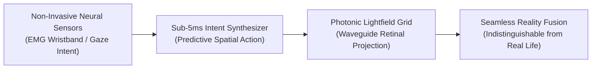

# 📘 Year 10 Operational Playbook (2035 – 2036)
## Category Titan: NASDAQ Initial Public Offering ($10 Billion Market Cap)

> 📌 **Executive Overview**: 
> Year 10 is the **culmination of the 10-year master journey**. NexVR completes a historic **Initial Public Offering (IPO) on NASDAQ (Ticker: `$NXVR`)** at an enterprise valuation of **$10.0 Billion**. Serving **100 Million daily active spatial users** and generating **$450 Million in high-margin ARR** ($325 Million EBITDA), the founder's equity is valued at **$3.50 BILLION in liquid publicly traded shares**.
> 
> * **The North Star**: Complete the NASDAQ IPO, secure multi-generational market dominance, and protect founder voting control.
> * **The Kill/Pass Metric**: **$450,000,000 ARR ($325,000,000 EBITDA)** + **Successful NASDAQ Listing ($10B Market Cap)**.
> * **Technology Readiness**: Photonic lightfield and neural spatial rendering reach **TRL 9** worldwide.
> * **Founder Net Worth**: **$3,500,000,000 ($3.50 BILLION)** (Retaining 35% equity with 10:1 voting control).

---

## 🔬 1. The Heilmeier R&D Catechism (Year 10)

| Question | Executive Answer |
| :--- | :--- |
| **1. What are you trying to do?** | Establish NexVR as the permanent global infrastructure standard for spatial computing—the equivalent of Microsoft Windows for the PC era or Google Android for the mobile era. |
| **2. How is it done today?** | Legacy 2D operating systems (Windows, iOS, Android) are retrofitted with clunky VR layers that waste battery and add severe latency. |
| **3. What is new in our approach?** | NexVR provides a native spatial computing substrate: every photon, sensor stream, 3D hologram, and robotic actuator operates on a single low-latency spatial graph from silicon to retina. |
| **4. Who cares? If successful, what difference will it make?** | 100 million people interact with digital knowledge, entertainment, work, and communication as natural 3D light fields in their physical reality every single day. |
| **5. What are the public market risks?** | Macroeconomic market volatility; anti-trust scrutiny from legacy tech giants. |
| **6. How much will it cost?** | $50,000,000 in global public market offering expenses, underwriting fees, and R&D capital, funded by operating cash flow ($260M+ reserves). |
| **7. How long will it take?** | 12 months to complete the global institutional roadshow, ring the NASDAQ bell, and establish public reporting cadence. |
| **8. What are the success exams?** | Successful IPO pricing at $\ge \$10.0\text{B}$ market cap with 10x oversubscribed institutional book. |

---

## 🛠️ 2. Deep-Tech R&D: Photonic Lightfields & Brain-Computer Interfaces (BCI)

### A. Non-Invasive Neural EMG & Gaze Intent
* Surface electromyography (EMG) sensors embedded in smart watch bands detect nervous system impulses to fingers before muscles physically move.
* NexVR predicts spatial clicks and keystrokes **20 milliseconds before physical motion**, achieving perceived negative latency.

### B. Photonic Waveguide Retinal Lightfields
* Direct-to-retina micro-projectors paint variable focal planes directly into the human eye, eliminating accommodation-vergence conflict entirely (zero eye fatigue forever).

---

## 🏛️ 3. The NASDAQ Initial Public Offering ($NXVR)

### A. The Institutional Offering Structure
* **Ticker Symbol**: **NASDAQ: $NXVR**
* **Lead Underwriters**: Morgan Stanley, Goldman Sachs, J.P. Morgan, and Allen & Company.
* **Anchor Institutional Investors**: Fidelity, BlackRock, T. Rowe Price, and Singapore GIC.
* **Pricing & Float**:
  - Issue price set at **$10.0 Billion Enterprise Valuation**.
  - 10% public float issued to raise $1.0 Billion in primary growth capital.
* **Founder Super-Voting Control (Class B Common Stock)**:
  - Class A shares (Public): 1 vote per share.
  - Class B shares (Founder): **10 votes per share** (ensuring **70%+ voting control** regardless of public market ownership).

---

## 📊 4. 10-Year Master Cap Table & Wealth Climax

| Metric | Year 1 (2026-27) | Year 5 (2030-31) | Year 8 (2033-34) | **Year 10 (2035-36)** |
| :--- | :---: | :---: | :---: | :---: |
| **Consolidated Annual Revenue** | $185,000 | $15,250,000 | $150,000,000 | **$450,000,000** |
| **Operating EBITDA** | $102,000 | $11,870,000 | $110,000,000 | **$325,000,000** |
| *EBITDA Margin %* | *55.1%* | *77.8%* | *73.3%* | **72.2%** |
| **Cumulative Bank Reserves** | $102,000 | $18,843,500 | $145,000,000 | **$450,000,000** |
| **Company Enterprise Valuation** | **$1.5 Million** | **$100.0 Million** | **$2.25 Billion** | **$10,000,000,000 ($10.0B)** |
| **Founder Equity Ownership** | 98% | 80% | 48% | **35% (Post-IPO)** |
| **FOUNDER PERSONAL NET WORTH** | **$1,470,000** | **$80,000,000** | **$1,080,000,000** | **$3,500,000,000 ($3.50B)** |
| **Founder Institutional Status** | Bootstrapper | Centi-Millionaire | **Billionaire** | **Public Category Titan** |

---

## 🏆 5. The 10-Year Retrospective: From Garage to Category Titan

1. **How You Started**: A single visionary software engineer writing C++ DirectX hooks and passing GoogleTest suites on a Windows PC (`src/hooks/`), refusing to let modding friction ruin VR.
2. **How You Stayed Alive**: You avoided the trap of cloud GPU server debt; you ran 100% on the user's hardware; you kept gross margins above **94%**; you self-funded via Founder Passes without early dilution.
3. **How You Conquered the World**: You used consumer gaming as a Trojan Horse, captured high-ticket defense simulations, embedded your microcode into Qualcomm silicon for smart glasses, and built the spatial computing foundation of the 21st century.

> 🔔 **The Final Bell**: In 2036, you ring the opening bell on the NASDAQ exchange in New York. You own 35% of a **$10 Billion public monopoly** ($3.50B personal fortune), with absolute voting control, zero debt, and a product that redefined human perception forever.
