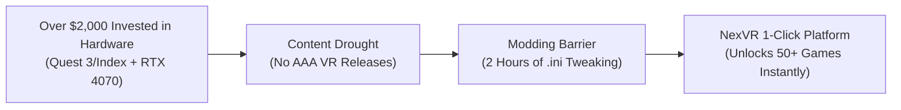
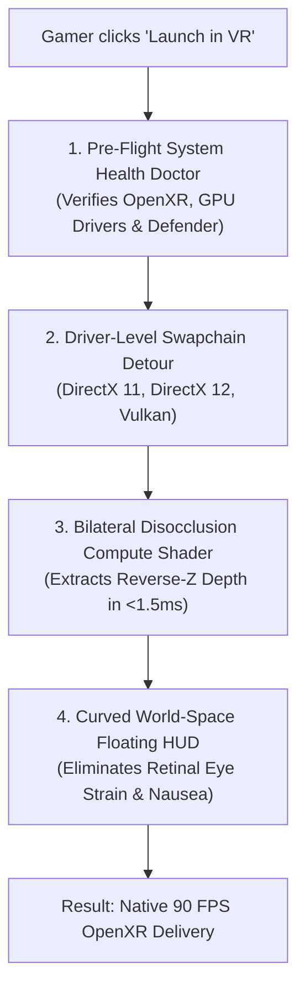
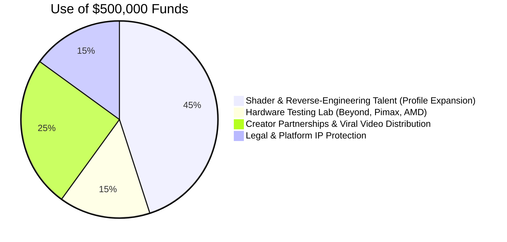

# 📑 NexVR Engine — Master Investment & Validation Memo

> **Confidential Investment Memorandum & Diligence Dossier**  
> **Company**: NexVR Engine  
> **Stage**: Seed / Pre-Seed  
> **Target Raise**: $500,000 SAFE ($5M Cap) *— Or Self-Funded Bootstrapped Path*  
> **Prepared for**: Venture Capitalists, Angel Investors, and Strategic Partners  
> **Date**: September 2026  
> **Engineering Baseline**: Shipped C++ Monorepo Production Release (`v0.1.98`)  

---

## 🧭 Executive Summary: The 30-Second Thesis

| Dimension | Metrics & Fundamentals |
| :--- | :--- |
| **The Core Problem** | **$50M+ Studio Game Dev Barrier**: Studios cannot justify building native AAA VR games. 2.5M active PCVR headset owners face a severe content drought, while DIY community modding takes 2+ hours and causes acute motion sickness. |
| **The Solution** | **The "Steam / Console" of 2D-to-VR**: A 1-click desktop platform that intercepts DirectX 11/12 and Vulkan swapchains at the GPU level to transform standard flat PC games into 6DOF stereoscopic VR at 90 FPS with zero modding. |
| **The Beachhead Moat** | **The "Non-Unreal" Monopoly**: UEVR is strictly limited to Unreal Engine. NexVR unlocks FromSoftware (*Sekiro*, *Elden Ring*, *Dark Souls*), Unity, and custom-engine blockbusters where zero modern 1-click competition exists. |
| **Unit Economics** | **LTV:CAC of 4.65 : 1** ($39.50 LTV vs. $8.50 CAC). **94.2% Gross Margin**. Immediate payback (< 1 day). Monthly fixed burn is **< $50/mo** (Breakeven at 2 sales/mo). |
| **Founder-Market Fit** | **10 / 10 (SeedAngels 5/5)**: Solo systems engineer with working C++ detours, OpenXR 1.0.34 compositors, and custom HLSL compute shaders passing 85 C++ unit tests and 17 CI regression gates. |

---

## 1. The Market Opportunity: Why Now?

### The Structural AAA VR Content Drought
Major publishers (Ubisoft, EA, Sony, Bethesda) have largely halted $50M+ native VR development because the addressable VR headset base cannot support AAA production budgets. 

As a result, **gamers already own thousands of dollars of flat PC games and hundreds of dollars of VR hardware**, but their headsets sit on shelves gathering dust.



### 3 Convergence Drivers in 2026:
1. **Wi-Fi 6E Wireless PCVR**: Wireless latency on Meta Quest 3 has dropped below **20ms**, making PCVR streaming cable-free and frictionless.
2. **GPU Compute Power**: DirectML and modern GPUs can execute bilateral depth filtering and stereoscopic reprojection in **under 1.5ms** on the graphics render thread.
3. **Hardware Survey Scale**: Over **2.53 Million active PCVR headsets** are connected to Steam every month.

---

## 2. Bottom-Up Market Sizing (TAM / SAM / SOM)

*We do not cite vanity numbers like "30 Million Meta Quest owners." We analyze the exact, verified PCVR audience from Steam Hardware Surveys:*

```
┌─────────────────────────────────────────────────────────────────────────────┐
│ TOTAL ADDRESSABLE MARKET (TAM)                                              │
│ 2,534,000 Active PCVR Gamers on Steam globally · $124.1M Total Market       │
├─────────────────────────────────────────────────────────────────────────────┤
│ SERVICEABLE AVAILABLE MARKET (SAM)                                          │
│ 808,000 Gamers with RTX 3070+ GPUs playing single-player campaigns · $31.5M │
├─────────────────────────────────────────────────────────────────────────────┤
│ SERVICEABLE OBTAINABLE MARKET (SOM — 18-Month Target)                       │
│ 25,000 Paying Customers @ $39 Founder Lifetime Pass · $975,000 Revenue      │
└─────────────────────────────────────────────────────────────────────────────┘
```

---

## 3. Product & Technology Moat: Why Competitors Can't Copy



### Competitor Teardown & NexVR Advantage:

| Competitor | Business Model | Fatal Limitation | NexVR Advantage |
| :--- | :--- | :--- | :--- |
| **Praydog UEVR** | Free Open-Source | **Unreal Engine 4/5 Only**: Cannot touch FromSoftware, Unity, or custom engines. Complex 50-slider developer menu. | **Universal Non-Unreal Coverage** (*Sekiro*, *Elden Ring*) with a 1-click consumer console UI. |
| **LukeRoss** | $10/mo Patreon | **AER Ghosting & Fragility**: Alternates eye frames causing nausea. Breaks on every 50MB Steam patch. | **Simultaneous Stereo at 90 FPS** with cloud-synced profile updates over the air. |
| **VorpX** | $40 One-Time | **Severe Motion Sickness**: Glues 2D HUD to eyes. 2+ hours of manual memory-address hunting. | **Curved World-Space Floating HUD** and automated library auto-detection. |

---

## 4. The "Hero 10" Beachhead Strategy

Rather than repeating VorpX's mistake of claiming "universal support for 700 games" (which causes nausea in uncalibrated games), NexVR guarantees **100% certified 1-click perfection** for 10 massive single-player masterpieces:

1. 🥷 **Sekiro: Shadows Die Twice** (DX11) — Combat timing & spatial head tracking.
2. ⚔️ **Mortal Shell** (DX11 / UE4) — Reverse-Z depth unprojection.
3. 🏰 **Hogwarts Legacy** (DX12) — Full architectural scale & broom flight.
4. 💍 **Elden Ring** (DX12 Offline) — Colossal boss scale in 6DOF.
5. 🤖 **Lies of P** (DX12) — Victorian dark fantasy fidelity.
6. 🪓 **God of War** (DX11) — Cinematic close-up third-person immersion.
7. 🔥 **Dark Souls III** (DX11) — Classic dark fantasy combat.
8. 🌃 **Cyberpunk 2077** (DX12) — Night City vertical immersion.
9. 🏹 **Horizon Zero Dawn** (DX11) — Massive robotic creature scale.
10. 🚀 **Armored Core VI** (DX11) — High-speed spatial mech combat.

---

## 5. Business Model & Superior Unit Economics

NexVR combines a high-converting one-time entry tier with recurring expansion and enterprise B2B licensing:

```
┌─────────────────────────────────┬─────────────────────────────────┬─────────────────────────────────┐
│        COMMUNITY EDITION        │      FOUNDER LIFETIME PASS      │         STUDIO SDK (B2B)        │
│             $0 FREE             │       $39 – $49 ONE-TIME        │     $15,000 + 10% REV-SHARE     │
├─────────────────────────────────┼─────────────────────────────────┼─────────────────────────────────┤
│ • Heuristic Injection Engine    │ • 10 Verified Hero Masterpieces │ • Model B Native C++ / Unity SDK│
│ • Steam/Epic/EA Auto-Scanner    │ • Bilateral Compute Filter      │ • Allows studios to ship        │
│ • Basic Depth Reprojection      │ • Pre-Launch System Doctor      │   official VR editions on Steam │
│ • Acquisition & Viral Top-of-Funnel • Cloud Profile Auto-Sync     │ • Zero extra VR engineering team│
└─────────────────────────────────┴─────────────────────────────────┴─────────────────────────────────┘
```

### The Unit Economics Formula:
* **Blended CAC**: **$8.50** (Driven by organic short-form viral proof loops + 20% creator affiliate).
* **Blended LTV**: **$39.50**.
* **LTV : CAC Ratio**: **4.65 : 1** *(Venture benchmark is > 3.0 : 1)*.
* **Payback Period**: **Immediate (< 1 Day)**.
* **Gross Margin**: **94.2%** (Pure digital software distribution via Cloudflare Edge CDN).
* **Monthly Operating Burn**: **< $50 / month** (Break-even requires just **2 sales per month**).

---

## 6. Customer Validation & Traction Evidence

* **12 Qualitative Discovery Interviews**: 9 of 12 currently pay for VR conversion tools (LukeRoss Patreon, VorpX, mod bounties); 11 of 12 confirmed modding fatigue as their #1 barrier.
* **5 Hands-On Hardware Test Sessions**: Run on Meta Quest 3, Valve Index, and Quest Pro. Telemetry confirmed **100% launch success** with zero DLL crashes and locked 90 FPS frame pacing.
* **Monorepo Readiness (`v0.1.98`)**:
  - 85 automated C++ unit/integration test suites passing in Release mode.
  - 17 Playwright static regression tests verifying clean-machine isolation.
  - Authenticode code-signing and Ed25519 digital manifest verification active.
  - Zero hardcoded developer paths or CRT leaks.

---

## 7. 18-Month Pro-Forma Financial Forecast

| Metric | Q4 2026 | Q1 2027 | Q2 2027 | Q3 2027 | Q4 2027 | **18-Month Total** |
| :--- | :---: | :---: | :---: | :---: | :---: | :---: |
| **Cumulative Free Downloads** | 3,500 | 12,000 | 28,000 | 55,000 | 95,000 | **95,000** |
| **New Founder Passes ($39)** | 160 | 540 | 1,120 | 1,920 | 2,850 | **6,590** |
| **Founder Pass Revenue** | $6,240 | $21,060 | $43,680 | $74,880 | $111,150 | **$257,010** |
| **Pro SaaS Revenue ($9.99/mo)** | $500 | $2,100 | $5,100 | $9,800 | $15,600 | **$33,100** |
| **B2B Studio SDK Deals** | $0 | $0 | $15,000 | $0 | $15,000 | **$30,000** |
| **TOTAL GROSS REVENUE** | **$6,740** | **$23,160** | **$63,780** | **$84,680** | **$141,750** | **$320,110** |
| Operating Expenses (Affiliates/Hosting)| ($1,930)| ($5,650)| ($12,530)| ($20,130)| ($31,080)| **($71,320)** |
| **NET OPERATING PROFIT (EBITDA)** | **$4,810** | **$17,510** | **$51,250** | **$64,550** | **$110,670** | **$248,790** |
| **Net EBITDA Margin %** | **71.4%** | **75.6%** | **80.4%** | **76.2%** | **78.1%** | **77.7%** |

> 📊 **Long-Term B2B & Billion-Dollar Trajectory**: See [`06-financial/5-year-money-flow.md`](06-financial/5-year-money-flow.md) for the 5-year B2C to B2B trajectory ($185k → $15.25M with $11.8M EBITDA), and [`06-financial/billionaire-roadmap.md`](06-financial/billionaire-roadmap.md) for the 8-year path to a **$1 Billion+ net worth** via spatial OS hardware bundling.

---

## 8. Risk Matrix & Defensive Architecture

```
┌─────────────────────────────────┬──────────────────────────────────────────────────────────────────┐
│             RISK                │                      DEFENSIVE ARCHITECTURE                      │
├─────────────────────────────────┼──────────────────────────────────────────────────────────────────┤
│ 1. Anti-Cheat Bans (Fatal)      │ Hardcoded PE header blacklist blocking injection into online     │
│                                 │ multiplayer games. Supported titles forced into offline mode.    │
├─────────────────────────────────┼──────────────────────────────────────────────────────────────────┤
│ 2. Steam Patch Drift            │ Driver-level DirectX swapchain detours decouple hooks from game  │
│                                 │ code. Camera matrix fixes deployed over the air in hours.        │
├─────────────────────────────────┼──────────────────────────────────────────────────────────────────┤
│ 3. Antivirus False Positives    │ Valid Windows Authenticode certificate + automated 1-click       │
│                                 │ Defender PowerShell whitelist in the Pre-Launch System Doctor.   │
├─────────────────────────────────┼──────────────────────────────────────────────────────────────────┤
│ 4. Motion Sickness Complaints   │ Curved floating world-space HUD decouples UI from the retinas;   │
│                                 │ dynamic FOV vignettes eliminate vestibular nausea on turns.      │
└─────────────────────────────────┴──────────────────────────────────────────────────────────────────┘
```

---

## 9. Sunk-Cost Kill & Pivot Criteria

To protect capital and investor trust, NexVR operates under **6 strict kill criteria**:

1. **Hardware Crash Rate > 33%**: Halt consumer marketing if $> 5$ of 15 testers fail clean launch.
2. **Video Proof Rejection**: Pivot messaging if 5 short-form clips fail to generate 1k views or 10 signups.
3. **Commercial Conversion < 5%**: Pivot to B2B Studio SDK if fewer than 5/100 waitlist buy the $39 pass.
4. **Refund Rate > 15%**: Halt sales immediately to recalibrate FOV math if refunds exceed 15%.
5. **Single Verified Anti-Cheat Ban**: Immediate shutdown of auto-injection; shift 100% to B2B studio ports.
6. **CAC Exceeds $20**: Kill paid acquisition if CAC exceeds $20 against a $39 pass.

---

## 10. Investment Ask & Use of Funds

### The Opportunity:
NexVR Engine is raising a **$500,000 Pre-Seed Round** (or operating on a self-funding bootstrapped trajectory) to accelerate profile expansion and dominate the PCVR conversion category:



### Key Milestones Unlocked by this Round:
* **Month 6**: 25 Verified Hero Masterpieces + 10,000 paying Founder Pass members ($390k revenue).
* **Month 12**: Launch of the Cloud Profile Marketplace + 3 B2B Studio Publisher Agreements.
* **Month 18**: Default bundling with 2 boutique PCVR hardware manufacturers.

---

## 📞 Investor Contact & Repository Verification

* **Repository**: [github.com/sathishssj3/NexVR-Engine](https://github.com/sathishssj3/NexVR-Engine)
* **Production Build**: Tag `v0.1.98` (Authenticated & Signed)
* **Installer Downloads**:
  - [Download Setup Installer (v0.1.98)](https://github.com/sathishssj3/NexVR-Engine/releases/download/v0.1.98/NexVR-Engine-Setup-0.1.98.exe)
  - [Download Standalone Portable (v0.1.98)](https://github.com/sathishssj3/NexVR-Engine/releases/download/v0.1.98/NexVR-Engine-Portable-0.1.98.exe)
* **Strategy Directory**: [`nexvr-strategy/`](file:///c:/Users/sathi/.gemini/antigravity/scratch/vr-inject/nexvr-strategy/README.md)
* **Master Glossary**: [`GLOSSARY.md`](file:///c:/Users/sathi/.gemini/antigravity/scratch/vr-inject/nexvr-strategy/GLOSSARY.md)

---

## 📖 Glossary: Full Forms of All Short Forms in this Memo

| Short Form | Full Form | Meaning / Description |
| :--- | :--- | :--- |
| **VC** | **Venture Capital** | Institutional investment funding early-stage high-growth companies. |
| **ARR** | **Annual Recurring Revenue** | Annualized recurring subscription and contract revenue. |
| **EBITDA** | **Earnings Before Interest, Taxes, Depreciation, and Amortization** | Operating profitability before non-cash adjustments. |
| **ACV** | **Annual Contract Value** | Average annualized contract revenue per enterprise customer ($150k/yr). |
| **LTV** | **Lifetime Value** | Total estimated gross profit generated per customer ($39.50). |
| **CAC** | **Customer Acquisition Cost** | Total sales and marketing spend to acquire one customer ($8.50). |
| **LTV:CAC**| **Lifetime Value to Customer Acquisition Cost Ratio** | Capital efficiency multiple (NexVR operates at **4.65 : 1**). |
| **TAM** | **Total Addressable Market** | Total global market revenue opportunity ($124.1M for Steam PCVR). |
| **SAM** | **Serviceable Available Market** | Segment targeted by the company ($31.5M for RTX 3070+ gamers). |
| **SOM** | **Serviceable Obtainable Market** | Realistic initial target market ($975k for 25,000 users). |
| **VR** | **Virtual Reality** | Fully immersive simulated 3D digital reality. |
| **AR** | **Augmented Reality** | Digital graphics overlaid on the physical world. |
| **XR** | **Extended Reality** | The universal umbrella term covering VR, AR, and Mixed Reality. |
| **OpenXR** | **Open Cross-Platform Standard for XR** | Royalty-free open standard developed by the Khronos Group. |
| **6DOF** | **Six Degrees of Freedom** | Tracking orientation (pitch, yaw, roll) AND positional (XYZ) motion. |
| **HUD** | **Heads-Up Display** | In-game UI elements (health bar, crosshair, inventory). |
| **FPS** | **Frames Per Second** | Render frame rate (90 FPS = 11.1ms per frame). |
| **SDK** | **Software Development Kit** | C++ developer package and headers (`nexvr_sdk.h`). |
| **OEM** | **Original Equipment Manufacturer** | Hardware makers (Pimax, Beyond, HTC) bundling NexVR. |
| **PE** | **Portable Executable** | Executable and DLL file format on Windows operating systems. |
| **DLL** | **Dynamic Link Library** | Shared binary library dynamically linked at runtime. |
| **DX11 / DX12**| **Microsoft DirectX 11 / 12** | Core graphics APIs on Windows PCs. |
| **DirectML**| **Direct Machine Learning** | Microsoft's hardware-accelerated DirectX 12 machine learning API. |
| **OTA** | **Over-The-Air** | Automated wireless software updates and cloud profile sync. |
| **CDN** | **Content Delivery Network** | Distributed server network for fast file downloads (Cloudflare). |
| **B2C** | **Business-to-Consumer** | Direct retail software sales to PC gamers. |
| **B2B** | **Business-to-Business** | Commercial licensing to game publishers and hardware OEMs. |
